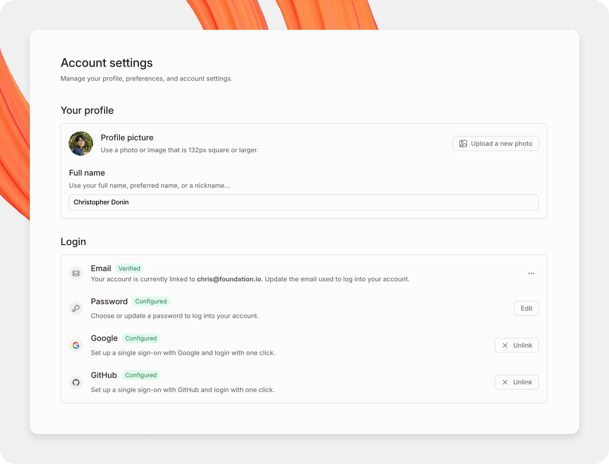

# Personal settings

You can manage your login details, third-party login options, GitBook subdomain, interface theme, notification, integrations and API access tokens.

<figure><figcaption>
Your personal settings page.
</figcaption></figure>

### How to access your personal account settings

Click on the **settings** icon, then click on **personal settings**. This will take you to the account tab of your personal settings, and you’ll see additional tabs containing further settings on the left-hand side.

Account

**Your profile**

You can update your profile picture and your full name.

**Login details**

You can update the email address and password used to log into your GitBook account. **Note:** if you created your account on or after October 9th 2021, your account does not have a password and you’ll instead use a magic link to sign in.

**Third-party login**

You can also use your Google and/or GitHub credentials to log into GitBook.

**Publishing**

Each published GitBook space that lives within your personal library will have a domain in two parts:

1. `[something].gitbook.io` (this is the GitBook subdomain)
2. `/[spaceURL]` (this is set within the settings for the space itself)

You can update the GitBook subdomain here, as well as the default content, which is the space that visitors will see if they navigate to your GitBook subdomain directly.

**Preferences**

You can choose your preferred interface theme — dark, light, or matching your system preference. **Note:** this setting only affects your experience when logged into the GitBook app, and will not affect your published content in any way

**Troubleshooting**

Optionally, you can enable the recording of advanced logs. These advanced logs help our team to more effectively troubleshoot issues.

**Account actions**

From this section you can sign out, or delete your account. **Note: there is no turning back if you delete your account!** All associated data will be deleted as well.

Notifications

GitBook can provide you with two types of [notifications](../collaboration/notifications.md) — email notifications, and in-app notifications. From this settings screen you can decide which kinds of notifications you would like to receive when different events happen.

Organization

Your personal account could be a member of any number of organizations, and this tab can be considered a shortcut to the [organization settings page](organization-settings.md) for each organization. You can also create a new organization from this page.

Developer

On this page you can manage and create access tokens for the [GitBook API](https://developer.gitbook.com/).

### **How can I reset my password?**

Please note, that if your account was created after October 10th 2021, it doesn’t have a password. You should be able to log in by requesting a magic link:

1. Visit [https://app.gitbook.com](https://app.gitbook.com)
2. Enter the email address associated with the personal account you signed up for
3. Click **continue**
4. Click **send a link** (make sure you check your spam folder)

If you _do_ want to reset your password:

1. Visit [https://app.gitbook.com](https://app.gitbook.com)
2. Follow the **forgot your password?** link at the bottom of the page
3. Enter the email address associated with the personal account you signed up for
4. Click **send a link** (make sure you check your spam folder)
