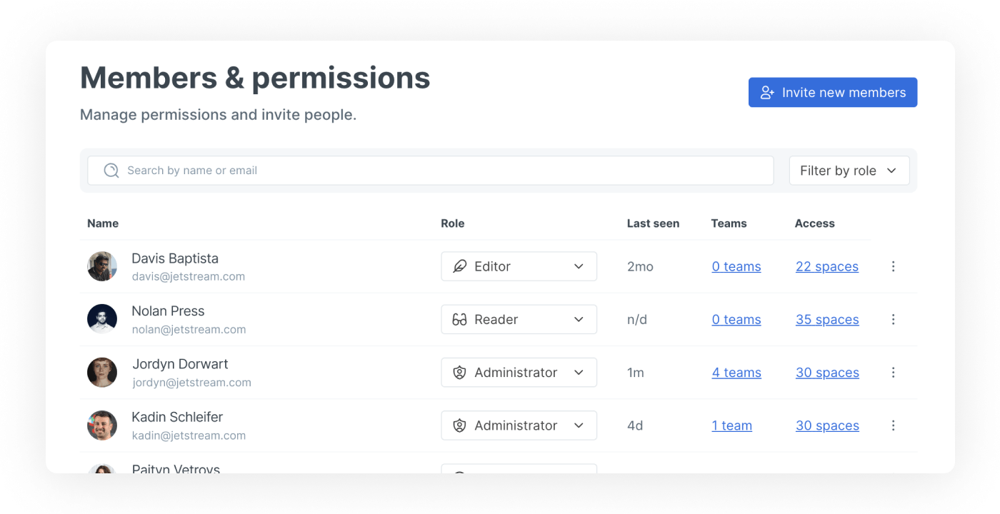

# Member management

You can [invite and remove members](invite-members-to-your-organization.md) from your organization, change members' [roles](roles.md) and [permissions](permissions-and-inheritance.md), and manage [teams](teams.md) of members from the members page in your organization's settings.


**Permissions**

Admins can invite and remove members, change members' roles and permissions and manage teams. Creators can manage permissions at a content level.


The **Members & permissions** section of your organization settings shows each person’s role, last seen date and [SSO](../../product-tour/sso-and-saml/sso-and-saml.md) status, if applicable. You’ll also see an overview of the [spaces](../../content-creation/content-structure/what-is-a-space.md) they can access and, if you’re on the Pro plan, how many [teams](teams.md) they’re part of.&#x20;

Click the **Teams** or **Access** listings for any member to jump to a list of all those teams and spaces.

<figure><figcaption>
In the Members &#x26; Permissions section, you can see all the members and guests in your organization, as well as information about their activity and permissions.
</figcaption></figure>

You can also click on any member to open their individual member page. Here, you can see more information about them, including their join date and active status.&#x20;

Select the **Teams** and **Spaces** tabs to see a list of the [teams](teams.md) they’re a member of, and the spaces they have access to — as well as their access level for those specific spaces.

### Learn more about:

<table data-card-size="large" data-view="cards"><thead><tr><th></th><th></th><th data-hidden data-card-target data-type="content-ref"></th></tr></thead><tbody><tr><td><strong>Inviting members</strong></td><td>Learn more about inviting members to your organization</td><td><a href="invite-members-to-your-organization.md">invite-members-to-your-organization.md</a></td></tr><tr><td><strong>Member roles</strong></td><td>Define the level of access and control that members have</td><td><a href="roles.md">roles.md</a></td></tr><tr><td><strong>Teams</strong></td><td>Learn about using teams to organize your members.</td><td><a href="teams.md">teams.md</a></td></tr><tr><td><strong>Permissions and inheritance</strong></td><td>Learn about content permissions and inheritance.</td><td><a href="permissions-and-inheritance.md">permissions-and-inheritance.md</a></td></tr></tbody></table>
