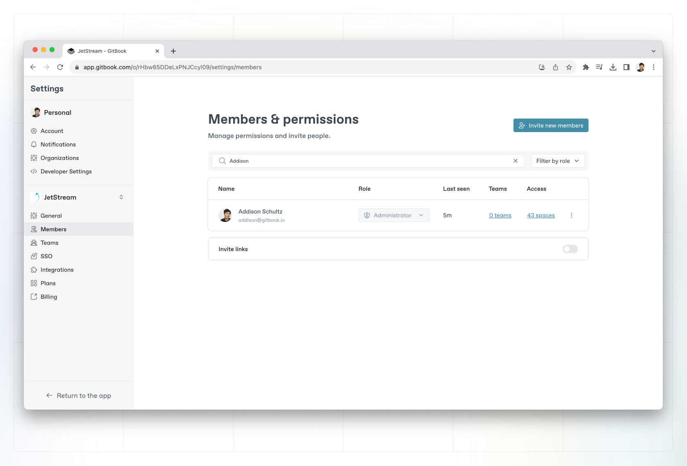

# Member management

You can [invite and remove members](invite-members-to-your-organization.md) from your organization, manage members’ content access through [roles](roles.md), and manage [teams](teams.md) of members from the members’ page in your organization’s settings.


**Permissions**

**Admins** can invite and remove members, change members’ roles, and manage teams. **Creators** can manage permissions at a content level (collection or space).\
**Team owners** can manage members of the team they have ownership of.




## Members & permissions

Shows each person’s role, last seen date, and [SSO](../sso-and-saml/sso-and-saml.md) status, if applicable. You’ll also see an overview of the [spaces](../../content-editor/editor/content-structure/what-is-a-space.md) they can access and, if you’re on the Pro plan, how many [teams](teams.md) they’re part of.

<figure><figcaption>
Members in a GitBook Organization.
</figcaption></figure>

Click the **Teams** or **Access** listings for any member to jump to a list of all those teams and spaces.

You can also click on any member to open their **individual member page**. Here, you can see more information about them, including their join date and active status.

Select the **Teams** and **Spaces** tabs to see a list of the [teams](teams.md) they’re a member of, and the spaces they have access to — as well as their access level for those specific spaces.

<figure><figcaption>
Member Space permissions
</figcaption></figure>

### Learn more about:

<table data-card-size="large" data-view="cards"><thead><tr><th></th><th></th><th data-hidden data-card-target data-type="content-ref"></th><th data-hidden data-card-cover data-type="files"></th></tr></thead><tbody><tr><td><strong>Inviting members</strong></td><td>Learn more about inviting or removing members to your organization</td><td><a href="invite-members-to-your-organization.md">invite-members-to-your-organization.md</a></td><td><a href="../../.gitbook/assets/2 (1).png">2 (1).png</a></td></tr><tr><td><strong>Member roles</strong></td><td>Define the level of access and control that members have</td><td><a href="roles.md">roles.md</a></td><td><a href="../../.gitbook/assets/5 (1).png">5 (1).png</a></td></tr><tr><td><strong>Teams</strong></td><td>Learn about using teams to organize your members.</td><td><a href="teams.md">teams.md</a></td><td><a href="../../.gitbook/assets/9 (1).png">9 (1).png</a></td></tr><tr><td><strong>Content permissions and inheritance</strong></td><td>Learn about content permissions and inheritance.</td><td><a href="permissions-and-inheritance.md">permissions-and-inheritance.md</a></td><td><a href="../../.gitbook/assets/12 (1).png">12 (1).png</a></td></tr></tbody></table>
