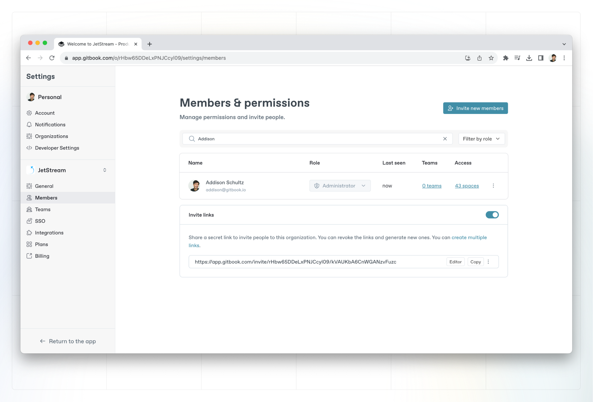

# Invite or remove members

There are a couple of ways you can invite new members to your organization:

- Generating an invite link and sharing it directly.
- Inviting them using their email address.


**Don’t forget** — inviting additional members, regardless of their role, to your organization, will immediately impact the price of your subscription. Take a look at our [billing policy](../billing-faq/billing-policy.md) for the details.


### Managing invite links

Invite links in GitBook allow you to maintain a list of links that members can use to sign up and quickly join your organization.

Invite links are tied to specific [roles](roles.md) – and you can create (and revoke!) as many invite links as you like.

### Inviting members directly

You can directly invite members in the members’ section of your organization settings. Enter their email(s), select their default role, and click **continue**. Each member will receive an email that will allow them to sign up to GitBook and instantly join your organization.

<figure><figcaption>
Invite links to a space
</figcaption></figure>

#### Email domain

You can allow all users with a specific email domain to join your organization.&#x20;


Please note that this can result in quick member growth, leading to [higher ](../billing-faq/#when-i-invite-a-new-member-to-my-gitbook-organization-when-will-i-be-charged)charges.&#x20;


### Removing members

#### Leaving an organization

You can leave an organization by going to the organization’s settings page and clicking on **leave organization** at the bottom of the page. Note that it will not be possible to rejoin the organization unless you are invited to it again.

#### Removing a member

Organization admins can remove a member of a team through the members list in the members’ section of the organization settings.

### Transferring ownership

In GitBook there isn’t really a concept of ownership - as long as you or whoever you want to transfer ownership to are an admin, you should be able to perform all the same actions as the owner. If you prefer to have only one user in charge of the billing and member management, we recommend downgrading other users to the Creator role or below.

#### **Leaving the organization to downgrade to a free single-user plan**

The admin who will remain as the owner can remove other users completely, blocking their access to collaboration and editing features. ​You can also ensure that the right person receives bills and receipts by updating their details in organization settings billing section. ​
