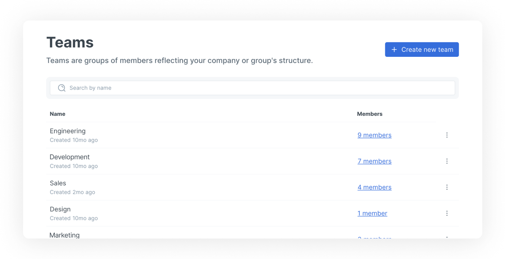
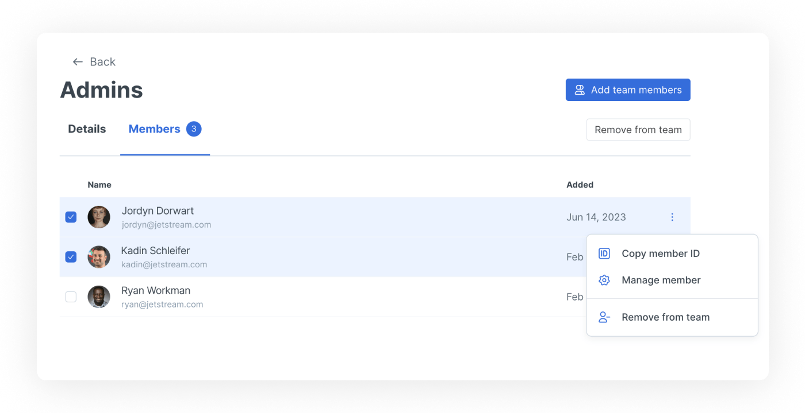

# Teams

## Creating and managing teams

You can create, edit and remove teams in the **Teams** section of your organization settings. To find this, click the cog in the bottom-left of your window. Choose organization settings for your desired organization, then click the Teams option in the sidebar.

<figure><figcaption>
View and search your teams, or click one to get more details and see a full member list.
</figcaption></figure>

On this page, you can view and search your current teams, or click one to open the team details page and see more information about it and its members.&#x20;

## Managing team members

You can manage team members in two ways:

1. Click on a specific member in **Members & permissions** to open their member page, and selecting the **Teams** tab. Click the vertical ellipsis and you can remove them from the team immediately, or choose **Manage team**.
2. In the **Teams** section, click on the number of members in the list to open the team details page.  You can then use multi-select on the member list to select and remove team member, or add more with the button at the top.

<figure><figcaption>
The team details page lists all the team’s members, and lets you add or remove member in bulk.
</figcaption></figure>

