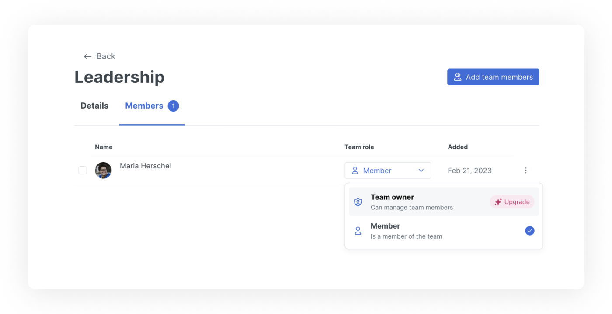

# Teams

Teams allow you to manage user access at scale. By creating a specific team, consisting of multiple members, you can grant or remove their access to spaces or collections. Read more about [permissions and inheritance](permissions-and-inheritance.md).

## Creating and managing teams

You can create, edit, and remove teams in the **Teams** section of your organization settings.&#x20;

To find this, click on :gear: in the bottom of your window. Choose organization settings for your desired organization, then click the Teams option in the sidebar.

<figure><figcaption>
View and search your teams, or click one to get more details and see a full member list.
</figcaption></figure>

On this page, you can view and search your current teams, or click one to open the team details page and see more information about it and its members.&#x20;

## Managing team members

You can manage team members in two ways:

1. Click on a specific member in **Members & permissions** to open their member page, and select the **Teams** tab. Click the vertical ellipsis and you can remove them from the team immediately, or choose **Manage team.**
2. In the **Teams** section, click on the number of members in the list to open the team details page.  You can then use multi-select on the member list to select and remove team members or add more with the button at the top.

<figure><figcaption>
The team details page lists all the team’s members, and lets you add or remove member in bulk.
</figcaption></figure>

### Team owners

Team owners (available only in Enterprise plans) allow you to hand over management of a specific team to a selected member. Team owners can add and remove members from the team they are an owner by clicking on the organization settings, then teams. They will not have access to any other organization settings, including managing other teams.&#x20;

<figure><figcaption></figcaption></figure>
