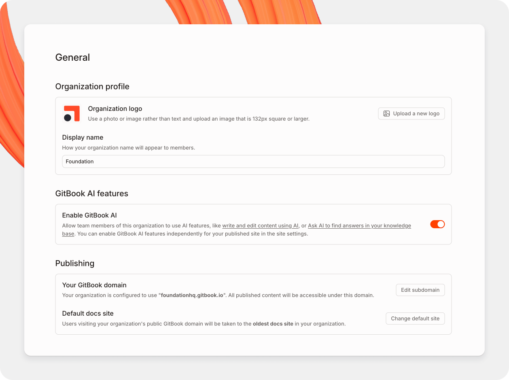

# Organization settings


Only Admins in an organization can access organization settings.


View and manage your GitBook organization’s settings. These include members, sign-in methods, merge rules, billing, and plans.

<figure><figcaption>
Your organization settings page.
</figcaption></figure>

### Access the settings for an organization

1. At the top of the sidebar, open the organization menu.
2. Click **Settings**.

Settings open in a dedicated screen. Your personal **Account** settings include **General**, **Notifications**, **Organizations**, and **Developer tools**. Your **Organization** settings appear in the sidebar. Click **Back to app** to return to your work.

The **Organization** group contains the following pages:

General

**Organization profile**

Update your organization’s logo and name.

**GitBook AI features**

[GitBook AI](../creating-content/searching-your-content/gitbook-ai.md)-powered search lets members ask questions about your content in natural language. You can also enable GitBook AI for published content in your site’s [customization settings](../docs-site/customization/).

**Actions**

Delete your organization from this section.


**Deleting an organization is permanent.** GitBook deletes all associated data. To keep organization-owned content, [move it to another organization](../creating-content/content-structure/space.md#move-a-space) first.


Members

Add and remove [members](../collaboration/member-management/). You can also update each member’s [role](../collaboration/member-management/roles.md).

Merge rules

Control how change requests are reviewed and merged across your organization. Organization rules apply to every section by default. Each section can inherit, replace, or disable those rules. Learn more about [merge rules](../collaboration/merge-rules.md).

GitBook Agent

Manage organization-level settings for [GitBook Agent](../gitbook-agent/what-is-gitbook-agent.md).

Integrations

Check which integrations are installed for your organization. You can also [install new integrations](../integrations/install-an-integration.md).

OpenAPI

Manage the OpenAPI specifications your organization’s sites use for API references.

Translations

Manage organization-wide settings for auto-translations.

Invite links

Create and manage links that let people join your organization.

Teams

[Teams](../collaboration/member-management/teams.md) group organization members. You can grant access to members of a team.

SSO

**Email domains**

For each domain you add, people with an email address on that domain can access the organization after they create a GitBook account. Choose their default [role](../collaboration/member-management/roles.md).

**SAML**

If you’re on the Enterprise plan, configure SAML single sign-on with your preferred identity provider. [Contact sales](mailto:sales@gitbook.com) to upgrade to Enterprise.

Billing

View your current plan and switch plans. Use the toggle to view annual prices, with 2 months free, or monthly prices. Then use the upgrade or downgrade button under each plan.

See our [billing policy](plans/billing-policy.md) to learn how we calculate charges when you change plans mid-cycle.

Click **Manage Billing** to open Stripe. There, you can manage your payment method and billing information. You can also [cancel your plan](cancelling-a-plan.md). If you renew before the billing period ends, your plan continues without interruption.

