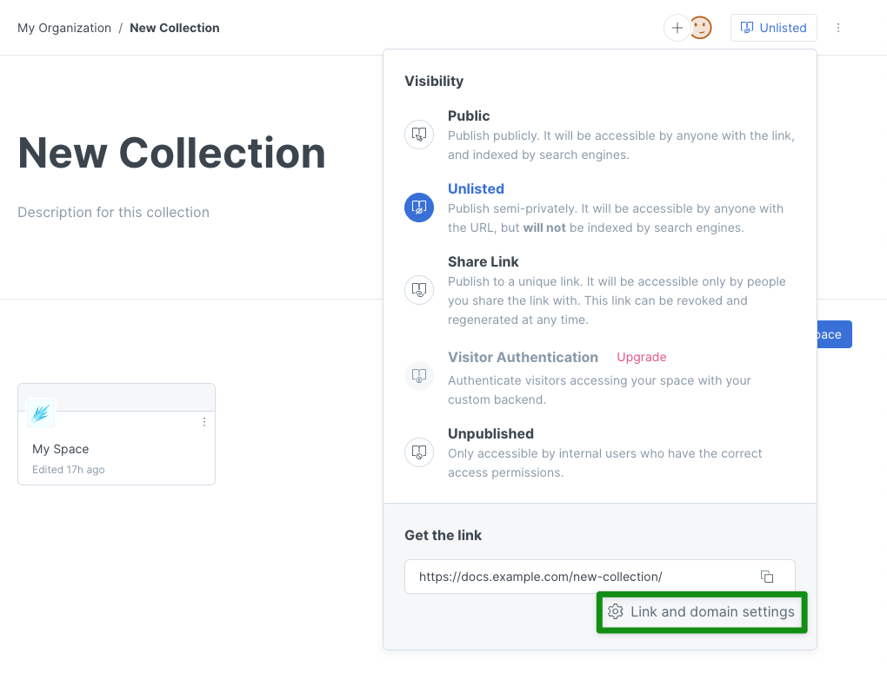
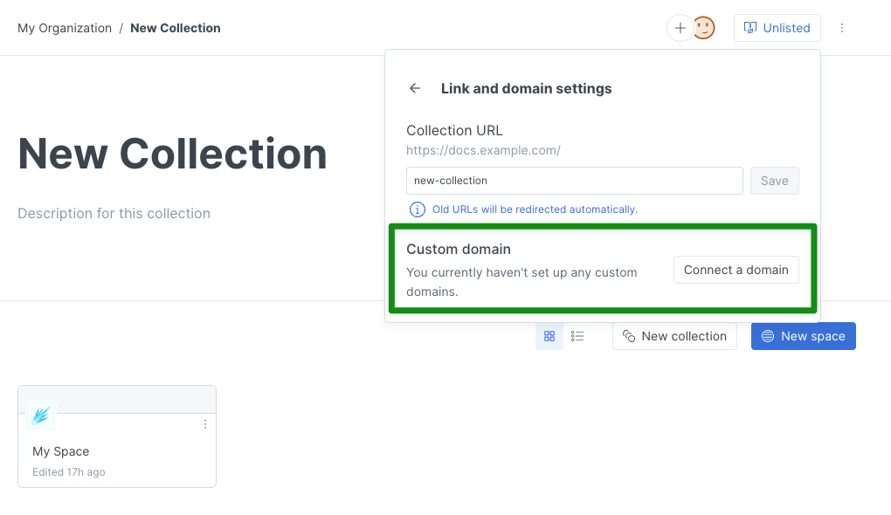
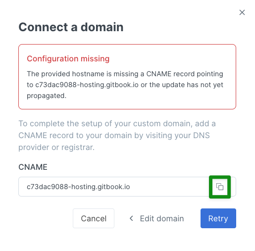

# Collection-level custom domain


Please follow the steps to set a custom domain in this order:

1. ****[Choosing a subdomain](../choose.md)
2. ****[Deciding where to set the custom domain](../location.md)
3. [**Initiating the custom domain setup**](./) **(at the** [**organization**](organization-level-custom-domain.md)**,** [**collection**](collection-level-custom-domain.md)**, or** [**space**](space-level-custom-domain.md) **level) (you are here)**
4. [Configuring DNS](../configure-dns.md)
5. [Finalizing the custom domain setup](../finalize.md)



The custom domain will be used as-is for the default space in the collection. Other spaces in the collection will have a URL in this format: `[yourcustomdomain]/v/[spaceURL]`.


You'll find the options for setting a custom domain for a collection within the collection's **visibility menu**. To get there, click on the name of the collection in the sidebar, and then click on the button to open the visibility menu near the top-right corner. It will look something like this:

<figure><figcaption>
Click the button to open the visibility menu
</figcaption></figure>

First, your collection needs to be published. Any setting other than unpublished will work — **Public**, **Unlisted**, **Share Link**, or **Visitor Authentication**. (Depending on the plan you have chosen, it might be that only _some_ of these publishing options are available to you.)

Once you have published your collection using one of those options, the button will no longer say Publish, but will instead state the current publish setting. In this example, the collection is published as **Unlisted.** Next, click on **Link and domain settings**:

<figure><figcaption>
Link and domain settings
</figcaption></figure>

From **Link and domain settings**, click the **Connect a domain** button:

<figure><figcaption>
Connect a domain
</figcaption></figure>

This will open up a window where you can enter the custom domain, and then click the **Continue** button:

<figure><figcaption>
Connect a domain
</figcaption></figure>

Behind the scenes, we'll check the DNS settings for the custom domain and we'll provide the value to use in the next step when you create your CNAME DNS record. Copy that value to your clipboard by clicking on the icon on the right-hand side of the value field.

<figure><figcaption>
The CNAME value for your custom domain
</figcaption></figure>

The value for the CNAME record will be in the format `[something]-hosting.gitbook.io`, where that `[something]` will be **unique to you**. Make sure to use the value displayed to you in the GitBook app, and _not_ the value in the screenshot above! 🙂

Once you have copied the unique CNAME value to your clipboard, you're ready to move onto the next step: [configuring DNS](../configure-dns.md).
