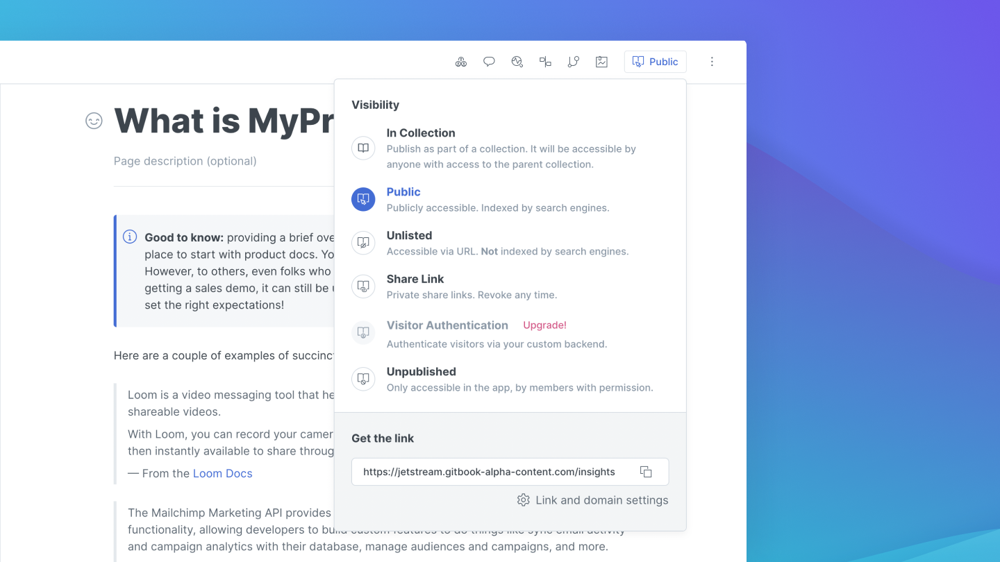

# Configure the integration

After installing the integration to your Space or GitBook library, you will need to connect it to your Segment Source.


Before proceeding, make sure you have a Segment Source ready to use and its write key handy. Go back to the [Getting Started](./#get-started) section to read more about this.


First, head to your **Segment dashboard**, navigate to the Source's settings and copy the Source's **write key**:

Next, go back to **GitBook** and navigate to the Segment integration's **configuration screen**:

Then, **paste** the write key in the **Write Key** input field in the **Space configuration** section and **press Enter** to save the key:

Finally, repeat the above steps for each Space you need to connect to the Segment integration.

To switch to another Space and save the write key, click the **Space dropdown** at the top right hand corner of the **Space configuration** section, and select the specific Space you want to connect:

### Test the configuration

Once you have configured the Segment integration on your Space(s), you can test that the integration is correctly configured and sends [events](gitbook-segment-event.md) anytime a visitor access a page on your Published content.

First, head to one of the Spaces (which is [Published](../../../getting-started/publishing/space-publishing.md)) that you've connected to the integration. Then copy its Published URL from the **Get the link** section of the Space's **Publish** menu:

Next, open that link **in a new tab** and start browsing your Published content. Navigate between pages to generate multiple events.

Then go to your Segment dashboard and navigate to the Source you've connected to the integration.

In the Source's **Debugger** tab (see [this section](https://segment.com/docs/connections/sources/debugger/) of Segment's documentation to access the Debugger tool), you should see `[GitBook] space_view`  events showing up:

