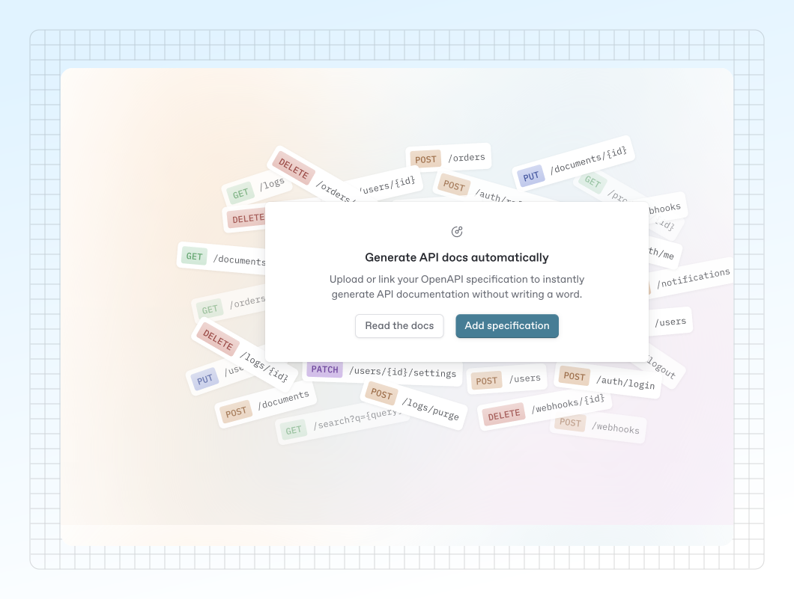

# Add an OpenAPI specification

If you have an OpenAPI spec, you can add it to your organization by uploading the file directly, linking to a hosted URL, or using the [GitBook CLI](https://gitbook.com/docs/developers/integrations/reference).

<figure><figcaption></figcaption></figure>

### How to add a specification

1. Open the **OpenAPI** section in the sidebar
2. Click on **Add specification**
3. Give your specification a name. This helps identify it, especially if you manage multiple specs
4. Choose one of the following:
   * Upload a file (e.g. _openapi.yaml_)
   * Enter a URL to a hosted spec
   * Use the CLI to publish the spec

<figure><figcaption><p>Add an OpenAPI specification modal.</p></figcaption></figure>

### Update your specification

You can update your OpenAPI specification at any time using the GitBook UI or the CLI, regardless of how it was initially added.

#### In GitBook Application

In the OpenAPI panel:

* If your spec is linked to a URL:
  * GitBook checks for updates automatically **every 6 hours**.
  * To fetch updates immediately, click **Check for updates**.
* If your spec was uploaded as a file:
  * Click **Update** to upload a new version.
* You can switch from a File to a URL source by clicking on **Edit** in the breadcrumb actions menu.

#### Using the CLI

Use the same command to update your specification:

```bash
gitbook openapi publish --spec api-spec-name --organization organization_id <path-or-url>
```

You can also use the CLI to **Check for updates** by running the publish command on the same URL.

Read our [support-for-ci-cd-with-api-blocks.md](../guides/support-for-ci-cd-with-api-blocks.md "mention") guide to learn how to automate the update of your specification.
