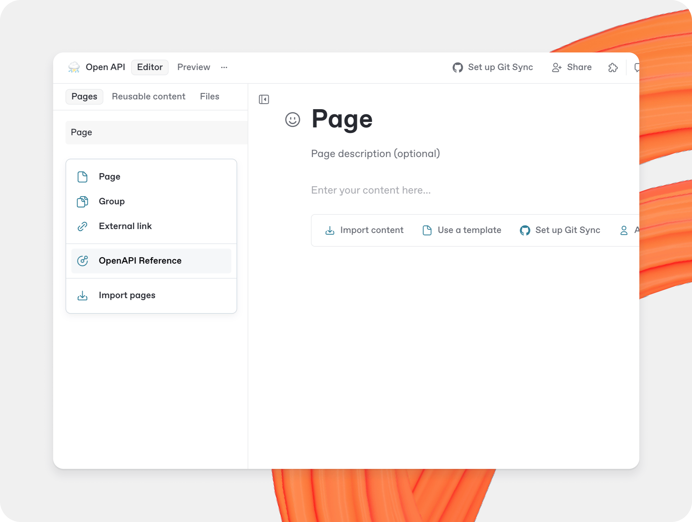

# Insert API reference in your docs

GitBook allows you to automatically generate pages related to the endpoints you have in your OpenAPI spec. These pages will contain OpenAPI operation blocks, allowing you and your visitors to test your endpoints and explore them further based on the information found in the spec.


Endpoints added from your spec will continue to be updated anytime your spec is updated. See the [Update your specification](add-an-openapi-specification.md#update-your-specification) section for more info.


### Automatically create OpenAPI pages from your spec

After you’ve [added your OpenAPI spec](add-an-openapi-specification.md), you can generate endpoint pages by inserting an **OpenAPI Reference** in the table of contents of a section.

<figure><figcaption>
Insert API References in the table of contents of a section.
</figcaption></figure>



**Generate pages from OpenAPI**

In the section you’d like to generate endpoint pages, click the **Add new...** button from the bottom of your section’s [table of contents](../../resources/gitbook-ui/#table-of-contents).

From here, click **OpenAPI Reference**.



**Choose your OpenAPI spec**

Choose your previously uploaded OpenAPI spec. Then choose a **Page structure**:

* **One page per tag**
* **One page per operation**

You can also choose to add a models page and a download link. Click **Insert** to generate the reference.



**Manage your API operations**

GitBook will automatically generate pages based on your OpenAPI spec and the tags set inside its definition. If you choose **One page per operation**, GitBook groups the generated operation pages by tag.

Head to [OpenAPI layouts](../guides/openapi-layouts.md) to compare layouts, or [Structuring your API reference](../guides/structuring-your-api-reference.md) to organize pages with tags.



### Add an individual OpenAPI block

Alternatively, you can add OpenAPI operations or schemas from your spec individually to pages throughout your docs.



**Add a new OpenAPI block**

Open the block selector by pressing **/**, and search for OpenAPI.



**Choose your OpenAPI spec**

Choose your previously uploaded OpenAPI spec, and click **Continue** to choose the endpoints you’d like to use.



**Choose the operations or schemas you’d like to insert**

Pick the operations and the schemas you want to insert in your docs and click **Insert**.


