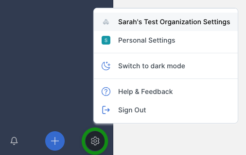
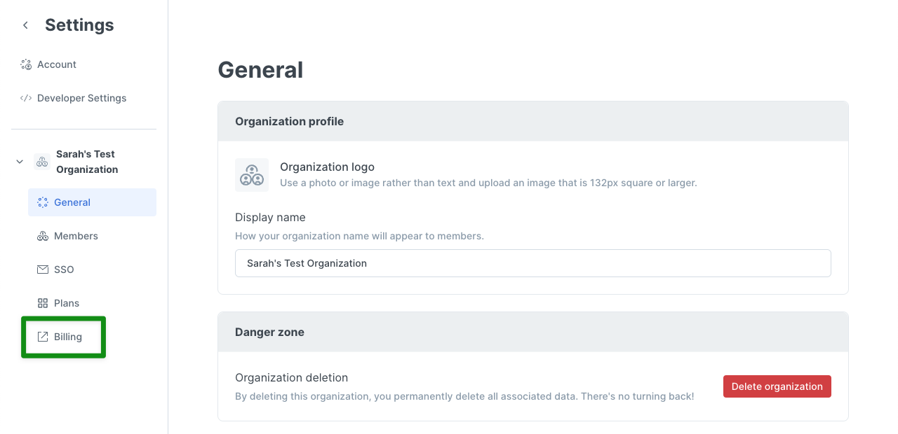
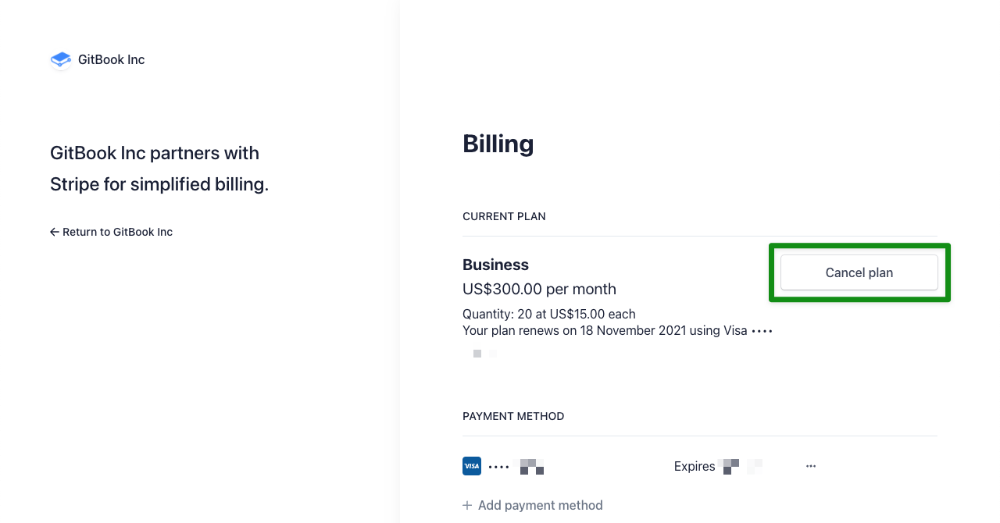
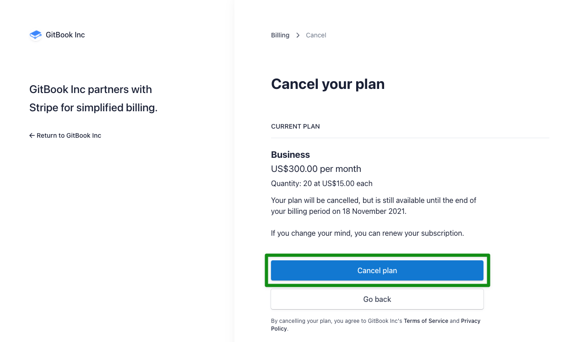
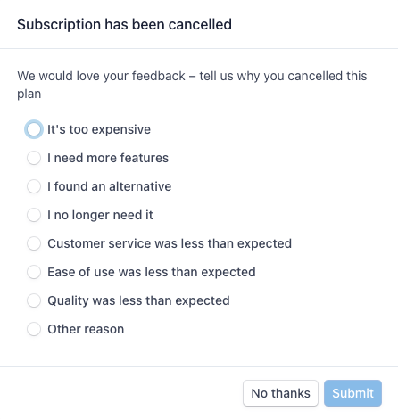
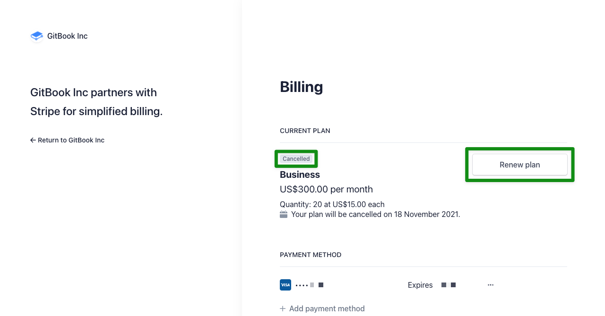

# Cancelling a plan


**Permissions**\
****Only Administrators can access an organization's billing settings to cancel a plan.


If you're thinking about cancelling a plan because you're running into any issues while using GitBook, please [contact the support team](../../troubleshooting/support.md) first! We'd love to help you.

If your mind is made up, here's how to cancel your plan.

### Step 1: go to your organization's settings

Click on the cog icon near the bottom-left corner of the page, and then select the settings page of the relevant organization.

### Step 2: go to the billing settings

In the navigation menu on the left side, click on the billing link.

This will take you to your billing page in Stripe, our payment processor.

### Step 3: cancel and confirm

Click the button to cancel your plan.

On the next page, confirm the cancellation.

### Optional step 4: provide feedback

We love to hear your feedback at _any_ time, but it's especially helpful for us to know why you've decided to cancel. If you have a moment, would you share your thoughts with us?


**Good to know:** Once your plan has been cancelled, it will remain active through to the end of your current billing period. Your subscription will no longer renew, and the plan's cancellation will take full effect at the end of that billing period.


### Changed your mind? No problem!

After cancelling and before the end of your current billing period, you have the option to renew your plan! Just click the "renew plan" button shown below (and again on the next page to confirm) and your subscription will once again renew automatically.

