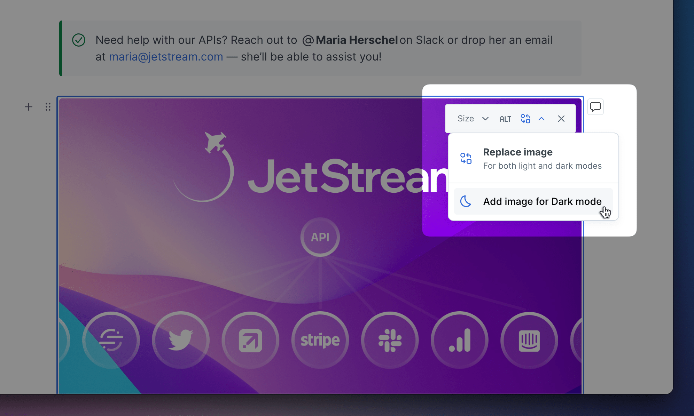
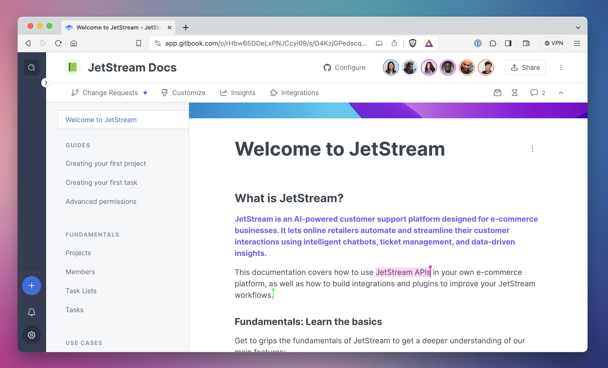
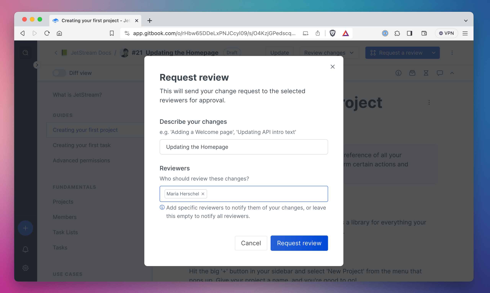
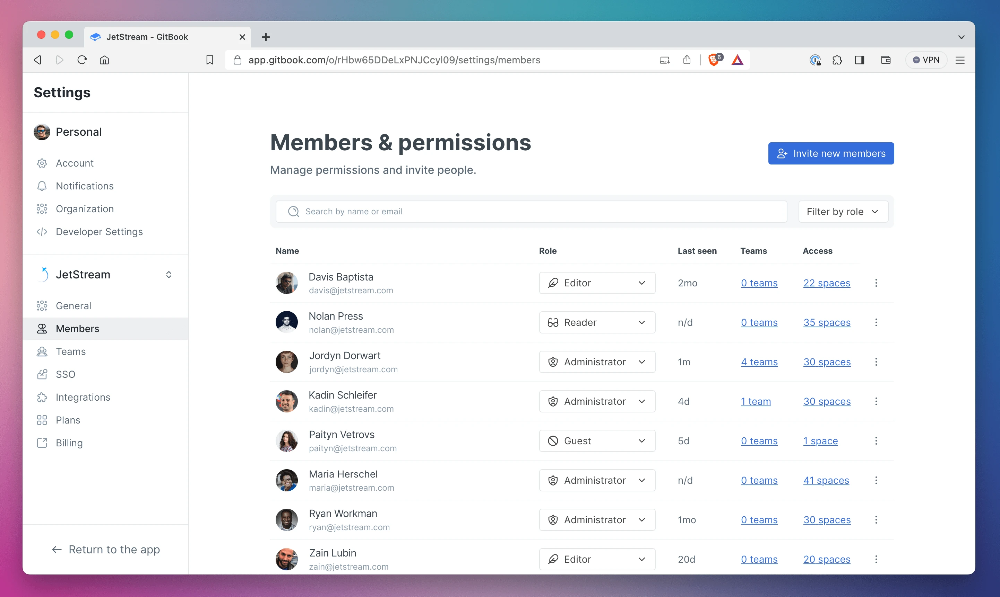
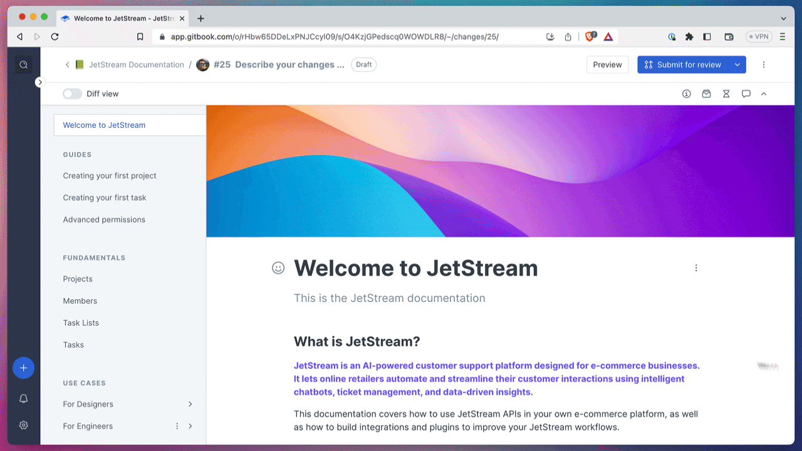
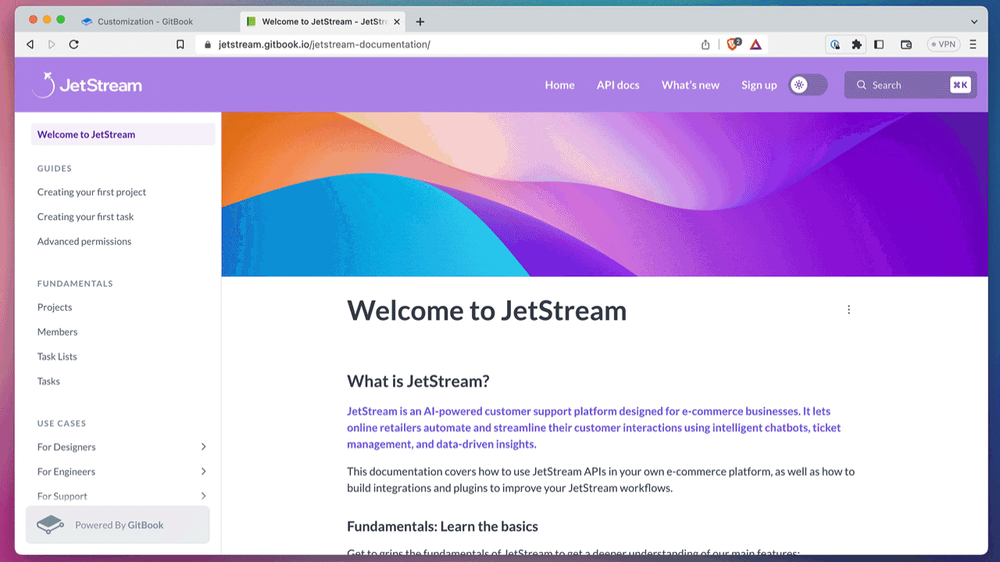

# 2023



## A huge update for GitBook

New integrations, a more modern design, better performance, and new features to help you audit and improve your content.

### ✨ New

There’s a lot to talk about this month! To read more about our epic release, head over to [our announcement blog post](https://www.gitbook.com/blog/meet-the-all-new-gitbook). Or read on below to get a quick summary, plus more details on smaller changes.

* **An improved** [**Slack integration (beta)**](https://www.gitbook.com/integrations/slack) – Got useful knowledge in a thread? You can now summon our Slack bot in a message thread and it’ll extract the essential information and summarize it in your knowledge base, so you and your team can find and use it later. You can also ask our Slack bot a question and it’ll use GitBook AI to answer it using information in your knowledge base.
* **A new VS Code integration (alpha)** – With this new integration, you can capture knowledge while you code. Just narrate a process while you work, and GitBook will combine your actions and voiceover into documentation. And just like in Slack, you can also access useful docs right in VS Code, just by asking a question.
* **See your knowledge snippets (beta)** – All the knowledge you capture using the new Slack and VS Code integrations will appear in the new Snippets page, where you can edit them, copy them to a specific section of your knowledge base, and more. GitBook AI indexes all these snippets automatically, and will use them in answers when you ask a question.
* **Improved content insights (closed beta)** – Insights now live on their own page, accessible from the sidebar. The new **Content audit** tab uses AI to show pages that feature contradictory information, or duplicated content. So you can find outdated pages that need your attention, and quickly add updated knowledge. Apply to get access directly from the GitBook app.
* **A new design** – We’ve overhauled the design of our entire app, added new icons and streamlined the sidebar to make everything cleaner and more modern

### ➕ Improved

* We’ve added a **Show/Hide** button for the table of contents, so you can temporarily collapse it and focus on your content if you wish.
* You can now create new collections and spaces, or import your content, using the + button next to the **Documentation** section title — giving you more space to view content in the sidebar.
* We’ve moved the **Trash** to the bottom of the sidebar, and opening it now opens a new page so it’s easier to find a deleted space or collection.
* We’ve made the sidebar slightly wider so you can see more of those long space and collection titles.
* You’ll now see a quick animation when you open and close side panels for a smoother feel.
* We’ve changed the Activity side panel to focus on the changes made in your version history.
* You’ll find a new font — Favorit — in the customization options for published spaces.
* We’ve changed the text in the search bar to say **Ask or search**, to make it more obvious that you can ask GitBook AI a question about your content and get an answer in seconds.
* You can now comment on a whole page using the new **Comment on page** button above the header.

### 🔧 Fixed

* Fixed an oversized alert on the notifications icon.
* Fixed some visual issues with side panels and tabbed blocks in dark mode.
* Fixed some minor spacing issues in the new sidebar.
* Fixed an issue that scrolled to the top of a page when you selected a specific comment from the side panel.
* Fixed a bug that sometimes cause the page to reload when you opened the comments side panel.
* Fixed a bug that showed the user avatar in the wrong place when writing a new comment.



## Feedback scoring overhaul in the API

We’ve revised how feedback scores are calculated in the Insights API.

### Breaking: changing feedback score computation logic

We’ve changed the way we compute the feedback score based on user ratings which is affecting the following endpoint: `/v1/spaces/:id/insights/content`

* <mark style="color:orange;">**\[Updated]**</mark> `score` is now calculated this way$$score = positives - 0.5 * intermediates - 2*negatives$$.\
  This is done to reinforce negative ratings and help surfacing content that may require updates.
* <mark style="color:orange;">**\[Updated]**</mark> `rating` is now computed this way
  * `'good'` whenever the score is > 0
  * `'ok'` whenever the score is 0
  * `'bad'` whenever the score is < 0
* <mark style="color:green;">**\[Added]**</mark> `ponderedScore` is computed by multiplying the `score` by the total amount of ratings given by visitors.

**Note: The GitBook app is displaying `ponderedScore` inside of the Insights section.**



## Side panel and sidebar improvements

We’ve made getting information about your space more consistent, and improved the sidebar to make it easier to browse and copy your content.

### ✨ New

We’ve made some big improvements to the side panels that give you information about your space:

* We’ve replaced the sidesheets on the right of the interface with new side panels for better consistency across the app. You’ll see them when you open files, history, comments, page options or change request info.
* The **Comments** side panel now includes filtering for individual pages, as well as for open and resolved comments.
* The **Change Requests** panel also include filtering for all change requests, or only change requests that you personally have started.

But that’s not all! We’ve also made some smaller improvements to the sidebar to make it easier for you to navigate your content:

* Collections will now appear with an icon in the sidebar, so they sit more neatly alongside spaces and are easier to differentiate.
* We’ve also improved the **Copy** feature in the options menus for collections and spaces. If you click the options icon next to a collection or space name in the sidebar, you can easily copy its link, ID or title.

### ➕ Improved

* You’ll see improved performance when loading spaces after their initial load.
* We’ve added the option to get and update space customization settings to the API.
* You can now create collections and publish content using the API.
* We’ve changed emoji behavior for new spaces. Now the chosen emoji will be random, rather than based on your space title.
* We’ve added a button to make it easier to trigger GitBook AI from a standard search query.
* We’ve also improved the appearance of search results to make them easier to parse, including adding new icons.

### 🔧 Fixed

* Fixed an issue when batch importing multiple files.
* Fixed an issue with copy and pasting content in an OpenAPI block.
* Fixed a bug that could prevent you from toggling the **Inherit customizations** option in a collection.
* Fixed a bug that stopped you from scrolling if you were writing a long comment.
* Fixed a bug that could stop people pasting content into the editor.
* Fixed a crash that could occur when deleting pages with cross-links one after the other.
* Fixed a spacing error at the bottom of the sidebar.
* Fixed overlapping icons in the notifications panel on mobile.
* Fixed an oversized alert on the notifications icon.
* Fixed a bug that could prevent a user getting an @ mention in a change request



## Theme-aware images, team owners and more

We’ve added an option to tailor images for light and dark modes, added team owners, and have some great security news to share.

You can now click the **options** button on an inline or block image to choose a specific image for dark mode. This is great if you have diagrams or illustrations with no backgrounds — now you can create a version to work specifically with dark mode in your docs.

If you’re using GitHub or GitLab Sync, you can also do set these in Markdown using the HTML syntax `<picture>` and `<source>`. [Head to our docs](https://gitbook.com/docs/creating-content/blocks/insert-images#light-and-dark-mode) to find out more.

<figure><figcaption>
Once you’ve set an image for dark mode, you’ll see options to replace both versions of the image in this menu.
</figcaption></figure>

### ➕ Improved

* We’ve added the option to set team owners for your teams. If you’re on our Enterprise plans, you can now set a team owner for a specific team. They can manage team members and access organization settings, no matter their other permissions.
* We’ve got our SOC 2 and ISO 27001 security certifications! [Read our blog post](https://www.gitbook.com/blog/gitbook-security-soc2-iso27001) to find out more about what this means and why it’s such great news :tada:

### 🔧 Fixed

* Fixed a bug that caused unexpected scrolling when you selected text in an expandable block or a table.



## Real-time collaboration and reviews

We’ve made collaboration better than ever with real-time editing and reviews for change requests.

## ✨ New

With this release, we’ve got a couple of updates that aim to help you improve collaboration among your team.

First, you may have noticed other people’s avatars popping up in the top corner of the your spaces. That’s because we now have real-time collaboration in GitBook!

If someone else is view the same page as you, you’ll see their avatar in the corner, and a colored cursor will appear on the page where they’re working. You’ll be able to see any changes they make in real-time, making collaboration easier than ever.


Real-time collaboration is only available in unpublished spaces. It doesn’t work in spaces that are set to public, or in spaces where Git Sync is enabled.


<figure><figcaption>
If other people are working in the same space as you, you’ll see their avatars in the header bar. And if they’re on the same page, you’ll see their cursors showing precisely where they’re working
</figcaption></figure>

We’ve also added a new way to get reviews before you merge change requests. Just like code reviews, content reviews are a really useful part of the content development cycle. So the new flow lets you choose **Request a review** from the button in the header bar, then tag specific people in your request to notify them.

<figure><figcaption>
You can now request a review in your change requests. When you’re done reviewing someone’s work you can approve it or request changes.
</figcaption></figure>

## ➕ Improved

* We’ve added a progress dialogue for Git Sync progress, to make it clearer that the sync is progressing.
* Improved the look and feel of the formatting menu with a dark mode theme, as well as new icons and interactions.
* If you’re using Git Sync with GitLab, authentication errors will now give you more information.
* We’ve added a **Configure** button in each space’s header bar to make it easier to set up Git Sync.

## 🔧 Fixed

* Fixed an issue that was causing occasional timeouts during Git Sync.
* Fixed a bug in the **Import content** modal when you tried to import content in a new space.
* Fixed a bug that made the emoji picker flash after typing a comma, and unified it’s UX with the @ mention picker.
* Fixed a crash that could occur when you opened page options and merged a change request.
* Fixed a crash when opening the search box when the URL contains an organization ID for an org that the current user isn’t a member of.
* Fixed a bug that could slow things down when you tried to duplicate a space.
* Fixed an issue that was causing anchor links in the TOC being exported as absolute links.
* Fixed a bug that allowed people to change their email when they’re part of an SSO-enforced organization.
* Fixed an issue where GitBook sometimes didn’t create a user profile when signing up with GitHub or Google.
* Fixed an issue that caused Brave’s default adblocker to block the emoji, @ mention and # tag palette menus.



## Member management and more

We’ve made it easier to manage members in your organization, plus made some other useful improvements.

## ✨ New

We know that maintaining a knowledge is about everyone having the right access to add and access information when they need it. So with this release, we’re making it easier for you to view and manage your team members.

The new **Member Settings** page gives you more information at a glance. In the member list you can see each member’s role, last seen date and SSO status. You can also see an overview of the spaces each person has access to — you can click the number to find out more.

<figure><figcaption></figcaption></figure>

If you’re on our Pro or Enterprise plans, we also show how many teams the member is part of, and you can find out more with a click. And it’s easier to enforce mandatory SSO across your organization thanks to a new setting.

We’ve also redesigned the **Teams** page in **Organization settings** to make it easier to create and manage teams. It shows all the teams in your org, and you can click on one to see all the members. From here, you can add or remove members in bulk for fast team management.

Read [our blog post](https://www.gitbook.com/blog/new-in-gitbook-member-management) to find out more about this update

## ➕ Improved

* You can no access information about your organization’s teams and team member’s subscriptions through the API. And you can use the API to update team lists, add or remove member, or create new sets of members.
* You can now trigger the **Insert block** menu by just hitting / on your keyboard. Before you had to hit Cmd+/.
* You can now change the page cover from the page cover menu.
* Integration authors can now build customer configuration screens for space-level installations.
* When you open a space or change request that has a Git Sync error, you’ll now see a modal explaining the error.
* Embedded blocks will no re-render as integration blocks if you’ve installed a matching integration on the space.
* We’ve simplified the **Integrations** menu by splitting tabs based on the context.

## 🔧 Fixed

* Fixed a but that prevented diff view showing diff content.
* Fixed an issue with images and files breaking temporarily when updating files.
* Fixed an issue that caused some change requests to show broken links for content references.
* Fixed a bug that could duplicate entries in the **Change history** menu.
* Fixed a crash that sometimes happened when reopening an inactive GitBook tab.



## Iterating, improving, fixing

We’ve made some small (but mighty) quality-of-life improvements with our latest releases.

## :heavy\_plus\_sign:Improved

* Added an API endpoint to list all the change requests in a space.
* Added support for favicons on iOS, so you can now see the favicon if you add a GitBook page in your home screen.
* Top-level blocks now have a plus button on the left to quickly create new blocks above or below it.
* We disabled the option to merge a change request when Git sync is already running both on the API and in the editor. This prevents conflicts during merges.
* Google Translate will no longer translate code blocks when you use it on a page.
* The formatting toolbar got a fresh coat of paint. It now features new icons, plus we made it a little larger and added a hover animation to make it easier to select the tool you need.
* Toolbar links such as **Export as PDF** and **Copy link** used to be displayed above the Outline. They are now under **Page actions**  alongside the page title.

## 🔧 Fixed

* Fixed whitespace added at the bottom of the document when an expandable block is collapsed.
* Fixed a bug where duplicating a Space would carry over previous git metadata in its revision files.
* Fixed some small issues with the sidebar styling for comments and page options.
* Fixed PDF rendering in quote and hint blocks.
* Fixed an issue where GitHub authentication was failing and preventing users from signing in.
* Fixed an issue where inline images wouldn’t always render in published spaces.
* Fixed an issue where larger code blocks would have incorrect styling for line numbers.
* Fixed the broken link at the bottom of the in-app integrations modal. It now directs to our developer documentation.



## More customization options and our new integrations platform

Powerful page options give you more control, plus we have a new platform so you can build your own integrations for GitBook.

### Our new Integrations platform

We’ve opened up our integration platform to the public, which means you (and anyone else) can now build custom integrations that suit you and your team’s workflows.

Now, you can build on top of the ways that you’re already using our app, uniting your tech stack and streamlining the way you work, collaborate and share knowledge.

Find out more in [our blog post](https://blog.gitbook.com/product-updates/build-your-own-gitbook-integrations-and-unite-your-tech-stack).

### Improved Page Options

The new Page Options menu gives you granular control over every individual page, so you can tweak things like page layout presets and cover image sizing. Plus, you can now drag cards to reorder them — and naturally they look great in the full-width mode we added recently, too.

Find out more about all these improvements (including those we announced last month) in [our blog post](https://blog.gitbook.com/product-updates/new-in-gitbook-upgrade-your-public-docs-with-powerful-new-customization-tools).

<figure><figcaption>
Page Options lets you customize different settings for individual pages within a space.
</figcaption></figure>

### ➕ Improved

* Cards now have some top spacing to avoid the control buttons interfering with the text.
* You can now drag and drop cards directly on the page, as well as dragging and dropping sections within the card modal.
* Added a ‘reviewing’ feature to change requests, so you can now review change requests, and request a review from others.
* Enhanced the controls for image blocks with a collapsible panel, and set the color of the controls to match light or dark mode.
* Added Git Sync support for Page Options.
* Improved the transition when toggling between light and dark modes in public content.
* Added a search parameter, organization members and member subscriptions to the API.
* Added filtering by `visibility` property when listing spaces in the `/orgs/:organizationId/spaces` API endpoint.
* You can now filter by the status of the last Git Sync operation for the `listSpacesInOrganizationById` endpoint. You can also expose Git Sync information via the API.
* Added APIs to fetch integrations on a published space, and install and uninstall integrations.
* Added feedback score to the CSV export in Insights.
* Increased the clickable area of the comment input box to make it easier to select.
* Updated the copy on the Create Organization screen to make it easier to understand.
* If you install an integration from outside the app, it will now default to installing the integration to an organization you’re a part of rather than your personal organization.
* Swapped the order of theme mode and preset panel in Customize panel.

### 🔧 Fixed

* Fixed an unexpected error that could occur when creating a change request.
* Fixed a bug in the hint block that stopped you from changing the icon and theme by clicking it.
* Fixed a bug where GitSync would not mark as failed in cases where it fails to boot.
* Fixed a visual bug where the hint text to exit a block was overlapping other content.
* Fixed an issue where blocks were re-rendering more than necessary, which was impacting performance.
* Fixed a bug that occasionally hid the merge button when working on a change request.
* Fixed a visual bug that meant an organization’s logo would sometimes show white lines on the corners when viewed in dark mode.
* Fixed a regression on search analytics missing context.
* Fixed a bug that prevented the PDF modal opening when editing a change request.
* Fixed a bug that made the light/dark mode toggle appear very small on mobile.
* Fixed an issue where dropping a file on FileManager would get stuck in a dragging state.
* Fixed an issue so the page now scrolls to the right section when clicking on a search result in public docs.



## A light/dark mode toggle and new customization options

We’ve added a light and dark mode toggle for your public documentation, and new color settings to help you customize your content.

### ✨ New

You can now enable a light and dark mode toggle for your public documentation — giving your readers the choice of how to view your content. Simply enable the toggle in the **Customization** menu and readers can select their preferred view from the top navigation bar of your public pages.

<figure><figcaption>
You can enable this public-facing toggle in the <strong>Customize</strong> menu.
</figcaption></figure>

We’ve also added new color customization options. You can set primary, header and link colors for both light and dark mode, and even upload a different logo for the two modes, so your brand always looks its best.

<figure><figcaption>
You can choose to just set the primary color for light and dark mode, or choose Custom, which lets you select a header background and link colors, too.
</figcaption></figure>

You also now have the option to set blocks to span the full width of your content, helping you create a clear visual hierarchy. This is perfect for giving images and tables more space to breathe, but it looks great with a whole range of block types — as you can see from our demo videos above.

Finally, we’ve added a fast new way to insert commonly-used blocks on an empty line. Simply start a new line on any page and you’ll see three new icons on the right that let you quickly create an image, code or unordered list block. You can highlight these quick block buttons using `Tab`, then cycle through them with the arrow keys on your keyboard, selecting the one you want by hitting `Enter`.

<figure><figcaption>
You can use your cursor to select from the options, or hit Tab and use the arrow keys to cycle through them.
</figcaption></figure>

### ➕ Improved

* Added API endpoints for Change Request reviews.
* Added a parameter in our API method to create a space.
* Added the API properties “organization” and “parent” on space objects.
* Added API for installing & uninstall integrations.
* Added API to create a space
* Added API to duplicate a space
* Allowed integrations to be verified and listed in the marketplace.
* Improved the usability of drag and drop by making drop zones clearer.
* Added an information panel that gives change requests extra context.

### 🔧 Fixed

* Fixed the lettered favicon in published content.
* Fixed theme toggle icons in mobile, which had a small width/height.
* Fixed an issue where dropping a file on FileManager would get stuck in the dragging state.
* Fixed page cover positioning when there is ToC on published content.
* Fixed an issue where notification toasts would show twice.
* Fixed a potential crash when reading content that was recently imported.
* Fixed support for custom table column sizes with Git Sync.
* Fixed an issue that still sent notifications, even when the setting was turned off.
* Fixed parsing of OpenAPI spec that includes the path’s common parameters.
* Fixed an issue where public content would scroll past an anchored header element.



## Image resizing and othe improvements

We’ve improved the editor to give you more options when it comes to image sizes.

### Image resizing

You now have more control over the sizing of your images. You always had the option to show the image inline or its original size. Now you can control the sizing of an image block as well.

You have a few options:

* **Full** - the image takes as much space as possible
* **Large** - 75% of the image size
* **Medium** - 50% of the image size
* **Small** - 25% of the image size

This is also available through [GitHub & GitLab Sync](https://app.gitbook.com/s/NkEGS7hzeqa35sMXQZ4X/docs-as-code/git-sync "mention") where you can specify a percentage or pixel value for the resize.

<figure><figcaption>
Hover over an image block to see the new resizing option.
</figcaption></figure>

### Private spaces


We have edited this changelog update to remove information about private spaces, as this feature is no longer available in GitBook.


### ➕ Improved

We've also made improvements to the following:

* Added SSO property to org members API.
* New badge to Organizations' member list showing whether members are disabled or not.
* Increased to 10 the maximum number of header links in Customization options.
* Added the OpenAPI block's expanded option support in Git Sync.
* Added drag and drop capability for multiple selected blocks.

### 🔧 Fixed

Below is a list of bug fixes also included in this release:

* Fixed a bug preventing the installation of integrations in Organizations.
* Fixed a bug where Organization members couldn't access spaces using Firefox.
* Fixed the share modal button being unresponsive when the comments side dialog is open.



## Block selection and upcoming improvements to the GitBook editor

We're opening a series of improvements to our editor by enabling block selection and interactions on selected blocks..

### ✨ New

As a first of many upcoming improvements to the editor, we're introducing **block selection**!

Block selection enables you to select a set of blocks using the `Esc` key, and swiftly copy, cut, or delete them. This makes manipulating documents more efficient: try it out!

<figure><figcaption>
Select a chosen block with an ESC key and simply copy, cut or delete it as required
</figcaption></figure>

### :rocket: More to come

We are working on improving your editing experience and have the following updates planned:

* Full-width blocks for better readability of large blocks such as tables, or images...
* Improvements to our most used block types: tables, images, lists, hints and expandable
* Performance improvements, getting the interface snappier even on large documents
* ...and many more

Stay tuned, and happy editing :writing\_hand:



## GitBook AI search, preview your change requests and more

In February we opened up GitBook AI search for testing for selected users. This month we are ready to roll it out to all users at no additional cost while in open alpha. A big change in change requests comes in the form of **previews**, where you can see how your content will look when it's published. As usual, this update comes with a number of bug fixes and improvements to the overall stability of GitBook.

### :mag\_right: GitBook AI search

GitBook AI search is available now for everyone to use! GitBook AI will scan your documentation and give you a simple semantic answer with clickable references. You can find out more about the new tool and learn how to enable it in your public or private documentation by [reading our docs.](https://gitbook.com/docs/creating-content/searching-your-content/gitbook-ai)

<figure><figcaption></figcaption></figure>

GitBook AI search will be available for **all users** while in Alpha testing. In the future, this feature will be limited to our **Pro and Enterprise plans.**

### :eyes: Preview your change request before merging

When you are creating content, it's hard to get a sense of how it'll fit and appear to other users when it gets published. Now GitBook allows you to create a preview of your changes **before they are merged.** This allows you to have a quick glance at your content in published format, and make that last-minute adjustment to look just right.

This is available inside change requests as you are editing them.

<figure><figcaption></figcaption></figure>

* Add a preview link for a change request
* Add a success modal when publishing content.

### ➕ Improved

We've also made improvements to the following:

* Improve the GitSync commit message for change requests with no subject.
* If the description is empty we show the title in OpenAPI response schema.
* Show delete modal when the page is being deleted.
* Redesign in-app search.
* Add API endpoint to list space permissions of a user in an organization.

### 🔧 Fixed

Below is a list of bug fixes also included in this release:

* Fix an issue where deleted pages were still appearing in the ToC.
* Fix an issue where the option to publish a space is disabled when previously the space was published under a collection.
* Fix Git Sync export issue where non-updated page content can be reverted to the previous version.
* Fix highlighted blocks not being interactive during a merge conflict.
* Fix an issue when setting up a custom domain that shows an SSL error outcome.
* Fix redirects not happening for spaces in a collection for published content.
* Fix an issue where using the mouse to scroll in the Editor could cause bouncing.
* Add delete command for block selection.



## AI-powered search, share & permissions, and more

A new search feature powered by AI and a number of quality-of-life improvements on GitBook.

### \[Alpha] AI-powered search

AI has been the talk of the town for the past few months, and we want to leverage that power in your documentation. So we’re introducing a new, smarter search option that’s powered by GitBook AI, to help users get answers to their questions based on your documentation content. You can see it in action right now in the [GitBook docs](https://gitbook.com/docs). Read more on this release and [how to join the alpha test in our community](https://github.com/GitbookIO/community/discussions/98).


You can now try this out in the GitBook docs


* Introduced advanced search using AI to answer questions asked in the published content search.

### New share & permissions modal

Collaborating in a space with others and publishing it to the world is a key part of many workflows in GitBook. And now, we’ve added a modal that gives you all the sharing controls you need in one place. This also give you a quick glance at who in your team has access to a space and what their role is inside that space. It’s a great way to audit your spaces and check current permissions.

<figure><figcaption></figcaption></figure>

* Added a new modal for sharing and permissions in a space.
* Added publishing options in the new sharing modal.
* Added an overview of the publishing state in the **Who can access** tab of the share dialog.

### ➕ Improved

We've also made improvements to the following:

* Added API to list all users who can access a space.
* Added API to list all users who can access a collection.
* We now display users’ email address in the autocomplete drop-down when inviting to a space.
* We also display users’ email address in the popover to select team members.
* Added a new **Share and Permissions…** menu entry in a space’s menu.
* Added a **Copy link** menu entry in a space’s menu.
* Added **Submit** dialogs when you try to create or rename team by pressing `Enter`.
* The mention shortcut @ will no longer show content results (only users). To access content, you can type #.
* The mention menu now shows eight results instead of four, and includes the user’s email.

### 🔧 Fixed

Below is a list of bug fixes we’ve also included in this release:

* Fixed “Main revision not found” error when using a template on a space.
* Fixed an issue where imports were unsuccessful.
* Fixed TOC to show correct modification state when moving a page in a change request.
* Fixed styling for OpenGraph custom logos.
* Fixed an issue where the block comment button would flash as the mouse moved over it.
* Fixed and issue where the expandable block title overflowed its limits.



## Monorepos, customized commit messages, and more

More flexibility with Git Sync and some new designs for search and change requests.

### Added support for Monorepos

Synchronize more than one directory from the same repository with multiple spaces. This allows you to have a single repository for multiple projects and sync them with GitBook (e.g. an iOS client and a web-application).

<figure><figcaption>
You can set up monorepos in the Git Sync configuration panel
</figcaption></figure>

* Add configuration option for GitSync to specify a project directory to sync multiple spaces in the same monorepo.

You can read more on [how to set this up in our documentation](https://gitbook.com/docs/getting-started/git-sync/monorepos).

### Customize your commit messages with Git Sync

Easily identify what change request was merged and when a commit is coming from GitBook. You can also use an Autolink feature to add the change request URL to the commit message. That way, you can click on that link, get straight to GitBook and see the changes within our editor.

<figure><figcaption>
Create your own template for Git Sync's commit messages
</figcaption></figure>

* Add option in GitSync to use a custom template for commit messages.
* Improve URL format for change request to use a more user-friendly version (recognizable), based on the number indicator.

You can read more on [how to set this up in our documentation](https://gitbook.com/docs/getting-started/git-sync/commits).

### ➕ Improved

We've also made improvements to the following:

* Redesigned the search on published content.
* Redesigned change requests sidepanel.

<figure><figcaption>
Redesigned search box ✨
</figcaption></figure> <figure><figcaption>
Redesigned change request sidepanel ✨
</figcaption></figure>

* Add a comment via submit change request modal.
* When submitting a CR for review, notify reviewers, or creator, or admins in this order. Never notify the author.
* Change requests are no longer automatically converted to draft when editing happens.
* Add syntax highlighting for `prisma` .
* Update the drawing editor (excalidraw), with a refreshed design and better features.

### 🔧 Fixed

Below is a list of bug fixes also included in this release:

* Fix scroll to top when changing page on published content.
* Fix an issue where the comment emoji button had disappeared.
* Clear the cache immediately for content using a share link when the share link is revoked.
* Fix app crash from opening Integrations tab where user doesn't have proper permissions.
* Fix bug after opening drawing modal where elements are hard to select and drawing doesn't draw at the right location on the screen.
* Fix error when posting comments on the main content.
* Fix sitemaps links for collections using a custom domain.



## Change request subject, ordered lists, and more

We've added more context around change requests, improved performance and squashed some bugs.

### Change requests default subject

A default subject is added when you create a change request instead of leaving it untitled. This allows you to see what are the most recent changes at a glance, even if you forget to add a subject to a change request.

<figure><figcaption>
The subject defaults to your name and the date you started the change request
</figcaption></figure>

* Add default subject to change requests without one.
* Update change request's `updatedAt` field on all comment activity.

### Ordered lists starting at another number

You can start at steps 2, 3, or beyond in an ordered list now. If you already have an ordered list somewhere else on your page, you can pick the numbering up where you left off after that. No need to start at 1 every time.

<figure><figcaption>
You can start your list at any number
</figcaption></figure>

* Allow insertion of ordered lists starting at another number than 1 by typing
* Add support in Markdown/HTML parsing for ordered lists starting at another number than 1

We've also made improvements to the following:

* Notify also collection and organization reviewers when a change request is submitted for review
* Change requests are no longer automatically converted to draft when editing happens
* Usability and accessibility improvements for CheckBox
* Add an API endpoint to allow adding/removing users from a team based on their email
* No longer list expandable blocks in the page outline

### 🔧 Fixed

Below is a list of bug fixes also included in this release:

* Fix an issue where user couldn't access change request
* Fix page conflicts indicators not showing anymore when page has conflicts
* Fix position of deleted diff indicator when the first block is deleted.
* Fix issue where diff tooltip does not show for deleted pages
* Fixed an issue where the comments side panel would not scroll to the right place.
* Fix syntax highlighting in code blocks wrapped in an expandable
* Fix body of expandable blocks not being indexed in search engine
* Fix an issue where new pages would not show block-level diffs



## New comments UI, improved diff view, and more

We've spent a lot of time fixing critical bugs, improving performance, and adding key features.

### **Improved Comments UI**

<figure><figcaption></figcaption></figure>

We've looked into the way comments are being used across GitBook, and have made some major improvements not only to the way they function, but also to the way they allow you to work with the rest of your team. Here's a quick summary of some of the major changes:

* Comments moved to sidebar instead of overlay
* Context added to block level comments
* Comments available in diff mode

### **Updated diff view & indicators**

<figure><figcaption></figcaption></figure>

We've also made some major UX improvements to the way diff view looks and feels, allowing you to have greater context to the the things that have changed inside a document you might be working on.

* Deleted blocks now show a diff indicator in the editor
* Apply new diff view UI elements in diff mode
* Added modified/added diff indicators when viewing a change request

### **OpenAPI request body examples added**

If you're using the OpenAPI block in any of your GitBook pages, you'll now see any request body examples included in the definition file used to generate the block.

### Notifications are now sent for all space reviewers for change requests

Lastly, we've improved the way notifications are shared when change requests are finished and submitted for review.

### ➕ Improved

We've also made improvements to the following:

* Add missing icons to table options menus.
* Add support for (un)indenting multiple selected list items.
* Add an option to show/hide the pagination at the bottom of the page.
* Directly download a file in a table when clicking it on public content.
* Add a back button to the change request header breadcrumb.
* Improve table UX when editing column options and header titles. They now auto-save on change.
* Improve keyboard navigation in table cards, using Backspace and Enter to move between having the entire card selected or a specific column.
* Change the default state of new created checklist items to unchecked.
* Change the default extension for drawing files to `.excalidraw.svg` to ease the insertion of drawing created in excalidraw.com.

### 🔧 Fixed

Below is a list of bug fixes also included in this release:

* Limit collection description input to prevent silent "Missing or insufficient permission error".
* Fix outline active section compute on public content.
* Fix popovers placement on public content.
* Fix hovering annotations leading to text wavering.
* Fix tab navigation within table cells and non-text cells selection.
* Fix caching Firestore queries in browser cache to improve initial load time.
* Fix page shift when switching between editable and diff views.
* Fix an issue where the collection dropdown wouldn't show if the page is scrolled.
* Fix an issue where selecting heading text was not possible.
* Fix keyboard selection of Inline math nodes.
* Fix the expandable block collapsing when editing the title.
* Fix images being rendered very small on mobile.
* Fix issue where scrolling position is lost when switching to diff or creating a Change Request.
* Fix vertical content shift in diff mode.
* Fix an issue where only selected image, from multiple, would open in gallery
* Fix issue where Space or Collection invite links are not deleted when content is moved to new owner.
* Fix issue where last image in a carousel is slightly bigger.


