# 2024



## Visual upgrades, table improvements and more

We’ve made some visual upgrades to published docs sites, added content breadcrumbs, made tables more consistent, and added new ways to style text in comments.

### Visual upgrades for docs sites

This week, we’ve released a few visual improvements for docs sites.

First, the [**Tint color**](https://app.gitbook.com/s/NkEGS7hzeqa35sMXQZ4X/manage-your-site/customization#styling) customization option now has more choices. Set it to **Primary** and the background of your docs site will subtly tint to match your primary theme color. Alternatively, choose Custom to select a different color to use as the background, and across your site — such as in tables (more about tables below).

<figure>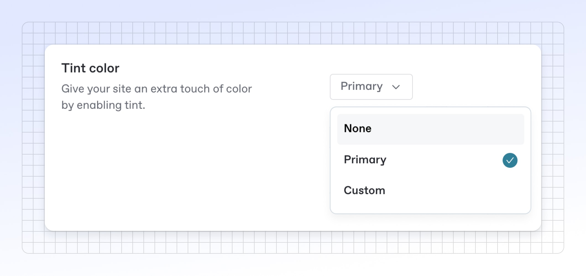<figcaption>
You can find and enable the <strong>Tint color</strong> option in your site’s Customization menu, in the <strong>General</strong> > <strong>Themes</strong> section.
</figcaption></figure>

Your site header also now has a more modern look. It now features translucency, a new search bar, an a more flexible layout across screen sizes — especially on small and tiny screens.

Finally, we’ve updated the link styles of the footer to match those of pages and groups, to give a more consistent look and feel.

<figure>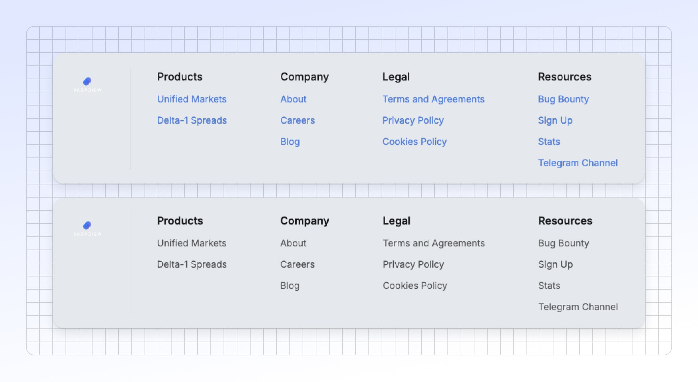<figcaption>
A before and after comparison of footer links in published docs. Links now match your chosen link style for pages and groups.
</figcaption></figure>

### Site-level breadcrumbs

You may have noticed that we now show breadcrumbs at the top of your pages in GitBook. By default it will show the page group title, but for nested pages it will also show the parent pages, including their page icon or emoji. You can click any of the breadcrumbs to jump to that page or the top of the group.

<figure>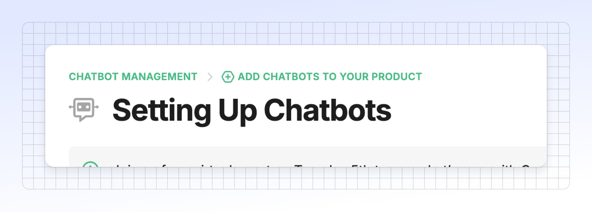<figcaption>
Subpages and pages in page groups will now show breadcrumbs at the top, making it easier to navigate between levels.
</figcaption></figure>

### More consistent tables

This week we’ve released a bunch of improvements to tables to make them more consistent.

* First, tables that are smaller than the page will now appear at the same width when published — rather than increasing it to the width of the block as it did before.
* Likewise, if you set custom column widths by dragging the separator, this will now be respected in the published site.
* We also know that text-wrapping in cells was too aggressive, so we’ve fixed that to make better use of available space.
* On top of that, we’ve updated table styles for published content. The table header will now adopt your [tint color](https://app.gitbook.com/s/NkEGS7hzeqa35sMXQZ4X/manage-your-site/customization#styling) — if you’ve enabled it in your site’s **Customization** screen — and it’ll also respect your selected corner style.


**Note:** As this changes the way tables are sized, we recommend checking your published docs to see if your tables look the way you expect them to look


### Bold, italic, code and lists in comments

You can now use [Markdown](https://app.gitbook.com/s/NkEGS7hzeqa35sMXQZ4X/create-content/formatting/markdown) to apply styling to text in comments. As well as bold, italic and code styling, you can also create bulleted and numbered lists in comments. Plus, we made pasted URLs clickable in comments so you can open them more easily.

<figure>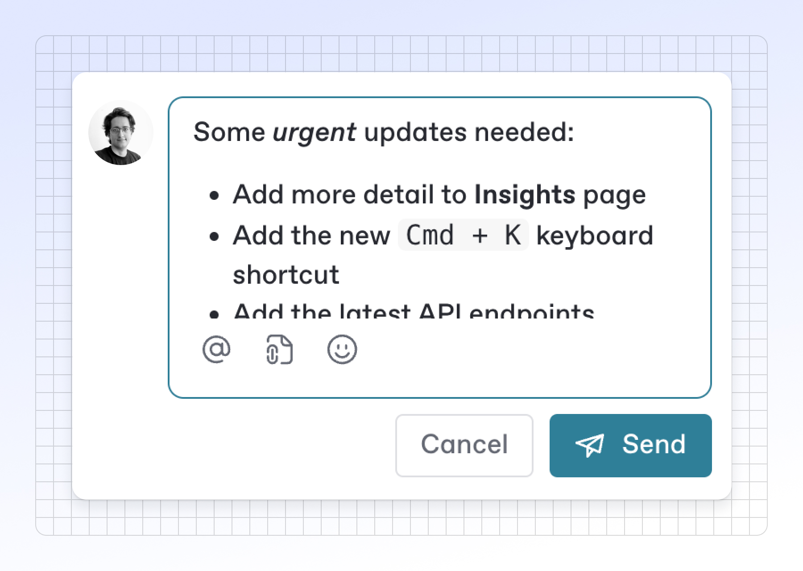<figcaption>
Use Markdown to style text in comments.
</figcaption></figure>

### Our own docs just got better

We’ve spent the last few weeks improving our own docs with new information, improved images, and more details to help you find the information you need faster.

You might also have noticed a couple of new site sections at the top of this page — Guides and Help Center. Guides includes a range of tutorials and advice to help you make your docs the best they can be in GitBook, and Help Center is there to answer your questions and solve issues as you run into them.

Take a look around — we hope you like the changes we’ve made. We’ll be adding to these sections regularly going forward, so stay tuned for more!

Improved

* You can now add image blocks within a stepper block. Before, the images could only be inline, which meant they were small on the page. Now you can add an image block, so it’ll span the full width of the stepper block.
* Your GitBook Home page will now also show sites, as well as spaces — so you can jump to them faster.
* We’ve updated our **Pricing** page within the app to make it easier to browse and to update information to include all our latest features.

Fixed

* Fixed the **Join organization** button after you created an account from a join link. Before it would add you to the organization in backend but not refresh the page — now it works as expected.
* Fixed a bug that hid the names of teams in the teams **Settings** table when you viewed all teams without searching.
* Fixed a bug that could prevent you from updating your account’s email address in some situations.
* Fixed a bug with site customizations that would prevent some settings from applying to all spaces if a single space had overridden that setting.
* Fixed a bug that meant, when hovering over a reaction on a comment, there was no tooltip showing who reacted. Now the user(s) who reacted will appear again.
* Fixed a bug that kept live edits locked in a space even after you unpublished every site it’s linked to.
* Fixed a bug that could prevent you from commenting when viewing changes in a change request.




## Ask AI improvements, a better inline code experience and more

With this release your users can now get AI-powered answers from across all the sections of your docs site, plus we’ve improved inline code blocks, upgraded the page outline, and more.

### Ask AI for all your public docs

When we released site sections in October, we announced that it also unlocked site-wide search for all your content. Now, we’ve also unlocked Ask AI for public docs, so when you or one of your users asks a question in your published docs, it will pull from sources across all your site sections.

### Upgraded page outline

The page outline of the right-hand side of the screen has had an upgrade. It’s now faster than ever to jump between sections on the page with a click, and the highlighted bar on the left of the outline shows all visible sections, so it’s easy to see all the sections that are currently in view.

{% embed url="https://files.gitbook.com/v0/b/gitbook-x-prod.appspot.com/o/spaces%2FPGZZo1PCN4rYgFLPD8Cl%2Fuploads%2FWnm0SfPJJ61lIevVxaIo%2Fpage-outline.mp4?alt=media&token=40de9db9-85c8-4fd9-b12a-b41b6a1090d3?autoplay=1&_loop=1" %}

### A better inline code experience

You can now use backticks to create and close a code block when writing code inline in the editor. Plus, when you are writing in a code block, you can now press the right arrow key to exit it and return to writing standard paragraph text.

### Add a header drop-down without a link

Want to add a drop-down menu to your docs site without linking the menu button itself? Now you can. Simply leave the link section blank in any header link with sub-links and it will act purely as a hover-activated menu.

<figure>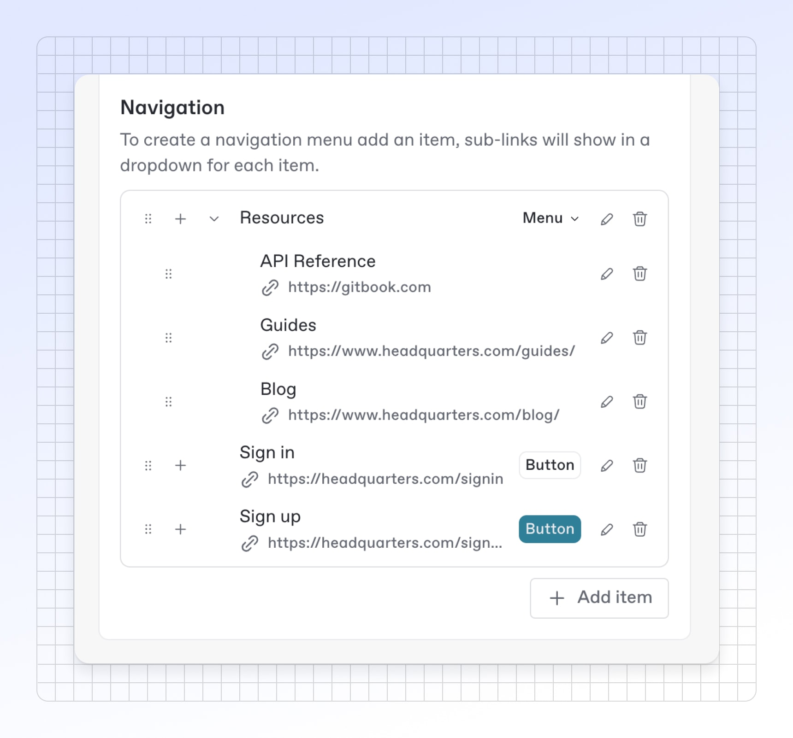<figcaption></figcaption></figure>

### Improved cards

You’ll now see a cover image placeholder in empty cards, making it easier to add header images to all your cards. Plus, we’ve made it easier to add new fields to a card with a button at the bottom of each one.

<figure>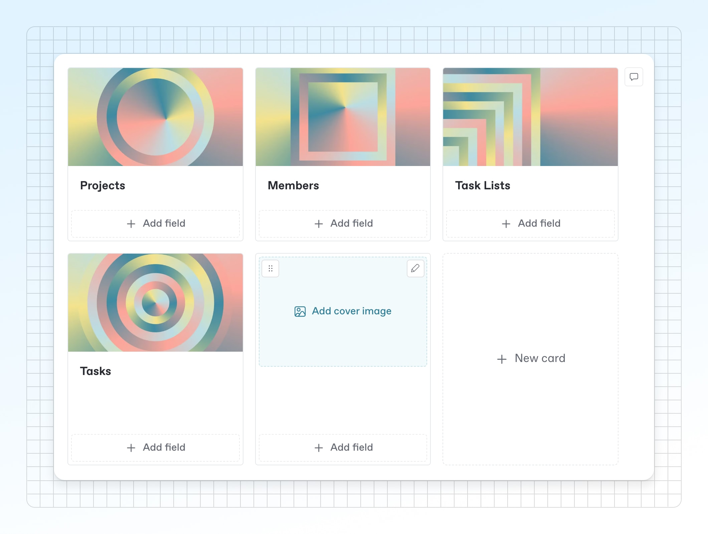<figcaption></figcaption></figure>

### Icons for site sections

You can now add icons to the site section tabs along the top of your docs, making it easier for your site visitors to navigate around your content and find what they need faster.

To enable them for your site, head to **Site settings**, select the **Structure** tab, and you can add icons to your sections using the table.

Improved

* Previously, it was possible to make edits to a change request while it was in the process of merging. This is no longer possible, to avoid conflicts and missing data.
* We’ve improved the emails you get when you’re tagged to review a change request. It’ll now show the name and number of the change request so you have more context before you open it.

Fixed

* Fixed a bug in site insights that meant long page titles would overrun the edge of the highlights box. Now they’re truncated, and you can view the whole title in a tooltip by hovering over the title.
* Fixed a bug that meant inline links would run over two lines. Now they’ll use line breaks in the same way as normal text.
* Fixed a bug that broke drag-and-drop reordering when you’re editing the card. Now you can reorder the card fields by dragging and dropping using the Options button on the left of a field.
* Fixed a bug where hidden table or card fields would still say **Hide field** after they were hidden. They now say **Show field** as expected.
* Fixed a bug in organization settings that could disable the AI features toggle if it was deactivated, preventing you from reactivating it.
* Fixed a bug that meant the sidebar didn’t update when you moved or renamed a space or collection.




## Site redirects, better site structure controls and more

Get more control over URLs, manage your site’s structure more easily, install integrations more easily, and auto-play and loop embedded videos in your docs effortlessly.

### More control over site redirects

Want to migrate content into GitBook, or just have a big reorganization? With the new [site redirect](https://gitbook.com/docs/publishing-documentation/site-redirects) options, you now have more control over where your old URLs point to. Open your site’s dashboard and open **Settings** to find the new controls.

<figure>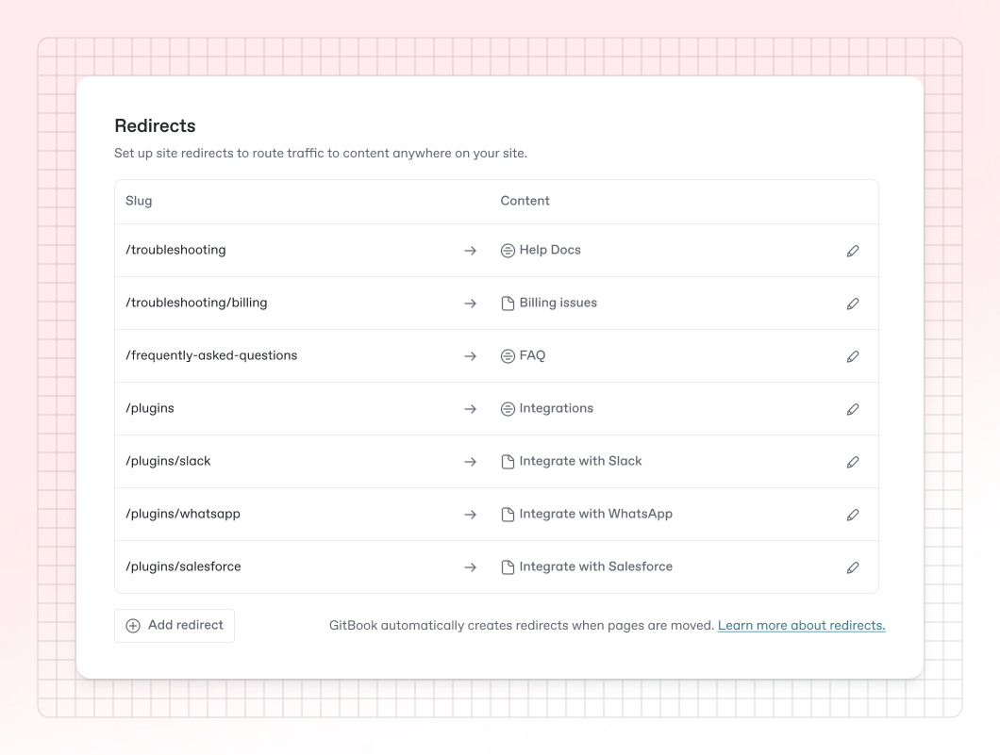<figcaption>
You can set up as many redirects as you like for your site — find it in your site’s settings.
</figcaption></figure>

GitBook [already sets up HTTP 301 redirects](https://gitbook.com/docs/publishing-documentation/site-redirects#about-automatic-redirects) if you move or rename a page, so that the old URL points to the new URL automatically. But you can now create a redirect from any path in your site's domain — which is important to avoid broken links in your docs which could impact SEO.

Head to [our docs](https://gitbook.com/docs/publishing-documentation/site-redirects) to find out more about site redirects.

### Integration improvements

We’ve given our integrations flow a big overhaul to make it easier to browse, install and configure integrations across all your content. Just click Integrations in the sidebar to head into the new page, where you’ll be able to see all available integrations and install them with one click.

<figure>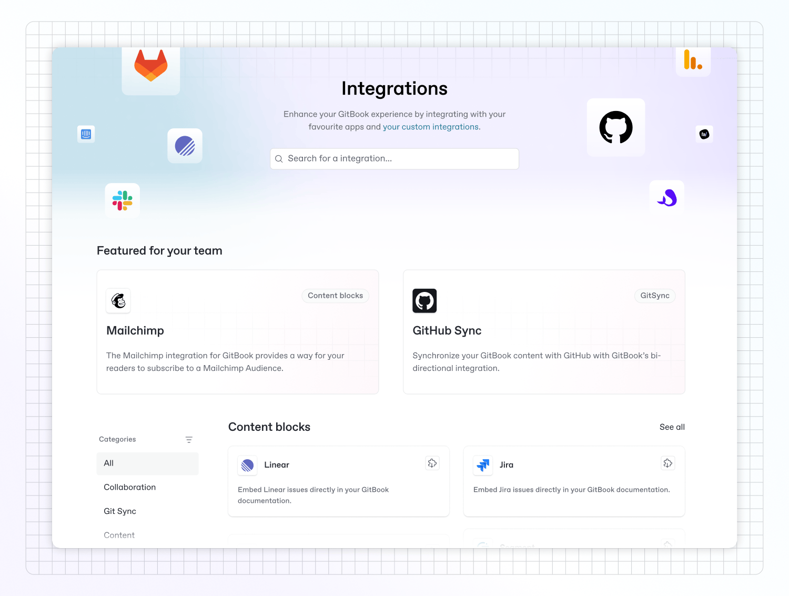<figcaption>
Check out our new Integrations page form the sidebar
</figcaption></figure>

There’s also a new **Integrations** button for spaces and sites, which opens a modal showing just the integrations enabled on that space or site. You can click to configure the ones you need or see more details about them, or install any others that you need.

### Improved site structure controls

Last month [we launched site sections](/broken/pages/i3qecHoIDofsUpNaSkNY#site-sections), giving you all the tools to build your docs out into a content hub for your users. This month, we’ve improved the site structure controls to make it easier to manage your site sections and any [variants](https://app.gitbook.com/s/NkEGS7hzeqa35sMXQZ4X/manage-your-site/site-structure/variants) within them.

We’ve also tweaked the way you rename variants — now, you can only do it from the site structure table, and the option is no longer available in the Customization menu.

Head to your site’s dashboard and open **Settings** to see the new table and test it out.

### **A new option to auto-play and loop videos**

Want your [embedded YouTube and Vimeo videos](https://app.gitbook.com/s/NkEGS7hzeqa35sMXQZ4X/create-content/blocks/embed-a-url#videos) to auto-play and loop in your docs? Just add `?autoplay=1&_loop=1` to the end of your video’s URL when you embed it and your users will never have to hit a play button again — at least in your docs.

### Type symbols faster

We’ve added automatic transformations for more symbols in the editor. You can now add an em-dash by typing `--` , fractions by typing, for example, `1/2` and math symbols such as ⇒ ≥ and ≠ by typing `=>`, `>=` and `!=` respectively.

Improved

* We’ve updated the styling of hint blocks so that they match in both the editor and in published content.
* We’ve made a number of small improvements the site customization area. You should notice an improved overall experience when customizing your site, and a larger preview to show your changes in real-time.
* One particular area of improvement is the color picker — we’ve increased the size of swatches, added a dropper in Chrome, and made some other small changes to make it easier to use and nicer to look at.
* We’ve made some improvements to search in published content. Now, you won't see results from duplicated spaces from different variants on your site, so your users will just get the most relevant results.
* As always, we’ve been making a number of small improvements to Git Sync, to fix bugs and improve performance across the board.

Fixed

* Fixed a bug that meant the ‘last modified’ date of a file didn't update when you renamed or updated it.
* Fixed a bug that prevented you from removing an annotation within the editor — the button works as it should again now.
* Fixed an issue where the GitBook app would crash after creating an organization.
* Fixed a bug in the social preview modal that made the preview itself too small or to large within the window.
* Remove a broken alert in the Customization panel when overwriting customizations for a space.
* Fixed a bug with site sections where deleting the default section didn’t automatically select a new default.
* Fixed an issue where the title of a site variant could be overwritten via customization.
* Fixed a bug that hid spaces or collections in the sidebar if a user had no access to the parent collection.
* Fixed a crash that could happen when using a Mermaid block in the editor.
* Fixed a bug that could cause you to lose content when merging a change request that included content generated by GitBook AI.




## Site sections with global search, sponsored docs for open source and more

Make your docs a content hub with site sections, create and reuse content across a space, add buttons to your site header, use stepper blocks in your content, and even more.

### **Site sections**

<figure><figcaption></figcaption></figure>

You can now add multiple topics, such as separate products or product areas, to a single docs site, and separates them into tabbed sections at the top of the screen, to turn your docs into a content hub. \[Site sections]https://gitbook.com/docs/publishing-documentation/site-structure/site-sections) are available as part of [our new Ultimate plan](https://www.gitbook.com/pricing).

### **Global site search**

When you add multiple spaces to a site using site sections, it also unlocks global search across all those spaces. So your users can use the [search bar](https://gitbook.com/docs/creating-content/searching-your-content) in your site header and find pages and information from any space with a single search.

### **Add buttons to your site header**

Now, you can add primary and secondary buttons to [your docs site’s header](https://gitbook.com/docs/resources/gitbook-ui#site-header), along with the links you could add before. Head into the Customization menu for your site, choose the Layout tab, then add the buttons you need. This is great for things like ‘sign up’ and ‘sign in’ links, for example.

### **Stepper blocks**

We’ve added a new kind of block that’s designed for detailing step-by-step guides — [the stepper block](https://gitbook.com/docs/creating-content/blocks/stepper). You can add steppers to any page, and add almost any other block within a step.

### **Improved insights**

<figure><figcaption></figcaption></figure>

We’ve given our [built-in docs site insights](https://gitbook.com/docs/publishing-documentation/insights) a small facelift. You’ll now see some data trends on each card to show how your content performance has changed over the last week, four weeks, or year — right on your docs site’s overview page. We have more insights improvements to come soon, so stay tuned!

### **Reusable content**

<figure><figcaption></figcaption></figure>

We’re continuing to roll out [reusable content](https://gitbook.com/docs/creating-content/reusable-content) — our new name for synced blocks. You can now create and reuse blocks of content across a space. When you edit the original content, those changes sync across all of its instances — making it easy to update published docs faster than ever.

### **Sponsored sites for open source**

<figure><figcaption></figcaption></figure>

Today, we’re [announcing a new free docs site plan](https://www.gitbook.com/blog/free-open-source-documentation) that’s designed specifically for open source projects. The Sponsored site has all the features you need to publish incredible documentation, including customization, data insights and integrations. It puts a small, relevant ad in the corner of your project’s docs — every view earns you money and you keep the ad revenue. The ads will never track or retarget users — and GitBook doesn’t take a penny from you. Find out all about it in [our announcement post](https://www.gitbook.com/blog/free-open-source-documentation).

### **Copy and paste files between spaces**

Now, when you copy any block that includes a file — such as an image or an API block — and paste in a new space, [the file will come along with you](https://www.gitbook.com/blog/reusable-content#copying-files-and-images-across-spaces). We know this is something you’ve been asking about for a while, and we’re glad we could make it happen without compromizing on GitBook’s file management experience.

### **New pricing for new users**

We’re [updating our pricing](https://www.gitbook.com/pricing) for new users to cover different needs and use cases. Our new pricing structure introduces site plans, which apply to each site you publish. Right now these changes only apply to new customers or new organizations. Head over to our [pricing page](https://www.gitbook.com/pricing) to see our new plans and how they stack up.

Want to hear more about everything we announced this week? [Head to our blog](https://www.gitbook.com/blog) to see all the announcements, teases and reflections on the future of documentation in GitBook.

Improved

* We’ve removed the word ‘you’ from next to your name and email in GitBook, because we figure you probably know who you are.
* Along with adding primary and secondary buttons to your docs site’s header, we’ve also overhauled the UI for adding and managing all the links in your header. Head into the **Layout** tab of the **Customization** menu to check it out.
* While refreshing our pricing, we also updated the in-app pricing table in the **Plans** section of Settings to remove outdated information and add more relevant descriptions to existing features.
* We’ve made a number of small improvements to loading times to help spaces and change requests load faster.

Fixed

* Fixed some inconsistent styling of buttons and text input areas across the UI.
* Fixed a bug that prevented the **Organization settings** option appearing in the Settings menu in some situations.
* Fixed a crash that could happen when the **Page Options** menu was opened on a page with locked live edits.
* Fixed a bug that broke the layout of an integration’s page in the app and made the content hard to read.
* Fixed some bugs that were preventing the GitSync flow from finishing correctly and causing error messages to appear for some users.
* Fixed a bug that hid the **Options** button on a card, so it was impossible to add links or cover images.
* Fixed a bug that was preventing labels in the **Page Options** menu from appearing.
* Fixed a number of other small visual inconsistencies and bugs across the UI.




## Improved diff view, synced blocks and more

We’re adding reusable content to GitBook, along with a better way to view edits in a change request, improved change request previews, and more.

### Synced blocks

<figure>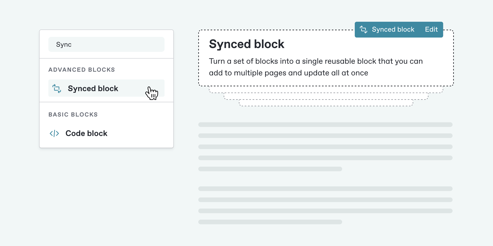<figcaption></figcaption></figure>

We’re slowly rolling out a new way for you to create and reuse blocks across all your content in GitBook — [synced blocks](https://gitbook.com/docs/creating-content/reusable-content).

Create a synced block by selecting and copying it, then add it to other pages from the insert menu. When you update it one place, those changes sync across all instances, making it easy to update published and internal docs faster than ever.

You can view, edit and manage all your synced blocks from a new section at the top of the sidebar.

Synced blocks will be available to everyone on a Pro and Enterprise plan soon.

### Better diff view

This update brings an improved diff view, with a new option to only show edited pages in the table of contents. So if you prefer, you can easily browse changes without scrolling past other pages with no edits.

<figure>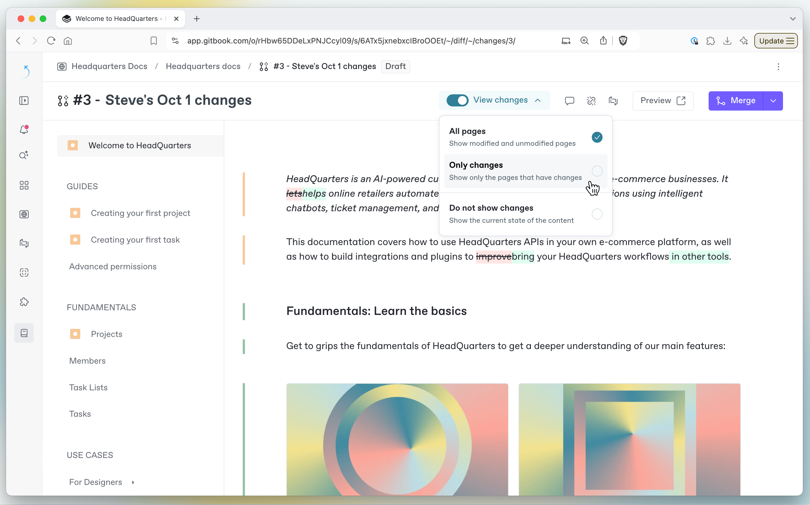<figcaption></figcaption></figure>

We’ve also changed the design of diff view to be more in line with other tools that use diffs. Modified blocks are now highlighted with a colored line, and text is highlighted using a background color rather than a text color to make edits clearer.

Finally, you can now add comments to individual blocks when viewing content with diff view enabled. This should make it easier to review content and add feedback without switching between view modes.

### Insert integrations faster

We’ve updated the insert pallet to include installed integrations for the space you’re editing. Now, when you hit `/` on an empty line, you can scroll or search through the palette and see block integrations that are already installed on the space, making it easier than ever to add them to your content.

<figure><figcaption></figcaption></figure>

Improved

* We’ve improved content previews when you edit published content in a change request. Firstly, it’s more consistent — so after a change, if you reopen the same preview URL it should show the latest content. Plus, we’ve improved the preview toolbar, with more controls and extra detail about the change request you’re viewing.
* You’ll notice a more prominent **Help** button in the sidebar, so it’s easier to view our docs, get support, or find other resources. We’ve also hidden the **Trash** button when the trash is empty, to save space in the sidebar.
* We’ve made it easier to customize your docs sites by adding a **Customize** button right on top of the site preview when you view the site’s overview page.
* We’ve also removed **Snippets** from the sidebar for orgs that weren’t using them, to make more space for the new **Synced blocks** section as we roll the feature out to more users.

Fixed

* Fixed an issue where some organizations on legacy business plans were losing access to site features.
* Fixed a crash that could occur when using diff view when viewing the version history of a space with deleted pages.
* Fixed some major performance issues for spaces with large amounts of content.
* Fixed a bug that stopped team owners from being able to add or remove team members, or change their team’s roles.
* Fixed a crash that could happen when members with creator permissions opened the **Share** modal from a space.
* Fixed a bug that meant moving a task list item to anywhere else in the doc turned the list into an unordered list.




## URLs for multi-variant docs sites are changing

We’re changing the structure of URLs for sites with multiple variants — and we’ve set up automatic redirects to ensure all links still work as expected.

### What’s changing?


**Quick summary:** URLs for docs site variants, such as `docs.mycompany.com/v/fr/` will be accessible at `docs.mycompany.com/fr/`starting 26 September. We are removing the `/v/` to simplify the structure of URLs.


This Thursday, 26 September, we’re releasing a change that will change the URL structure for [multi-variant docs sites](https://app.gitbook.com/s/NkEGS7hzeqa35sMXQZ4X/manage-your-site/site-structure/variants) — i.e. published sites with more than one linked space.

If you’ve published multiple spaces in the same site, you might’ve noticed that variant URLs have a `/v/` between the domain and the slug. This update will remove that to simplify the URL for your readers, and make it easier for people moving their existing published into GitBook.

The result will be that a URL such as `docs.mycompany.com/v/fr/` will now be accessible at `docs.mycompany.com/fr/` .

All depreciated URLs (e.g. `docs.mycompany.com/v/fr/` ) will automatically redirect to the new canonical URLs.

### What does this mean for your content?

In most cases, this should not be a breaking change — you may not even notice it’s happened. The old URLs will still work by redirecting to the new URL.

However, if you’ve set up some custom logic with there URLs, this change may require you to update your setup.

We’re proactively reaching out to customers who we know may be affected by this. But if you have any questions about your custom setup and how this change may affect it, please reach out to our support team — they’d be happy to help.



## Page index controls, better OpenAPI blocks and more

You can now exclude specific pages from searching indexing — for both in-app search and external search engines.

### ✨ New

* **Prevent page indexing** – We’ve added a new control in **Page options** that lets you disable indexing for a specific page. This will opt that page out of in-app content searches, as well as indexing by search engines like Google, Bing, etc. When combined with the **Hide page** option we introduced last month, it’s great for depreciated pages that should still be accessible via URL or the table of contents, or for special pages such as changelog entries, that you don’t want to be indexed by Google but should be accessible to users.
* **A new share modal** – We’ve improved the layout and structure of the share model within GitBook. It’s now split into two clear tabs — one for inviting organization members to the internal version of the page, and another for publishing the page to the web using a docs site.
* **A better trial process** – We’re slowly rolling out an improved trial process that makes it clearer when a trial has started and what you can test while it’s running. And, at the end of your trial, you’ll be able to easily choose whether to keep the features of the Pro plan, or downgrade back to the Free plan.

### ➕ Improved

* We’ve updated our OpenAPI blocks to use the latest version of Scalar. It means faster performance and a better experience when using OpenAPI docs in published documentation. We now also handle some extra aspects of the OpenAPI schema, including mandatory headers and examples with multiple status codes.
* We’ve added Dutch localization support, so you can now set the language of your public documentation UI to Nederlands. Head to your site’s customization settings to update the locale for your docs. A big thank you to Rens Reinders for the hard work on this translation. Check out [our open source repository](https://github.com/GitbookIO/gitbook/blob/main/.github/CONTRIBUTING.md) if you want to add your own localization!
* Our code blocks now support Python, plus we’ve improved syntax highlighting within them and fixed some issues with diffs.

### 🔧 Fixed

* Fixed the SAML configuration modal, which was taking up the full width of the browser window.
* Fixed a bug that would redirect a site’s share links to an internal URL if the site had a custom domain enabled.
* Fixed a bug that prompted you to save changes whenever you switched between tabs in the Customization menu.
* Fixed an issue that meant when deleting a collection, the Cancel button in the confirmation modal wasn’t clickable.
* Fixed a bug that made it impossible to edit the title of a change request if the field was cleared.
* Fixed an issue that removed the **Diff view** option from a merged change request.
* Fixed an issue where searching for members in Members table would reload the entire page, instead of just the table.



## A new space header, bug fixes, and a bunch of smaller improvements

We’ve just released a new space header to make it easier to manage your content, plus a whole host of other smaller changes to improve your experience in GitBook.

### ✨ New

* This release includes a new space header, which makes it easier to navigate through your content, manage your content and edit in a change request. As well as moving a few things into easier-to-reach places and decluttering the header, we’ve added breadcrumbs for your current content at the top of the screen, so you can navigate back to other parent pages and collections with a single click. Plus, the space header now aligned nicely with side panels to make a seamless experience — which our design team are particularly happy about.

### ➕ Improved

* You’ll see some nice improvements to the **Settings** section of the app — particularly the team settings, which now has a better structure that’s more consistent with other settings sections. The lists in the **Members** and **Teams** sections also got an upgrade, making it easier to select individual users, and sort by ‘last seen’.
* We’ve added an **Actions menu** button  to each change request in the **Change Requests** side panel — so it’s easy to archive old ones quickly without having to open each one individually.
* We’ve made a bunch of small improvements to the broken links side panel to make it easier to find and view broken links in your pages. Also, users on the Free and Plus plans can now see one broken link preview in the broken links side panel, so it’s clearer how the feature works and what the icon alert means.
* When you expand or collapse the docs site and spaces sections in the sidebar, GitBook will now remember the setting the next time you open the app — so you can always see exactly what you want, when you want. Plus, jumping to a specific space or docs site will automatically expand the relevant section in the sidebar so you can see it in context.
* You can now filter docs sites by ‘Published’ and ‘Unpublished’ in the sites list, to see only the sites you want. We’ve also added pagination to the list, so you can jump through them more easily if you have a large number of sites.
* We’ve also improved the SSO settings section. Now, you can configure a default team for each SSO provider. So if, for example, you want everyone who signs in with OneLogin to automatically be added to the Engineering team in GitBook, you can do that with a click — along with setting their default role. There’s also a link to our SSO documentation in the UI, so if you need help getting set up you can quickly get some answers.

### 🔧 Fixed

* Fixed a bug that stopped images being directly inserted into a page when you dragged them into GitBook to upload and add them.
* Fixed the spacing at the bottom of the site settings screen.
* Fixed an issue with organization invite links that could show an error to people trying to join your organization using a legitimate invite link.
* Fixed a bug that prevented some blocks from being switched back to normal width from full width.
* Fixed a crash that could sometimes happen when trying to delete a page.



## Page icons, docs site improvements, hidden pages and more

We’ve added new icon options for your pages, made a bunch of improvements to docs sites, made hidden pages and MFA available for everyone, and much more.

### ✨ New

* You can now [choose from a set of 3,600 icons](https://gitbook.com/docs/creating-content/content-structure/page#page-icons-and-emojis) to add to your GitBook pages, to help you add more context to your table of contents. It’s added to the picker when you click next to your page title, alongside emojis. Plus, the picker now remembered your more recently used options so you can quickly add them again. For icons on published pages, you can also change the icon style from the **Customization** menu from five options.
* We’ve improved your docs site’s home screen, with a new header that shows all the useful information you need about your site and some handy links to edit your content or change your settings.
* We’ve added a new flow for creating a docs site — you’ll now be guided through naming your site and choosing between an empty site or some sample content, before you choose whether to publish. It’s designed to get your site set up quickly and is great for new users. And just try clicking the icon on the preview to the right for a little easter egg :wink:
* As part of our ongoing UI improvements, this release makes it easier to navigate around GitBook. The sidebar has new buttons and a neater layout to make it easier to select and expand different sections. You’ll also see improvements in the **Settings** page, and a few other smaller improvements and fixes around the whole app.
* Last month, we told you we were slowly rolling out multi-factor authentication. Now, we’re pleased to confirm that MFA is available for everyone who wants to use it.
* Likewise, the [option to hide pages](https://gitbook.com/docs/creating-content/content-structure/page#visibility) from a space is also available to everyone now. Take a look at our previous changelog update to find out more.

### ➕ Improved

* GitBook will now remember how you logged in last time, and suggest it next time you need to log in — just in case you forget whether you signed up with GitHub, Google or an email.
* When you sign up to GitBook, we’ll now ask you what you want to use it for and offer you relevant options based on that choice.
* We’ve made a number of UX improvements and bug fixes to improve the performance of the files manager. As well as better sorting options and better page switching, you'll also notice that you can click the file preview to open a zoomed version of the file, and click the file to open the actions menu.

### 🔧 Fixed

* Fixed an issue that caused the app to crash when a referenced snippet no longer exists.
* Fixed an issue that meant links to other published content inside a docs site variant had the wrong URL.
* Fixed a bug that prevented you from deleting a block in some situations.
* Fixed an issue that meant you could create multiple change requests by clicking quickly on the **Edit** or **New change request** buttons.
* Fixed an issue with share links in docs sites — viewing the share links for a site would crash the app if there were more than 10 links.
* Fixed a number of visual layouts on mobile, including breadcrumbs, docs site list, insights, and more.
* Fixed an issue that meant when you opened the revision history for a page, it could break navigation on other side panels, such as comments.
* Fixed a layout issue in the notifications menu that would push the text too close to a user’s avatar.
* Fixed an issue that meant resolving conflicts could revert back to their conflicting state.



## Docs sites rollout introduces new publishing flow in the GitBook API

With the introduction of docs sites, several older API endpoints for publishing, share-links, and authenticated access have been deprecated.

### :boom: Breaking changes

With the release of docs sites, certain API endpoints for publishing, share-links, and authenticated access have been deprecated and may no longer function as expected. If you’re affected by this, we recommend the following approach to make the necessary updates:

To modify or retrieve publishing states, share links, or authenticated access settings for a space, locate the associated site and copy its ID. Click the globe icon at the top of the space’s screen to open the site, then copy the Site ID from the URL.

**Publishing**

`PATCH /spaces/{spaceId}` to change the `visibility` or published state of the space now requires the following changes:

* `PATCH /orgs/{organizationId}/sites/{siteId}` to change the visibility of the site.
* `POST /orgs/{organizationId}/sites/{siteId}/publish` in order to publish the site and `POST /orgs/{organizationId}/sites/{siteId}/unpublish` to unpublish the site.

**Share links**

`/spaces/{spaceId}/share-links` and `/spaces/{spaceId}/share-links/{shareLinkId}` now requires you to use `/orgs/{organizationId}/sites/{siteId}/share-links` and `/orgs/{organizationId}/sites/{siteId}/share-links/{shareLinkId}`respectively.

**Authenticated access (publishing auth)**

`/spaces/{spaceId}/publishing/auth` methods should now be used through `/orgs/{organizationId}/sites/{siteId}/publishing/auth`



## Rolling out MFA and the hidden pages beta

This release lets you make your account more secure, adds a beta option to hide pages from published sites, and includes a bunch of other, smaller improvements.

### ✨ New

* We’ve added a new option to hide pages from the table of contents in your published sites — available right now in closed beta. Your users can still access hidden pages via direct link, find them through an on-site search or by asking GitBook AI — and they’re indexed by search engines. This is ideal for content such as FAQs that you don’t want taking up space in your TOC, but you still want people to access if needed. Members of our closed beta can enable hidden pages in the **Experimental features** section of their organization settings.
* We’re improving the security of your GitBook account by adding the option to use multi-factor authentication (MFA) to sign in. We’ve started slowly rolling it to GitBook users, and we’re testing it carefully as we go. Right now, MFA in GitBook supports authenticator apps such as Google Authenticator and 1Password.

### ➕ Improved

* We’ve moved the social preview and page rating options out of the Customization menu and into the site settings, so they’re easier to find and change.
* You can now give your docs sites longer names, as we’ve incresed the site title length to 128 characters.
* Importing content from GitSync now infers the table of contents from files more effectively by removing common prefixes.
* We’ve tweaked the size, position and margins of some of our modals to make them fit better on smaller screens, tweaked the position of the search menu, and made a bunch of other small improvements to the look and feel of the app.
* You can now set Guest as the default role in your organization settings, to make adding guest users easier than ever.

### 🔧 Fixed

* Fixed a bug that prevented you from resetting the privacy policy URL in the customization settings of a published space or site.
* Fixed an issue where changing your trademark on a site wouldn’t show in the customization preview.
* Fixed a bug that was causing the custom domain modal to close unexpectedly after the second step.
* Fixed an issue that could prevent members with Editor permissions couldn’t merge a change request in a space.
* Fixed an issue where page ratings sometimes showed negatively-scoring pages in the ‘Good’ table.
* Fixed a bug that prevented you from typing anything in the text area when you added a link to a card block
* Fixed a bug that caused the organization switcher button to sometimes require more than one click to open.



## New localizations, docs site improvements and more

Support for Brazilian Portuguese and German, a new way to manage and install integrations, and a whole bunch of docs site improvements.

### ✨ New

* We’ve added Brazilian Portuguese and German localization support to GitBook, so you can now use the GitBook app in more languages. Head to your site's customization settings to update the locale for your docs. Huge thanks to Rodrigo Castro and David Burghoff for their hard work on these translations — and their contributions to [our open source repository](https://github.com/GitbookIO/gitbook/blob/main/.github/CONTRIBUTING.md).
* Integrations now live in their own page, accessible through the sidebar. You can view them by category, see which integrations are enabled for specific spaces, and install new integrations — all from the same screen.
* We made a bunch of smaller improvements to the docs sites dashboard, site settings, and the publishing flow in general. And we’re not done! You’ll see more in the coming weeks as we make it the best it can be.

### ➕ Improved

* We’ve made some big improvements to the way you set up custom domains for published content. You won’t see an error if you have a custom domain set up and try to edit it, and the button to edit it now takes you right to the DNS settings — and it’s contextual, based on the state of your domain. We’ve also improved the alerts and the general setup flow to be clearer about what you need to do.
* We’ve changed a lot of the wording in the publishing flow for docs sites to make it clearer when your content will or will not be indexed by search engines, and when share links are active or inactive.
* You’ll also notice improved wording when GitBook AI cannot find an answer to your query, and it’ll suggest some related spaces based on your question.
* When you open the **Share** modal from a space, you can now click **Publishing** to access your publishing options using docs sites.
* You can now quickly visit your published docs site from the **Actions menu**  in the sidebar. Just open the menu and choose **Visit site**.
* We’ve improved our toasts — you can now close them, and they’ll stack behind each other to prevent them taking up too much of your screen if you have multiple triggering at the same time.

### 🔧 Fixed

* Fixed an issue that stopped the **Rollback** button working properly when browsing a space’s history.
* Fixed an issue that prevented SAML providers being added or updated.
* Fixed a bug that meant clicking the **Options button**  in cards and other elements would select the element itself rather than opening the palette or menu.
* Fixed an issue where collections in the sidebar could appear highlighted after being opened or closed.
* Fixed some incorrectly-implemented prefers-reduced-motion checks, and added more checks so those users wont see animations in the UI.
* Fixed a bug that meant pressing **Esc** when a modal was open wouldn’t close it.
* Fixed an issue that stopped a custom domain from displaying immediately after you set it up. It’ll now update in the GitBook UI right away.



## Introducing docs sites, the new way to publish content in GitBook

We’ve revamped the way you publish content in GitBook by bringing all your published content together, along with all the settings and features related to publishing.

### ✨ New

* **Docs sites in the sidebar** – You’ll now see a new Docs sites section of the sidebar. Here, you can view all your published content in one place, quickly move between different sites, and manage each site individually.
* **Insights have a new home** – Insights now live in the **Docs site** area, right alongside each site. This makes it much easier to find insights for the content you want. Simply select a site, then click the **Insights** tab to view page ratings and search analytics for that site’s content.
* **Publish the same space on multiple sites** – If you need to publish different combinations of spaces for different user groups, you can now do it effortlessly. Link a single space to as many sites as you want — you can even customize them all differently to match branding or styling requirements.
* You can read about all these updates and learn more about docs sites in [our documentation preview](https://gitbook.com/docs/publishing-documentation/publish-a-docs-site).

### ➕ Improved

* We now automatically enable GitBook AI features (including search and editing) when you create or upgrade an organization on the Pro plan, so you can immediately start making the most of your plan’s features.
* We’re drawing a clearer line between integrations that are dedicated to publishing and those that are focused on editing or adding content to a space. So now, integrations like Google Analytics and Mailchimp will live alongside sites, while integrations like Linear and Supademo will stay with spaces. Mermaid is now a native block.



## GitBook AI gets a GPT-4o upgrade and new diagramming skills

We’ve migrated our AI to use the latest model, so asking questions and generating content will have even better results — plus we’ve added AI diagrams to our drawing tool.

### ✨ New

* We’ve added GPT-4o to our list of AI models, which means AI search, writing and editing in the GitBook app is now powered by the new and improved GPT model. You should notice faster responses, better understanding of your questions and requests, and an improved output.
* Talking of AI, we’ve just rolled out an update to our drawing tool that can create diagrams from a prompt. Simply describe the diagram you want and hit **Generate** to get an output in seconds. They’re fully editable, too — so you can dive in and tweak the layout as much as you like. As with our other AI features, this is available to everyone on a Pro or Enterprise plan.

### 🔧 Fixed

* Fixed an issue where sometimes matching an invalid URL could return a 500 error and crash the app.
* Fixed some accessibility issues to make the app easier to navigate with a keyboard.
* Fixed an issue where the editor would stay in read-only mode even after you disabled diff view in a change request or when viewing an old version of a space.



## Broken link detection and GitBook AI comes out of beta

Broken link detection for internal links, AI features are officially graduating, plus some other small but useful updates and bug fixes throughout the app.

### ✨ New

* **Broken link detection** – We’ve added a new way to find and fix broken links in your spaces for users on our Pro plan. When you open a change request or edit a space you’ll see a notification that shows broken links. Right now, this shows links to other GitBook pages, but we plan to add more link types in future! [Head to our docs](https://gitbook.com/docs/creating-content/broken-links) to find out more.
* **GitBook AI is coming out of beta!** – After a long period of testing and improvement, today we’re bringing AI search and AI writing and editing out of beta. They’ll now be available as part of the Pro and Enterprise plans. Head to our docs to learn more about how [GitBook AI search](https://gitbook.com/docs/creating-content/searching-your-content/gitbook-ai) and [GitBook AI writing](https://gitbook.com/docs/creating-content/write-and-edit-with-ai) can supercharge your content.

### ➕ Improved

* We’ve improved the rendering speed of drawings in the editor. Your drawing should now appear immediately after you finish editing it, rather than displaying a fallback image while it loads.

### 🔧 Fixed

Below is a list of bug fixes also included in this release:

* Fixed a bug that stopped some embedded content displaying properly in a published space.
* Fixed an issue that meant content was still editable during operations like merging or updating a change request.
* Fixed an issue that meant some search results had an invalid path, which could lead to broken links.
* Fixed a bug that could cause empty inline Math formulas to prevent Git Sync from working properly.
* Fixed a bug that could delete some content if you had two bullet lists and tried to merge them by hitting enter on the top list.



## Small improvements and bug fixes

We’ve made some small but useful improvements to the app, and squashed some pesky bugs as we prep for a bigger release coming soon.

### ➕ Improved

* You’ll now see a placeholder title and a cursor when you create a new H1, H2 and H3 block to make it easier to visualize how you content will look on the page.
* When you open the **Options menu**  on an ordered, unordered or task list block and choose **Delete** it will now delete the entire block, not just the content within it.
* You’ll now see a warning if you try to reload your page when your changes haven’t yet automatically saved.
* We’ve improved the way that file columns render in tables within published content, so your files should look great however you display them.
* We now support GitHub-flavored Markdown in OpenAPI specifications, so you can edit your content more easily through Git Sync.

### 🔧 Fixed

* Fixed a bug that meant the horizontal scrollbar in tables wasn’t usable in some browsers.
* Fixed an issue that could cause the editor to crash when the integrations side panel loaded.
* Fixed various types of OpenAPI schema setups that didn’t parse or displayed incorrectly in published content.
* Fixed a bug that could make diff view persist outside of a change request.
* Fixed a bug that meant anchor links were just linking to the top of the page, rather than the anchor.
* Fixed an issue that caused some images to overflow inside cards in published spaces.
* Fixed a bug which caused the customization preview to be outdated after you hit **Save**.
* Fixed a bug that prevented page feedback not being captured in some cases.
* Fixed a bug that put the cover image in published content in the wrong position.
* Fixed an issue with integration installation permissions that caused an **Install** button to appear on already-installed integrations.
* Fixed an issue that caused published pages with a lot of code blocks to crash.
* Fixed an issue that could cause some embedded content to be cut off on the page.
* Fixed a bug that meant searching in a space that was part of a published collection wouldn’t lead to the right URL.
* Fixed an issue that showed the cookie prompt too often for some cookies.



## Open-sourcing our published documentation

You can now contribute and suggest improvements to GitBook to make published documentation even better.

### ✨ New

* We’ve opened our repository for the published documentation side of GitBook, so you can now contribute. Suggest improvements, submit bug fixes, translate the UI into other languages and more — it’s all possible! Head over to [our contribution guide](https://github.com/GitbookIO/gitbook-open/blob/add/readme/.github/CONTRIBUTING.md) to find out more. And if you want to discover more details about this huge development in the way we make GitBook, head to our blog post!
* We’ve partnered with Scalar to add a **Test It** button to [OpenAPI blocks](https://gitbook.com/docs/api-references/openapi) in your published documentation. Clicking **Test It** will open up an integrated API client, where you can add headers, cookies, variables and more — before sending the request to test your API live.

### ➕ Improved

* You can now press `Tab` when using block selection on multiple blocks — such as lists — and they’ll indent one step.
* We’ve added the Export PDF feature to the **Actions menu**  for your internal content, rather than opening the **Share** modal. This should make exporting a single page or all the pages in a space quicker and easier.
* We’ve improved the loading time for published spaces that include a lot of files — things should now be much speedier.

### 🔧 Fixed

* Fixed a styling issue for grouped icons in search results.
* Fixed some issues with emoji placement and color bleeding.
* Fixed a bug that removed the hint block when adding an unorganized list and then hitting `Enter` to start a new block.
* Fixed an issue with text wrapping in tab titles and table cells.
* Fixed an issue with visitor authentication that could occur when setting a token without an expiration time.
* Fixed an issue that prevented the insert palette opening when typing a `/` in the editor using Firefox.
* Fixed some caching issues with published docs that could cause a long delay before updated content appeared.
* Fixed some issues that were causing unnecessary rate limiting errors and CAPTCHAs for published content.
* Fixed an issue that prevented you from exporting the content of a change request or a previous revision as a PDF.
* Fixed an issue that was causing links between published spaces in published collections to break.
* Fixed some issues that caused some anchor links with upper-case characters to point to the main page URL rather than the section.
* Fixed an issue that could cause the editor to re-render when editing.



## Huge improvements to your published documentation

Your published sites are getting a big update, with a new look, better performance, extra customization, improved OpenAPI blocks, a redesigned PDF experience and more.

### ✨ New

* **A new, modern look and feel** – Your published now have a more streamlined layout that makes information easier to read. You’ll also notice some neat visual improvements across your docs, such as animated hint icons.
* **New customization options** – You can now change the background color of your published page. Choose between a plain background, or subtly change the color to match your theme.
* **Auto-detect light or dark mode** – Your published docs will now automatically detect whether the user’s device is set to light or dark mode, and adjust the theme to match it.
* **Multi-space search** – You can now also search across multiple published spaces — which is great when you have a published collection and want to let users find information across it all.
* Head to [our documentation](https://gitbook.com/docs) to see these new features in action!

### ➕ Improved

* **Improved performance** – You’ll notice improved loading performance across all your published content. Pages should load faster, feel snappier, and generally give your readers a better experience.
* **Better OpenAPI blocks** – The new OpenAPI block displays information like sample code to use an endpoint, the shape of a response, and a detailed list of attributes — all based on your API definition. So you can see all the information you need to use the API at a glance, and it’s easy to navigate between response types and languages for sample calls.
* **A redesigned PDF export experience** – If you allow users to export your published content as a PDF, it’s now faster and easier than ever — and it produces even better results.
* **Improved code block syntax highlighting** – We’ve improved the way syntax is highlighted in a code block, to make code easier to parse on the page.
* **Removed the API method block** – As we mentioned in [our recent announcement](/broken/pages/wzMKpCiu5dbzPKRJIrI7), we’ve deprecated the API method block. Instead, you can now use the insert palette to add the **API Reference** option, which adds a preset selection of blocks to add API information manually.

### 🔧 Fixed

* Fixed a bug that caused flickering in the search window when you used AI search.
* Pressing `Enter` in the title of an expanded block now opens the block. And expandable
* Fixed an issue where some complex emojis were represented by multiple emojis, rather than the single correct emoji.
* Fixed an issue that could make tab headers uneditable.
* Fixed a bug that caused some headers and some avatars to appear too large.
* Fixed a visual bug that occurred when multiple users were on the same page and had the same block selected.
* Fixed a bug in the modal that appeared near the end of the trial that caused text to misalign.



## Edit text with AI, a published docs preview and more

We’ve added the option to edit text with AI, a preview of our new published documentation experience, and a bunch of other nice improvements.

### ✨ New

*   You can now edit existing text on your page using GitBook AI. Simply select some text in a block — or multiple blocks — and click **Edit with AI**

    <picture><source srcset=".gitbook/assets/ai-dark.png" media="(prefers-color-scheme: dark)"></picture>

    then choose the option you want from the menu. It can do things like make your text shorter or longer, simplify language, or even change the tone of your text.

<figure><figcaption></figcaption></figure>

* We have a new published documentation experience coming very soon :eyes: and we’d love your feedback. In the next few days, you should see a pop-up that lets you preview your published space with the new experience. And you can always access it later from the **New!** button in the space’s sub-nav. Give it a try and let us know what you think!
* You can no longer add API method blocks to your documentation. [Read our announcement](/broken/pages/wzMKpCiu5dbzPKRJIrI7) to find out more.

### ➕ Improved

* We’ve improved the look of the automatic emails that GitBook sends, such as when you log in with a magic link. They now match our new brand styling.
* We’ve made some small improvements to the UI of the Home page to make everything easier to read and understand.
* You can now cancel AI writing while it’s generating if you decide what it’s creating isn’t right for you.
* You can choose to enable or disable all GitBook AI features across your whole organization from the **Settings** page.
* When you ask GitBook AI a question in the **Ask or search** bar, the answer will stream for you so you can start reading as soon as it begins to generate.
* When you type ‘Code’ in the insert palette, the code block option will now appear above Codepen in the list so you can easily hit Enter to add a code block. Plus, we’ve moved inline content to the bottom of the insert palette
* When you have multiple people viewing or editing the same space, their avatars will now stack in the top bar and footer to reduce the chance of them pushing other UI elements out of the way.

### 🔧 Fixed

* Fixed an issue that could lose the most recent edits if you quickly merged a change request.
* Fixed an issue where a tooltip wouldn’t disappear, even after navigating away from the button.
* Fixed an issue where changes to the title and description of a page weren’t saved when hitting Merge.
* Fixed an issue that could cause a crash when deleting a single image in an image block.
* Fixed a bug in the inline link editor that caused the link to overflow the text box.
* Fixed the header for change requests to adapt to any title length and screen width.
* Fixed a crash that could happen when you add a new tab to a tab block.



## Deprecating the API method block in favor of OpenAPI improvements

We’re making big improvements to our OpenAPI support and API documentation rendering — so we’re replacing the editable API method block with a standard text alternative.


We’ve heard your feedback, and we’re working on some major improvements to how teams can document APIs in GitBook. It’ll give developers a great reading experience, and provide the right information at a glance. We can’t wait to share this with you in the coming weeks!

However, this also means we had to reconsider how people document API using GitBook today. **As a result, we’ve decided to deprecate the API method block and make some big improvements to our OpenAPI block.**


### :frame\_photo: Context and reasoning

Up until now, you could document APIs in GitBook in three different ways:

1.  **Generating API documentation using an OpenAPI definition**

    This is by far the most advanced and flexible method. Teams can rely on their API definition and easily maintain up-to-date API documentation. We support the OpenAPI 3.0 standard to date. Here are a couple of examples:

    * [Our own developer docs](https://developer.gitbook.com/gitbook-api/reference/users#get-current-user)
    * [Bird’s API documentation](https://docs.bird.com/api/channels-api/api-reference/channel-groups#list-available-channel-groups)
2. **Craft API documentation using traditional blocks**\
   This method gives you full freedom over what to display, and how. While this offers flexibility, you also have to update your documentation manually every time the API changes. Still, some people love documenting their APIs this way!
   * [The Mews Connector API docs](https://mews-systems.gitbook.io/connector-api/operations/accountingcategories)
3. **Manually inserting API method blocks**\
   This method gave people control over what they displayed in their docs, but came with some drawbacks:
   * When the source API changed, someone had to update the block manually
   * The way the API method block rendered was inflexible, which didn’t meet our users’ needs
   * The block simply didn’t offer as much information and space as an OpenAPI block

From our perspective, the API method block was very restrictive in what it could support. It also technically limited our ability to improve the OpenAPI documentation experience to the quality we know you expect from GitBook.

### :date: Timeline

* **Monday 12 February 2024:** You’ll no longer be able to insert API method blocks in the GitBook editor.
* **Monday 4 March 2024:** We’ll automatically transition all pre-existing API method blocks to regular text blocks — read on for more details.

### :robot: What happens to your API method blocks?

On Monday 4 March 2024, we’ll automatically change your API method blocks into other, standard blocks. Here’s how an API block will look after the transformation:

<figure>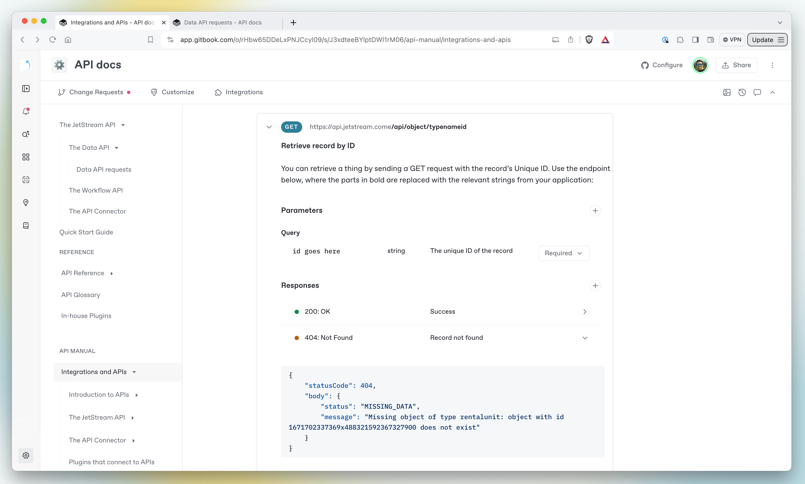<figcaption>
An example of the depreciated API method block.
</figcaption></figure> <figure>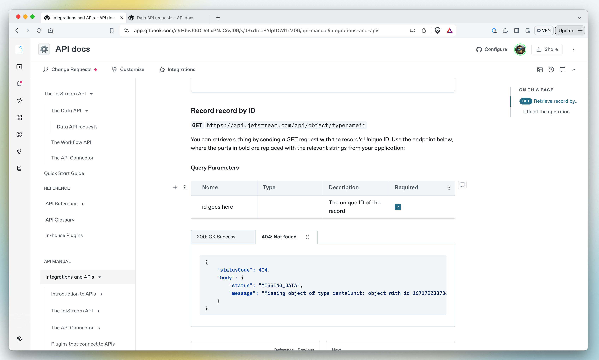<figcaption>
How the content will look after the transition, using standard blocks.
</figcaption></figure>

We’re confident that the editing and reading experience of translated blocks is going to be improved as a result. That said, we think API documentation is even better using OpenAPI definitions instead of manually written text.

### :woman\_technologist: What’s changing with OpenAPI blocks?

[OpenAPI](https://www.openapis.org/) is a standard that helps gather a lot of information about an API and present readers with that information consistently — and automatically. If you use definitions like Swagger, you can easily update the definition file when you update your API, and those changes will instantly sync to your docs, too.

The OpenAPI block improvements that we’re working on right now will show information like sample code to use an endpoint and a detailed list of attributes — all based on your API definition, rather than manual input. It’ll also make it easier to navigate between response types and languages for sample calls and show all the important information at a glance.

We’re testing the updated Open API block [in our own developer documentation](https://developer.gitbook.com/gitbook-api/reference/users) right now, so head over there to get a sneak peek. We plan to release it on the same day as we depreciate API method blocks, but we’ll share news on that soon.



## AI writing assistant, a new home for important updates, and more

We’ve added new ways to create and edit text with AI, plus a new Home section, snippet improvements, and a bunch of bug fixes.

### ✨ New

* GitBook AI can now help you write content, summarize information, and more — right on your page. Simply start a new line and press `Space` to bring up the palette. Try using it to expand on existing content, summarize disorganized notes, translate your text, and much more.
* We’ve added a new **Home** section that highlights important things that might need your attention — such as open change requests, replies to your comments, recent page edits, and other big changes you might want to check out. You can access it from the sidebar.
* You can now use new block types when editing a snippet, including images, files, drawings and API blocks. And we’ve removed the need to save changes you make manually — now, any updates you make will save automatically, just like a normal page.

### ➕ Improved

* Git Sync can now parse table columns that use the **Select** column type, and show that data in GitHub or GitLab.
* We’ve made some small improvements to the **Add new…** menu at the bottom of the table of contents and the resulting modals — including clearer UI copy and some nice new icons.
* You should see a big improvement in the speed and reliability of Git Sync, as we’ve made some backend changes that help things run more smoothly.

### 🔧 Fixed

* Fixed an issue that stopped a space’s footer inheriting customization settings from its collection.
* Fixed the icon in the tooltip for an inline link, which was displaying too small.
* Fixed a bug that could cause a RangeError when adding math formulae to a space with Git Sync enabled.
* Fixed some bugs that prevented you from dragging and dropping items in a collection in list view or grid view



## Small improvements and bug fixes

We’ve shipped some small but useful improvements to the app, and squashed some pesky bugs.

### ✨ New

* We’ve added a discovery date to the Content audit panel, so you can see when a conflict or duplicate was found.
* Admins can now remove themselves (and other admins) from an organization, as long as they’re not the only remaining admin.
* There’s a new Markdown shortcut to add a divider to your page. Type `---` and on an empty line and hit `Enter` to add a divider.

### ➕ Improved

* Added a notification to show if there’s an error when duplicating a space.
* You can now update or remove a space’s emoji using the API.
* When you’re viewing your space’s user ratings in the Insights panel, you can now jump to a listed page by clicking it.
* You’ll now see a maximum of three user avatars in the footer, so if multiple people have edited a space recently it won’t fill the width of your content.

### 🔧 Fixed

* Fixed some graphical issues with diff icons and GitBook AI search answers.
* Fixed an issue where merging a change request just after editing the content could occasionally cause the merged revision to be out of date.
* Fixed an issue that sometimes caused an invisible comments button to published content, and resulted in duplicated URLs.
* Fixed a crash that could sometimes occur when viewing the spaces or teams a user was a part of in an organization.
* Fixed an issue where published content using links in headers could cause visual flashing.
* Fixed an issue where snippets and comments didn’t save.



## Turn snippets into docs, change your public docs font and more

We’re making it even easier to turn knowledge into documentation in your knowledge base, adding a free customization option for everyone, and much more.

### ✨ New

* You can now easily turn snippets into documentation pages in your knowledge base! So when you’ve saved a technical guide from a really helpful thread in your #engineering Slack channel, you can now add it to exactly the right space in GitBook, for everyone to find and use.

{% embed url="https://files.gitbook.com/v0/b/gitbook-x-prod.appspot.com/o/spaces%2FPGZZo1PCN4rYgFLPD8Cl%2Fuploads%2Fh9zEkh1Fpu960Qkl2E1p%2Fsnippets-to-docs.mp4?alt=media&token=b39f1653-4783-4e2e-90c8-98b3b03312c9" %}
You can now turn a snippet into a page in your docs — it’ll instantly create the page, or automatically open a new change request if your space has locked live edits.


* You can now reference snippets in your documentation, using either the **new snippets block**, or using a # style mention. So even if you don’t want to turn your snippet into it’s own page, you can still point people toward it when you need to.
* We’re making it easier to set up visitor authentication for your published documentation without needing a custom backend. Instead, you can install integrations that serve as the backend for authenticating users and generating JWT tokens. We’re testing this with selected customers right now, and will open it up to all Pro and Enterprise organizations soon.
* We’ve restored Inter as the default font choice for public content, as Inter has better support for more languages than Favorit. You can switch your font back to Favorit in the Customize menu if you prefer — and we’ve made it available to everyone, no matter what plan you’re on.

### ➕ Improved

* You can now quickly create a snippet using the **+** button next to Snippets title in the sidebar.
* We improved support for lists in search results when using GitBook AI search.
* We’ve also improved the quality of suggested questions in GitBook AI search so that it uses actual content within the organization.
* We’ve updated the template screen to reflect the new brand colors.
* The Git Sync side panel will now hide while its progress model is showing.
* Comments on deleted pages now appear at the bottom of the list of comments.
* Readers in your organization can now access and read snippets too.
* We’ve updated our primary colors in the app to improve color contrast and accessibility.
* You can now edit a collection’s title and description, or delete a collection using the API.

### 🔧 Fixed

* Fixed an issue that caused the search modal to change widths as you typed.
* Fixed an SPI error that occurred when you submitted a change request with no reviewers.
* Fixed an issue where changing the title would cause focus to move away from the page.
* Tidied up some text inconsistencies in the app following our recent font change.
* Fixed a bug that caused a slug not to be generated properly when a Git Sync import didn’t include a SUMMARY.md.
* Fixed an issue that caused the content Change Request side panel to overflow into the header when it overflowed.
* Fixed a bug that could cause some admin rights to be overwritten when an admin visited an invite link.
* Fixed direct links to relations in the Content audit section of Insights.
* Fixed an issue that could show an error when modifying header links in published content using the Customize menu.
* Fix an issue where badly parsed math blocks could cause a Git Sync failure or an app crash.
* Fixed a bug that meant the error screen didn’t respond to light or dark mode.
* Fixed a bug that caused the footer not to show in published collections.


