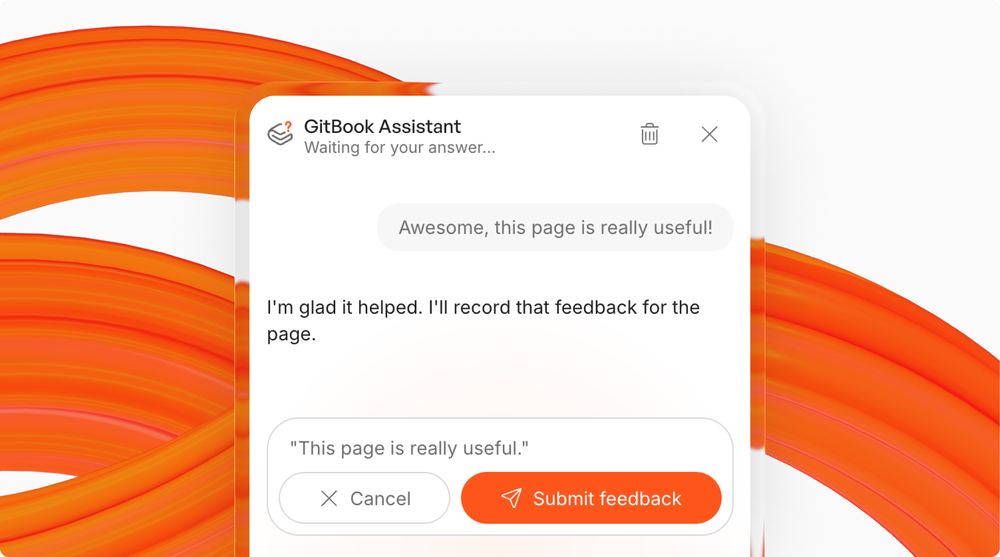

# Product updates



## New! Full site support with Git Sync



You can now [sync an entire docs site with a single Git repo using Git Sync](https://gitbook.com/docs/docs-as-code/git-sync). This doesn’t just make it easier to import and edit your docs using docs-as-code workflows — it also pairs with new site-level permissions to improve agentic workflows.

Previously, Git Sync was only possible at a content level: you could sync individual spaces, but not your entire site. This meant adding more content required the manual work of creating a space and setting up Git Sync in the right folder.

Now, you can set up Git Sync for a whole docs site, with all the content in a single repo. Each site maps to a directory in your file structure, and the Git Sync process is now focused around `gitbook-docs.yaml` .

If you’re setting up a new site for the first time, the app will help you set up Git Sync from your site’s sidebar — either pulling from existing content, or creating a new site and building the `gitbook-docs.yaml` file using your coding agent.

If you want to switch your existing space-level Git Sync to site-wide Git Sync, you can manage the migration from your site dashboard. The app will guide you through the process, with any spaces switching to the site’s repository that you choose. You have control over the configuration and content mapping, so you can manage the site content and structure however you like.

Head over to [our Git Sync docs](https://gitbook.com/docs/docs-as-code/git-sync) to find out more, or check out [our guide to site-wide Git Sync to set it up for your own docs](https://app.gitbook.com/s/LBGJKQic7BQYBXmVSjy0/editing-and-publishing-documentation/how-to-sync-your-entire-docs-site-with-a-git-repository).



## Add external links to your site navigation, plus list spaces multiple times

You can now add links to external pages to your docs site’s top nav, giving you more ways to promote important pages outside of your docs.

You can also now hide a section from your site navigation, so readers only see the sections you want to show.

We’ve also made it possible to include the same GitBook space in multiple places within the navigation. So if you want to list some content in two drop-down [sections](https://gitbook.com/docs/manage-your-site/site-structure/site-sections), you can now do that — without needing to duplicate the content internally and maintain both versions.

This is great if your nav is organized by use case or reader persona, but you have content that’s relevant to everyone. It’s also useful for [versioned documentation](https://gitbook.com/docs/manage-your-site/site-structure/variants) when there haven’t been any documentation changes.

All three of these options are available now in [the **Site structure** page](https://gitbook.com/docs/manage-your-site/site-structure), accessible from the left sidebar.

### Improvements

* AI agents connected to GitBook over MCP can now list a site’s topics and subtopics, so they can filter Ask AI questions, answers, and stats by topic more easily.
* The audit log now records SAML provider and organization SSO enforcement changes.

### Fixes

* Fixed an issue that clipped charge axis labels that were in the millions.
* Fixed an issue that prevented large, unpublished spaces from indexing, which meant updated pages weren’t searchable
* Fixed a bug that meant audit logs by a custom date range could include or miss a day depending on your timezone.
* Fixed an issue with column blocks that changed their background color when a user hovered over one.



## New site-level permissions for controlling site management for humans and agents

We’ve rolled out new [site-level permissions](https://gitbook.com/docs/manage-your-site/site-permissions) that give you more control over what people on your team can do in a live site.

These changes are essential as teams begin rolling out more agentic workflows to automate documentation management. The new controls give you the option to set permissions across an entire site, and choose who — whether they’re editing manually or using agents — can make edits, review, and publish changes to your site.

**A quick summary of what’s new:**

* Site-level permissions let you choose who can complete site-based actions and who can only edit site content
* Editors can edit content in change requests and add draft sections to a site.
* Reviewers can edit content and merge change requests and add draft sections to a site
* Creators can do everything a reviewer can, plus they can restructure the site: add, publish, rename, reorder, and delete sections and variants
* Admins can do everything across the site and the wider organization

Read more in [our site-level permissions documentation](https://gitbook.com/docs/manage-your-site/site-permissions).

### Improvements

* We’ve simplified the [AI settings for your site](https://gitbook.com/docs/ai-for-your-readers/ai-search) to a single AI Assistant toggle. You can enable or disable it, and when you enable it you can choose the AI style — either the full Assistant or a more basic AI search.
* The version history now contains more context in breadcrumbs along the top of your window. They now show the title and number of the original change request, GitHub pull request, or GitLab merge request. They also consistently show a **Merged** badge, along with the active section or variant path on the related site.
* You can now choose to [add a separate font for H1, H2, and H3 headings](https://app.gitbook.com/s/NkEGS7hzeqa35sMXQZ4X/manage-your-site/customization/icons-colors-and-themes#font-family) on your site, giving you more control over the look and feel of your published. You could combine a serif font for headings with a sans-serif font for the body copy, or any other combination you like.
* We’ve made the **Home** button at the top of the sidebar easier to find and more clearly labelled. It’s now easier to jump back to your main home screen to view all your sites and content.
* Deleting a docs site now requires typing the site’s title to confirm deletion to ensure the action isn’t completed by accident.

### Fixes

* Users searching your docs will now see each page’s description in the search results so page links can show page-level context.
* Fixed a bug that meant requesting a review from GitBook Agent that was required by a merge rule could sometimes skip the review but still pass the merge rule check.
* Fixed an issue that meant some SVG images weren’t displaying when a browser requested a jpg or png version of the image.
* We’ve also added support for avif images and a few other unsupported image types.
* Style guide reviews are no longer offered on sites with more than three spaces, to avoid creating an overwhelming number of change requests for large sites.



## Improvements

* Site creators can add content and structure without site administration access. Give authors access without handing over settings.
* Conditional content works inside table cells and card fields. Adapt a single row or field without duplicating the whole block.
* Site analytics can be filtered and grouped by sign-in state with the new **Authenticated visitor** dimension.
* The Content API supports cross-space links using the `app.gitbook.com` syntax. Link between spaces programmatically.
* Linking a Jira issue to a change request labels the issue and adds a link back to GitBook. Removing the link undoes both changes.
* The OAuth consent screen for a published site’s MCP server has been redesigned. Readers connecting an AI client see a screen that matches your site.
* Published sites expose AI agent detection and robots directives in Markdown. Control what agents can read.
* You can pick a home page for site sections and variants. The actions menu on a site item can edit the navigation item directly.

### Fixes

* Fixed an issue where exact searches couldn’t match long identifiers. Searching for a full function or constant name now finds its page.
* Fixed an issue where a very large space could disappear from regular and AI search. This happened when indexing ran out of memory near completion.
* Fixed an issue where analytics charts combined a day with no traffic into adjacent days. Charts also no longer end on an empty bucket for an in-progress period.
* Fixed an issue where analytics reports opened on a narrowed audience. This silently excluded crawler and agent traffic.
* Fixed an issue where connecting to an authenticated site’s MCP server could return an “Invalid client” error. An in-use OAuth client was cleaned up as expired.
* Fixed an issue where a Git Sync export failed with “A required object was not found in the repository.” This happened when a commit reused a file that export hadn’t regenerated.
* Fixed an issue where the sidebar collapse toggle did nothing in the editor on pages using a background cover.
* Fixed an issue where GitBook Agent replies in Slack, Linear, and GitHub didn’t link the change request it created.
* Fixed an issue where the spacebar was swallowed in the site search bar. The search input also lost focus before hydration finished.
* Fixed an issue where keyboard shortcuts didn’t work on non-QWERTY layouts.
* Fixed an issue where a table-of-contents entry wasn’t highlighted for the active page or section. A page group’s first item could also be cut off after navigating.



## Import existing docs with GitBook Agent

Bringing existing documentation into GitBook is no longer a one-person job. Point GitBook Agent at a documentation website, and it imports the pages into your current change request. You can also attach files directly, including ZIP archives containing Markdown, HTML, or DOCX.

Imports are shared, not siloed. Everyone with access to the space or change request sees every import, whether they open it after a reload or from another device.

**What’s new:**

* **View imports panel:** See running and past imports at a glance, each with its source and progress. Stop any import from the panel.
* **Ask what an import brought in:** GitBook Agent can tell you exactly what landed: the pages, their titles, and their sources.
* **Safer merges:** Merging is blocked while an import is still writing. A change request can’t be merged with content still missing.

## Organization audit logs for Enterprise, in Beta

Enterprise administrators can review a chronological log of organization activity. Filter it by action, actor, and date. Deep links open individual events.

Site structure and customization changes are recorded alongside other activity. You can trace a published change to the person who made it.

The same data is available through a read API. You can pull audit events into your own tooling.

### Improvements

* Jira issues labeled `gitbook` now sync into GitBook. A labeled issue opens a change request and keeps its content up to date as the issue changes. GitBook posts a comment and backlink to Jira.
* Adaptive content conditions can branch on `visitor.type` (`human` or `agent`). Serve agents a different page version from the one people read.
* The editor warns you when your changes aren’t reaching GitBook. You can recover your work before it’s lost.
* A site context connection that fails to sync names the failure. It states whether you need to fix it or GitBook is retrying.
* Search ranks exact-phrase, page-title, and section-heading matches above looser body matches. The page you name appears first.
* Site analytics can be grouped by day of week and hour of day. See when readers access your docs.

### Fixes

* Fixed an issue where a brief network problem could permanently stop changes from reaching GitBook. Nothing on screen indicated the problem. You had to reload the page to recover, which could lose written content.
* Fixed an issue where live updates could silently stop until you reloaded. After a network drop or waking from sleep, import progress, Git Sync status, and teammate changes could freeze on stale data.
* Fixed an issue that made large pages slow to open and edit. Comment hover state did work proportional to the square of the page’s block count.
* Fixed an issue where large ZIP archive imports could time out partway through. Content the AI enhancer couldn’t process no longer fails the whole import.
* Fixed an issue where import progress restarted instead of counting up. A 20-page archive could show “1 out of 10,” climb to “10 out of 10,” then restart.
* Fixed an issue where updating or merging an old change request could export a page outside the configured repository folder. This could break links to that page.
* Fixed an issue where links to API reference pages generated from an OpenAPI spec broke after Git Sync in spaces with more than one spec.
* Fixed an issue where renaming content from within a site renamed the underlying space. The site name now updates as expected.
* Fixed an issue where submitting a review left the reviewers list unchanged until reload. **Submit review** now shows whether you’ve approved or requested changes.
* Fixed an issue where you couldn’t click the comment button on an Expandable block.
* Fixed an issue where page-level search results linked to a section anchor instead of the page top.
* Fixed an issue where text was unreadable on pages with background covers in Firefox and iOS Safari.



## One-click MCP connectors and a redesigned Developer tools screen

Connect your site’s MCP server to an AI client in one click. The redesigned **Developer tools** screen puts MCP first.

Its tabs are linkable and persist after refresh. MCP also has a direct link in the organization sidebar.

<figure><figcaption></figcaption></figure>

## A more capable Content API

The Content API gives you more control when creating and linking pages. Set a page’s slug when you create it, and use temporary refs to link pages before they exist.

* The creation response now returns a page’s full content and metadata which supports round-trip workflows.
* The new `insert_files` action adds images through the API. Use a URL or inline base64 content.
* The API also accepts `.md` and `.mdx` slugs, relaxes page title requirements, and adds a compatibility flag. The flag protects existing workflows from future changes.

### Improvements

* Cancel or reactivate your subscription from the billing page. Cancellations take effect after your longest-running billing item ends.
* Give a button a select action in the editor. Choose an available slug or enter your own value.
* Integration blocks work inside Hint blocks. Add live integration content to a callout.
* The Broken URLs report groups every URL variant into one row. This includes query strings, fragments, trailing slashes, and share links. Embed views no longer appear.
* Git Sync configuration shows connected repository details. Confirm the repository before you save.
* Search indexing is faster and more reliable for very large spaces. This includes pages that previously exhausted the indexer’s memory.
* Published sites load less JavaScript up front. The syntax highlighter is split out, and Mermaid diagrams load lazily.
* GitHub exports check file sizes before export. Files over GitHub’s 100 MiB limit point to Git LFS.
* Bulk email invites are limited to 10 at a time. The dialog guides larger imports and clarifies SSO restrictions.
* Crawlers can’t access your site’s ask endpoint. Your crawl budget focuses on your pages.
* Visitor tokens revalidate without a redirect. Readers stay on the same page on authenticated sites.



## Your docs can now collect feedback from readers and AI agents

<figure><figcaption></figcaption></figure>

When page feedback is enabled, GitBook Assistant can submit it on a reader’s behalf. If a reader seems frustrated or reports a page problem, the Assistant can offer to log their feedback. This keeps feedback from getting lost when the conversation ends.

AI agents browsing your site can submit agent feedback. Published-site MCP servers include a `sendFeedback` tool for reporting unclear, outdated, or missing content. Agent feedback identifies issues the agent finds while working through your docs.

Both types of feedback appear on in your [site’s analytics](https://app.gitbook.com/s/NkEGS7hzeqa35sMXQZ4X/analytics/insights) under page feedback.


This feature is rolling out slowly across GitBook organizations. If you don't see it yet, it isn't enabled for your organization.


## Ask questions through your site’s MCP server

Published-site MCP servers (with AI enabled) now also include an `askQuestion` tool that AI agents can use to ask questions about your documentation and get grounded answers back. It complements the `?ask=` query parameter that markdown routes have supported for a while, and supports the same `goal` property — so agents can tell GitBook what they're ultimately trying to accomplish and get answers tailored to that goal.

## Custom instructions for GitBook Assistant

Site admins can now give the AI Assistant custom instructions from **Customization → AI Assistant**. You can set the Assistant’s tone of voice, and add product-specific knowledge and terminology so that it consistently matches your wider style.

This means you can refine the tone and knowledge of the Assistant — but these instructions will never override the Assistant’s scope boundaries or guardrails.

### Improvements

* When you use a Slack channel for support, GitBook Assistant now replies directly to the customer with its answer, rather than showing its thinking along the way.
* You can now queue messages to send to the Assistant while it’s still answering. Queued messages appear at the bottom of the screen — where you can clear them if you change your mind — and are sent automatically once the Assistant finishes its current reply.
* You can now attach any type of file to GitBook Agent — Markdown, Word documents and more — so you can hand it reference material in whatever format you have.

### Fixes

* Fixed a bug that meant disabled or removed organization members could still be requested as reviewers on a change request.
* Fixed an issue that meant you couldn’t comment on the title of an expandable block, only the text inside it.
* Change requests with conflicts now explain why the **Changes** tab is unavailable instead of silently returning to the **Overview** tab.



## Meet the GitBook CLI

The new [GitBook CLI](https://app.gitbook.com/s/NkEGS7hzeqa35sMXQZ4X/docs-as-code/gitbook-cli) (`@gitbook/cli`) brings your GitBook content and organizations to your terminal.

It wraps the GitBook API as a set of commands, so you can list organizations, inspect spaces and pages, ask questions against your docs, and build and publish integrations — all without leaving the shell.

And it’s built for agentic workflows as much as human ones. Machine-readable `--json` output and a predictable command structure make it easy for AI coding agents like Claude Code, Codex, and Cursor to run commands, parse the results, and chain them together as part of a larger task.

Install it globally with `npm install @gitbook/cli -g`, then run `gitbook login` to get started — or head to [the CLI docs](https://app.gitbook.com/s/NkEGS7hzeqa35sMXQZ4X/docs-as-code/gitbook-cli) for the full guide.



## A more powerful page cover system

We’ve added two new options that make page covers a much richer design tool for your docs site.

<figure><figcaption></figcaption></figure>

First, you can now set a page cover to display as a background image behind your content — with control over the color of the text displayed on top. That means your header can act more like a background for the top of your page.

We’ve also added the option to enable a radial mask on your page cover, creating a seamless transition from the header into your content.

Combined with the existing positioning and cover height controls, these options add up to a powerful system for enriching your pages.

### Improvements

* If you set a tint color that is very light (or very dark in dark mode), we’ll now use it as your site’s background — giving you a nice off-white background instead of the default light gray.
* You can now choose the size of buttons and inputs on your docs site. The default (large) stays the same, but you can make them smaller — especially useful if you want to fit more recommended questions on a single row.
* When readers navigate between sections on your published site, the table of contents now shows a handy back button so they can jump straight back to the section they were browsing.
* Prompt blocks now support an expanded mode, giving your prompts more room on the page.
* GitBook Agent will now bias more toward action, and will always be explicit if it’s waiting for user input.

### Fixes

* Fixed an issue that meant you wouldn’t see any progress when requesting a review from GitBook Agent. You’ll now see its work in the Agent window while it reviews.
* Fixed an issue that meant the GitBook Agent button didn’t appear when viewing a change request from the change request list.
* Fixed a crash on the change request screen that could happen when a contributor account was deleted, a linked Jira issue couldn’t be loaded, or a page diff failed to render.
* Fixed an issue that meant a space’s History list wouldn’t show page or computed content changes.
* Viewing an unchanged page in a split diff no longer renders the same content twice — the right-hand column now shows “This page did not change” instead.
* Fixed an issue in the change request overview that showed same-page heading links as broken.
* Fixed an issue with diff view that meant changes to a nested page didn’t show the page as being edited within a change request.
* Fixed an issue where Agent would intend to link to a page but wouldn’t include the URL because it was from a docs site that isn’t publicly visible. Now the Agent explains that it’s not accessible.
* File imports with no importable Markdown, HTML or docx files now fail with a clear error message.



## Meet the sites-first GitBook



We’ve redesigned the GitBook app around what you actually ship: your docs sites.

You now start at your organization **Home**, and each site’s content, structure, settings, and tools live together in one sidebar. Content in a site lives in [sections](https://app.gitbook.com/s/NkEGS7hzeqa35sMXQZ4X/manage-your-site/site-structure/site-sections) — what you knew as spaces, now part of their site — organized into groups when your docs grow. And the new [All content ](https://app.gitbook.com/s/NkEGS7hzeqa35sMXQZ4X/create-content/content-structure/all-content)screen gives you one place to find everything in your organization, including content that isn’t part of a site yet.

If your organization hasn’t made the switch yet, enable the new experience in the app. Your content, sites, and settings come with you exactly as they are.

Read about [what’s changed](https://app.gitbook.com/s/NkEGS7hzeqa35sMXQZ4X/getting-started/sites-first), or jump into the [quickstart](https://app.gitbook.com/s/NkEGS7hzeqa35sMXQZ4X/getting-started/quickstart) to learn more.



## Introducing style guides

You can now create a [style guide](https://app.gitbook.com/s/NkEGS7hzeqa35sMXQZ4X/create-content/styleguide) for your docs: a dedicated space for your team’s writing rules that GitBook Agent enforces whenever it writes, edits, or reviews content.

Start from the Starter, Google, or Microsoft template, import a guide you already have, or share one style guide across your sites. When content drifts from your rules, the Agent flags the exact rule it breaks and suggests a ready-to-paste fix. You can also request a full style guide review right from a change request.

Style guides are rolling out gradually in early access. [Learn more in the style guide docs](https://app.gitbook.com/s/NkEGS7hzeqa35sMXQZ4X/create-content/styleguide).



## GitBook Agent: broader context and hidden-page editing

GitBook Agent can now read other spaces and your site’s structure while it works, so its suggestions stay consistent with the rest of your docs. It can also create and edit hidden pages directly, without you needing to unhide them first.

## New connections for HubSpot, Front and more

You can now connect Freshdesk, Front, HubSpot, and Zoho Desk as context sources, so GitBook can ingest your completed support tickets alongside your existing docs, and suggest improvements based on customer conversations.

### **Improvements**

* Change requests now show reviewers directly in the sidebar and surface linked Jira issue status — so you can track review progress without leaving the page.
* You can now create a link with Cmd+K even when no text is selected, making it faster to add a url on the fly
* You can now use a carousel layout for card tables, helping you present grouped content in a more compact view.
* Page cover backgrounds now support masks, giving you the option to customize how your cover images are cropped and shaped.
* You can now open your site directly from the left nav, giving you a faster way to jump straight to the live page.
* We’ve optimized Git Sync to handle larger commits without timing out, so bigger changes sync reliably.
* You can now skip the onboarding walkthrough, letting you jump directly into your new docs if you’re keen to get moving.

### **Fixes**

* Fixed an issue that meant copying a page could drop its sub-pages’ content.
* Fixed an issue that showed the wrong diff when updating a change request.
* Fixed an issue that meant Git Sync would skip imports when a project directory started with a leading slash.
* Fixed an issue that meant relative links and Git-style markdown links didn’t resolve correctly through the content API.
* Fixed an issue that could crash the editor when turning content into a link.
* Fixed an issue that caused the link palette to hang on sites with many spaces.
* Fixed an issue that could leave the GitBook Agent stuck or cause it to lose messages.
* Fixed an issue that could leave some users missing site permissions after an update.
* Fixed an issue where search results over-favored the current space.
* Fixed an issue that allowed deleting a space that was still in use as a styleguide.
* Fixed a security issue that could allow server-side request forgery (SSRF) through the OpenAPI spec importer.
* Fixed an issue that could prevent the GitBook Agent from correctly checking site access permissions.



## Introducing GitBook MCP 

<figure><figcaption></figcaption></figure>

GitBook MCP gives AI agents tools to work across your GitBook content and workflows. Use Claude Code, Codex, Cursor, or another MCP client to create sites.

Agents can draft content, edit pages, open change requests, and restructure your docs.

<a href="https://app.gitbook.com/s/NkEGS7hzeqa35sMXQZ4X/getting-started/ai-documentation/gitbook-mcp" class="button primary">Discover the GitBook MCP</a>



## Private agent conversations

Agent conversations in change requests can now be marked private, so work-in-progress discussions stay visible only to the people who need to see them.

## Team management in site members

You can now manage teams and apply team-level role overrides directly from the site members screen, so access control for a specific site doesn’t require switching to org-level settings.

## Git LFS support for Git Sync

Git Sync now supports Git Large File Storage (LFS), so repositories that use LFS for binary assets or large files can sync with GitBook without manual workarounds.

### Improvements

* You can now select several paragraphs and convert them all into a list at once from the “Turn into…” palette — so restructuring a section into bullets no longer means formatting each line individually.
* We’ve streamlined the Git Sync provider connection step, reducing the number of screens you move through when connecting a new provider — so setup is quicker and easier to follow.
* When a Git Sync fails, the sync step is now shown in the UI so you can see exactly where the failure occurred.
* Pending editor changes are now always saved when you navigate away, so no edits are silently lost when leaving a page.
* The GitBook Agent floating panel is now hidden on overlay and modal screens, so it no longer obscures content when you’re in a dialog.
* The Ask AI page action is now hidden when page actions are disabled, so the UI stays consistent with your page configuration.
* GitBook emails have been updated with refreshed branding.
* AI answers no longer wrap internal page links in inline code formatting, so links render correctly and are clickable.

### Fixes

* Fixed an issue that meant the AI agent panel on the change request screen could get stuck in a loading state.
* Fixed a bug that meant the `/changes` API endpoints were computing diffs against the wrong base revision, causing some changes to appear missing or duplicated.
* Fixed an issue that meant AI-generated record titles were being incorrectly stripped of formatting, producing malformed output.
* Fixed an issue that meant the floating diff navigator showed an incorrect count of changed blocks.
* Fixed a bug that meant computed content was not being dereferenced properly, causing stale content to appear in some views.
* Fixed an issue that meant OAuth redirect URI matching was too strict, rejecting valid sub-path redirects from verified clients.
* Fixed a bug that meant spaces without an active installation were sometimes shown with a success status.
* Fixed an issue that meant `.git` was not being appended correctly to repository URLs during Git Sync operations.
* Fixed a bug that meant the Ask AI queries CSV export failed to download.
* Fixed an issue that meant GitBook agents could not loop correctly across multi-step workflows.
* Fixed a bug that meant anchor content references were not resolving correctly in some page configurations.
* Fixed an issue that meant the OAuth consent screen displayed a loading skeleton instead of the consent form in some flows.



## Faster change request reviews with improved diff navigation

Reviewing a change request with many edits is faster with the new floating diff navigator. You can now skip directly to the next or previous changed section without scrolling through unchanged content, so nothing gets missed in a long review. The change request overview now also supports split-diff view, showing the before and after of each edit side by side.

Toggle it on to compare original and revised text at a glance — useful when reviewing prose-heavy changes where inline highlights alone aren’t enough.

## AI-generated change request titles and descriptions

You can now let GitBook name and describe your change request for you. When you open a new CR, the docs agent reads your changes and proposes a title and a short description — so you spend less time on housekeeping and more time on the content itself. You can edit either field before submitting.

### Improvements

* Admins can now send invitations at both org and site levels from a single dialog, eliminating the need to repeat the invite workflow for each scope.
* The OAuth consent screen has been refined so permissions are clearer and easier to confirm when granting access.
* Change requests now open directly on the Changes tab by default, putting you in review mode immediately instead of the editor.
* The copy URL button always appears next to the page title, so you can grab a link anytime without hovering or opening a menu.
* The sidesheet now stays open after you duplicate a page, preserving your context and workflow without losing your place.
* Member management and invitations are now handled from the site context, so you can manage access to a specific site without switching to org-level settings.
* Findings linked to a site now automatically mark as done when all their associated change requests have been merged, keeping your findings list accurate without manual cleanup.
* Agent review status is now visible in the CR reviewers list, so you can see at a glance whether the agent has completed its review.

### Fixes

* Fixed a bug that meant the agent silently skipped reordered blocks instead of applying them, so content reordering now takes effect correctly.
* Fixed a bug that meant an agent was silently removed from a change request when it was explicitly added as a reviewer — agents requested as reviewers now stay assigned.
* Fixed a bug that meant inserting a page failed silently when the target location was a computed page.
* Fixed a visual bug in the table of contents where a computed group tag was rendered incorrectly.
* Fixed an issue that meant toggling draft mode on a single variant section left the UI out of sync with the actual state.



## Update change request content via the API

<figure><figcaption></figcaption></figure>

Use the GitBook API to update page content in a change request. You can send content as Markdown or in GitBook document format, including internal page links. Once submitted, your team can review and merge the changes directly in GitBook — making it easy to automate documentation updates from CI/CD pipelines, scripts, or other external tools.\
\
Right now the API supports `update_page`, with more operations coming soon. Check out our [API reference](https://app.gitbook.com/s/2SyQSbIa1iYS7z6Dx5di/gitbook-api) to get started.

## GitBook Agent can ask multiple-choice questions in change requests

When GitBook Agent needs a decision while working in a change request, it can now ask you a question with clickable options. You can pick an option or type your own reply.

### Improvements

* You can now click the page pill in the GitBook Agent panel to remove the current page from its context — so you can ask the Agent things unrelated to the page you’re viewing.

### Fixes

* Improved table diffs so newly added columns are highlighted clearly and aligned correctly in split view.
* Checkboxes inside menus no longer close the menu when toggled, so multi-select is functional.
* Opening a change request from the change requests overview no longer crashes with a “Something went wrong” error.



## Multiple AI chats per change request

<figure><figcaption></figcaption></figure>

You can now have multiple conversations with GitBook Agent inside a single change request. Create new chats, switch between them from the title dropdown (grouped by recency), and rename or delete them. Each chat keeps its own history and gets an auto-generated title — so you can keep separate threads for different tasks within the same change request.

## Mermaid diagrams: fullscreen view and improved controls

Mermaid diagrams can now be opened in a fullscreen view, making large diagrams easier to read and explore with zoom and pan. We’ve also redesigned the diagram controls into a cleaner, more compact toolbar.

## OpenAPI: one operation per page

When inserting an OpenAPI spec, you can now split it so each API operation gets its own dedicated page. This gives readers a cleaner, more focused view of each endpoint.

### Improvements

* You can now paste or drag & drop images and files directly into the GitBook Agent’s input — so you can share screenshots, diagrams, or reference files.
* We’ve added on-page search for tables and cards. Large tables and card blocks on your published site now automatically include a search bar, so your readers can filter records to find what they need faster.
* You can now export the user questions listed in AI insights to CSV — useful for sharing data with your team or analyzing question patterns outside of GitBook.
* You can now reorder page actions — including “Ask assistant” — with drag-and-drop in site customization, instead of relying on a fixed order.
* The Assistant now has a tool to open a page directly for your docs visitors during a conversation.
* The Agent now shows a live indicator of what it’s currently working on (thinking, searching, reading, editing…), so it’s always clear when it’s active.
* The Git Sync entry point is now always visible for space admins, so you can find and set up Git Sync without searching through settings.
* When linking a Git-Synced space into a Git-Synced site, you’ll now see a warning across all linking flows to help you catch sync conflicts before they happen.

### Fixes

* Opening a change request that includes reusable content changes no longer shows a “Something went wrong” error page.
* For sites with customized page actions, the PDF download option now stays consistent after a plan upgrade or downgrade.
* The AI Agent could get permanently stuck after hitting an internal error — it now recovers and accepts new messages.
* When editing a link in a table, the current link is now shown and editable instead of starting empty.
* Long link titles in tables now wrap instead of overflowing.
* Pages containing legacy full-width blocks now display as wide in the editor, matching how they already appear on the published site.
* Inline emoji, icon, and link shortcut insertion no longer duplicates text.
* Prevented deleted pages from being viewable outside active diff views.
* Prevented moved/renamed pages from appearing as duplicate deleted entries in diff views.
* Files attached to the Agent are no longer uploaded until you send the message, and the input is locked while sending.



## GitBook Agent can now work with variables

The Agent can now list, create, and update space and page variables, and insert variable references directly into your content — making it easier to maintain consistency across your docs without manual editing.

## Improved matching in full-text search

Search results are now more forgiving of typos and partial matches. So if you’re close to what you’re looking for, GitBook will find it — even if you don’t get the spelling exactly right.

## Multiple custom merge rules

You can now define multiple custom expression rules in a space’s merge settings, each with its own message that appears when it blocks a merge. So if your team has several conditions that need to be met before content can go live, you can enforce them all in one place.

### Improvements

* Recent search queries and questions are now saved locally and shown in the Search window and Assistant start screen, so you can easily return to them.
* If you’re testing our new and improved interface, you can now toggle the draft property on any section of your site. This means you can work on new content alongside your published docs without it going live until you’re ready — no need to keep it hidden in a separate space or hold it back in a change request.

### Fixes

* Fixed an issue where the image toolbar showed both “Caption” and “Remove caption” at the same time when an image already had a caption.
* Typing “list” in the insert palette now surfaces the more commonly-used ordered and unordered lists before the task list.
* Setting a different tag to display in the table of contents now correctly replaces the previous one.
* Fixed an issue that meant auto-generated content — such as translations and API references — could show outdated content after a Git sync resync.
* Fixed a crash that could occur when viewing the diff of a change request that included a page deleted from the main branch.
* Improved Git Sync export and content indexing performance.



## Reusable content diffs in change requests

Changes to reusable content now open in a dedicated modal inside the change request diff view. So if you’re reviewing a change request that touches reusable content, you can see exactly what changed before you merge.

### Improvements

* Stepper blocks can now be inserted inside tabs from the editor.
* Library-level changes — files and reusable content — now appear in the diff view within change requests, so you can see the full picture of what’s changed at a glance.
* Webhook and Slack “docs updated” alerts now include the user(s) who authored the revision via a new `updatedBy` field.
* You can now remove an applied highlight or text color in one click with the new “No color” option in color pickers.
* Version history now shows 25 items, up from 10 — so you have more history to browse when you need it.
* We’ve improved the Developer screen in Settings with examples and a “Coming soon” preview for the MCP server.
* We’ve reworked the Customization navigation and variant override controls, making it easier to browse settings and manage overrides across variants. We’ve also reorganized MCP settings — ingested MCPs are now under Connections, with a dedicated MCP settings page.
* Tags are back in page options.
* You can now right-click the “Open” button on a file block to copy the file’s link address — consistent with behavior in PDF exports and published content.
* We’ve added URL validation across org logos, site favicons, website imports, Git imports, site context-connections, and integration dev-mode tunnels. Requests to internal, private, and cloud-metadata hosts are now blocked.

### Fixes

* Fixed an issue that meant pages with a tabs block would scroll sideways.
* Fixed an issue that meant redirects with a `+` in the source path (e.g. `/c-c++`) were rejected when added manually or imported via CSV.
* Fixed an issue that meant the `@` mention menu would glitch and become impossible to select from during collaborative editing.
* Customization previews now use current light/dark styling instead of outdated dark mode colors.
* Fixed an issue that meant the focus ring was clipped on the “Link title” input.
* Fixed an issue that meant links to API reference and computed content pages would break after a GitHub sync.
* Fixed an issue that meant the text formatting toolbar didn’t appear correctly when editing inside annotation bodies and popovers.
* Fixed an issue that meant using the formatting toolbar while editing inside a dialog (e.g. the table editor) would close the dialog.
* Fixed an issue that meant Font Awesome icons were being clipped in the editor.
* Fixed an issue that meant comment links in email notifications weren't working correctly.
* Fixed an issue that meant identical changes across different change requests or revisions were flagged as merge conflicts.
* Fixed an issue that meant pasting from Google Docs would fail to insert images correctly.



## Improved GitBook Agent inside the editor

You can now invoke [GitBook Agent](https://app.gitbook.com/s/NkEGS7hzeqa35sMXQZ4X/gitbook-agent/what-is-gitbook-agent) directly from the editor using a new floating panel — no need to switch to the sidebar. Spot something that needs updating? The Agent handles it inline, right where you’re working.

<figure><figcaption>
The new Agent button appears in the bottom-right corner of the editor, ready to help without breaking your flow.
</figcaption></figure>

We’ve also combined the Ask AI and Agent experiences into one. When you select text, the Agent is available right from the format toolbar. And on every change request, the Agent now automatically is added as a reviewer — checking your docs against your existing content with no manual setup needed.


Free users can now try the Agent too, with a soft weekly limit that resets automatically.


## Filter update blocks by tag on your published site

If you’re using update blocks with tags to build a changelog, your site visitors can now filter updates by tag. This makes it easy for readers to find the type of update they're looking for — whether that’s new releases, improvements, or fixes.

### Improvements

* Expandable blocks now support anchor links, so you can link directly to a specific expandable section on your page.
* We’ve improved the ‘Target link’ experience in table and card blocks with a new edit dialog and a visit action, making it easier to set and follow links.
* Column layout changes now appear in the diff view within change requests, so you can see structural changes at a glance.

### Fixes

* Fixed an issue where the version history showed a **Load more** button even when there were no older revisions to load.
* Fixed an issue where a space was not refreshed after a Git Sync import.
* Fixed a layout shift where page content would jump horizontally when the outline panel appeared or disappeared.
* Fixed an issue where requesting an Agent review on a change request wouldn’t notify all assigned users.
* Fixed the translate selection menu in the Agent palette.
* Fixed an issue where clicking links and mentions inside a change request description didn't work.



## Integration blocks inside reusable content

You can now embed [integration blocks](https://app.gitbook.com/s/NkEGS7hzeqa35sMXQZ4X/creating-content/blocks) directly inside reusable content. Content powered by integrations — like embedded diagrams, videos, or third-party widgets — can now be reused across spaces just like any other reusable block.

### Improvements

* You can now filter [AI insights](https://app.gitbook.com/s/NkEGS7hzeqa35sMXQZ4X/docs-site/ai-insights) questions by channel type, so you can understand where readers are getting stuck across different sources. This is available for teams with the Ultimate plan.
* You can now set a GitHub repository URL as one of your site’s social accounts, appearing in your site’s header and footer alongside other social links.
* We’ve improved the speed of merging and updating change requests, especially for larger organizations.
* Diff blocks in change requests now have a tinted background and left border, making it easier to scan added, removed, and modified content at a glance.
* You’ll notice improved AI translation accuracy — translations should now be more faithful to the original phrasing.
* Changes to page options are now shown in the diff view within change requests.
* The Mermaid diagram block now uses a clearer, updated icon.

### Fixes

* Fixed an issue where larger change requests could fail when merging.
* Fixed an issue where the URL input showed the preview URL instead of the public URL for your site.
* Fixed a bug where removing the last child block inside a parent block would delete the parent block entirely.
* Fixed an issue where computed content was not resolving synchronously, which could cause stale or missing content on published pages.
* Fixed an issue where headings inside steppers and other custom blocks were downgraded by one level after a Git Sync roundtrip — a Heading 2 now stays a Heading 2.
* Fixed sites list cards keyboard navigation.



## Diff-style highlighting in code blocks

You can now mark lines in code blocks as added or removed using inline markers. Added lines render with a green highlight and removed lines render with a red highlight on your published page — and the markers themselves are hidden from readers, so your code stays clean.

This is ideal for tutorials, migration guides, or any documentation where you need to show what changed in a code snippet.

### Improvements

* Redesigned the versions comparison view to make it easier to compare changes across different revisions of your content.

### Fixes

* Fixed a memory and CPU leak that could occur when observing document changes in the editor.
* Fixed an issue with image parsing that caused images with specified dimensions to render incorrectly.
* Fixed site preview for unpublished sites that only have draft content.
* Fixed diff change indicators being misaligned on list items — they now always appear at the same horizontal position regardless of nesting depth.



## An update to site permissions and inheritance

We [recently](./#site-level-permissions) released site-level permissions, to make it easier to manage permissions for all of your content in a site. With this release, we’re tweaking the way those permissions are inherited to make them simpler and easier to manage.

For content linked to a site, site-level permissions now take precedence over permissions inherited from the organization or parent collection. That means a site can both grant access to a space that might otherwise be hidden by its parent collection’s permissions, and restrict access to a space that would otherwise be visible through inherited organization or collection-level permissions.

As always, space-level overrides for individual users and teams remain the most authoritative permissions, so will override any collection, organization or site-level settings.

### Improvements

* We’ve simplified the page width options in docs pages so you can now only apply full-width to an entire page — you can no longer apply the option to individual blocks. This makes pages more predictable and easier to scan. Wide mode gives code blocks, table blocks, embedded content and other data-heavy blocks more room, while keeping text at a comfortable reading width.
* We’ve added a new, compact ‘On this page’ section for narrower screens. The menu shows as lines on the right of your page, and hovering over it shows the full page content list.
* If you change a page title, that change is now properly listed in the diff view and overview in the change request, making it easier to see what changed on a page.

### Fixes

* OpenAPI pages now clearly indicate when wide layout is required, and will not allow you to switch to default width to avoid visual errors on published docs pages.
* Fixed an issue that prevented you from embedding integrations directly into update blocks.
* Fixed an issue that meant the **Page Options** menu might stay open even after leaving edit mode on a page.
* Fixed an issue that caused API pages to sometimes show outdated content after the OpenAPI spec file was updated. Now the pages will update automatically as expected.
* Fixed a bug that was removing inline icon colors when content was synced to GitHub. Setting an icon color, syncing, and pulling back now preserves the color instead of falling back to the default.
* Fixed a bug that could cause the redirects page to endlessly load when many redirects point to site pages.
* Spaces that are linked to multiple docs sites now show previews, editor styling and adaptive content using the correct site, rather than defaulting to the first linked site.
* Fixed a bug that showed old email addresses on the member list even after switching the organization’s primary Google Workspace domain for SSO.
* Fixed an issue with links inside reusable content showing as broken in the editor when the reusable content is embedded in another space.
* Fixed an issue that meant Chinese Markdown footnotes were not properly rendering.



## Faster site search, with better results



You’ll notice some major improvements to search on your docs site starting today. Here’s a quick overview of what’s new:

* **Instant results** – Results are served immediately from a local index, then updated with remote results as they come in, meaning everything feels faster.
* **More relevant results** – We’ve updated the matching algorithm so your site visitors get more accurate results at the top of the results panel.
* **Compact design** – The new search shows one result per page match. The most relevant section match is shown below the page title, instead of showing multiple sections per result.
* **Fixed ‘Ask’ bar** – We’ve moved the ‘Ask AI’ option to a consistent position at the bottom of the results list, rather than being mixed in with the search results.
* **Optimized for mobile** – The new search opens as a side sheet to provide more room for results on smaller screens.

## Text, background, tag, and tint color improvements

<figure><figcaption></figcaption></figure>

With this release, we’ve expanded the color palette from six set colors to nine themed colors — adding new options for pink, violet and cyan. All nine colors include great light/dark mode support.

We’ve also improved the way the editor handles semantic colors inherited from the content’s site. And there’s a new ‘tint’ option that will match your site’s tint color, if you’ve set one.

Most importantly, we’ve improved the readability and accessibility of all the editor’s colors, to make your content more accessible for all users.

### Improvements

* Comment popovers will now appear in better positions when there's little room available on the screen, and will resize to fit the available space before repositioning. And if it doesn’t have enough space to the side, the popover will reposition below the comment button to obscure less of your page content.
* Comments now also show a draft indicator when you've started a comment but haven't submitted it.
* We’ve improved the way that site analytics detects site visits from Claude, Claude Code and Gemini, to make it easier for you to see if any of these AI agents have visited your site to ingest its content.
* We’ve tweaked the way that site logos appear at the top of your docs site to add some padding and make it look better on the page. If you previously added padding to the image file manually before uploading it, you might want to update your logo with an SVG file, which will automatically scale to the perfect height.

### Fixes

* Fixed some confusing language in change requests when merge rules showed as failing incorrectly, or were non-blocking to the merge.



## Introducing channels: Integrate GitBook Assistant and GitBook Agent into other tools

Today we’re introducing [channels](https://gitbook.com/docs/gitbook-agent/channels) — a new way to bring the power of [GitBook Assistant](https://gitbook.com/docs/ai-and-search/gitbook-ai-assistant) and [GitBook Agent](https://app.gitbook.com/s/NkEGS7hzeqa35sMXQZ4X/gitbook-agent) into other tools and workflows.

You can now connect Slack, GitHub and Linear as channels to your GitBook site. Once set up, channels can work in two ways: for support, and for collaboration.

### Channels for support



When you connect a channel to your GitBook site for support, anyone can tag **@gitbook** and ask a question. GitBook Assistant will answer based on information from your docs (and any [connections](./#connections-give-the-assistant-a-full-picture) you've set up).

This way, channels help you ground your conversations in the truth of your docs, and answer questions before they become tickets.

### Channels for collaboration



With a channel connected to your GitBook site for collaboration, tagging **@gitbook** will call GitBook Agent. You can give it instructions and the Agent will use the context of the thread, pull request or ticket to create a change request based on your prompt, ready for you to review in the GitBook app.

When GitBook Agent works from Slack, GitHub, or Linear, it automatically links the change request to the originating thread, issue, or pull request for extra context.

Channels are available today for all sites using the [Ultimate site plan](https://www.gitbook.com/pricing). Head to your site’s **Settings** page and open the **Channels** section to get started.



## GitBook Assistant’s answers are now more elaborative and creative

<figure><figcaption></figcaption></figure>

We’ve tweaked the way GitBook Assistant responds to user questions. They’ll now offer more detail and be more creative — elaborating on information and offering step-by-step guides where relevant.

We’ve also improved the way localized versions of your site handle the ‘recommended questions’ that appear in GitBook AI search, so they now appear in the site’s chosen language.

## Collapsible page groups

You can now collapse and expand page groups within the table of contents in both the GitBook app and your published docs site. Users can use the chevron to the right of the page group title to collapse or expand them to save space in the sidebar by reducing section that aren’t relevant to their current tasks.

### Improvements

* You can now switch between tabs within a tab block using the tab key on your keyboard. We said tab too many times and it’s lost all meaning.
* If you invite someone by email using the Share modal, it now shows an error message in the modal if the email address wasn’t valid so you can try it again.
* We’ve improved the way that AI translations handle the glossary, so that it only provides glossary entries relevant to terms within the text. This makes the glossary more strict, with an aim of matching and translating exact terms without changing the wording — almost like find & replace.
* When you click **Add new…** at the top of the table of contents, your new page is now positioned relative to the currently selected page — rather than at the bottom of the table of contents.
* We’ve improved the archiving and unarchiving experience for change requests. You can now archive or unarchive a change request from the **Actions button** <picture><source srcset="https://2672413337-files.gitbook.io/~/files/v0/b/gitbook-x-prod.appspot.com/o/spaces%2FPGZZo1PCN4rYgFLPD8Cl%2Fuploads%2F5kiMOUnL9YUFIJPE7EJ6%2Factions-horizontal%20-%20dark.svg?alt=media&#x26;token=473a34af-fc8d-4c65-b9c7-9b328e711a71" media="(prefers-color-scheme: dark)"></picture> with a confirmation modal that lets you undo the action quickly if needed.
* You can now quickly restore pages that you’ve deleted within a change request using the new **Restore deleted page** page action, accessible in the **Changes** tab.
* When viewing a comment in the GitBook editor, clicking a different comment now opens up the second comment and closes the open comment popover, rather than needing a second click.

### Fixes

* Fixed an issue where unchanged pages in a change request would be incorrectly marked as edited in the **Changes** tab.
* Fixed the prompt for important content with GitBook Agent so that it correctly migrates code blocks with captions.
* Fixed a bug that meant members with Creator permissions couldn’t create a new docs site.
* Fixed an issue that meant you could add an absolute link to a GitBook page that wasn’t published as part of the same site — which wouldn’t work for external users.
* Fixed an issue that meant pages in an updated change request could sometimes still be marked as having conflicts after resolving all conflicts.
* Fixed a bug that meant assets imported via Git Sync could sometimes appear multiple times in your GitBook space.
* Fixed an issue with dragging and dropping images from the Library that meant it would sometimes be added to the current selection rather than where it was dropped.



## Page tag improvements

<figure><figcaption></figcaption></figure>

This release makes it easier to add and manage tags on your pages in GitBook.

When you want to add a page tag, you can now simply click the + at the top of the page. If your page already has tags, you can click one to see the option to remove it or view it in the Library.

To see more tag options, you can click the **Tags** button that appears when you hover over the page title. In the menu that opens you can search for or create a tag, see the tag options, and add tags quickly.

### Improvements

* We’ve added support for conditional MCP servers — meaning sites using adaptive content and authentication can still offer an MCP server for the content of the site to its users.
* Update blocks and stepper blocks now support anchor links, so you can now link to a specific update in a longer changelog by its date, or individual headings within an update or stepper.
* You can now view the **Library** tab in the table of contents even when the editor is in read-only mode, so you can browse (but not edit) files, reusable content and more if edits in a space are locked.
* We’ve improver the performance of the new Insights screen to make it smoother and faster to browse your AI insights.

### Fixes

* Fixed an issue that meant pages that had a modified slug in the main content could be shown incorrectly in the **Changes** tab within change requests.
* Fixed a bug that meant the dialog that appears after publishing a site would be empty in certain conditions. Now it’ll show the success message and links to the site as expected.
* Fixed a bug that was causing an ‘Access denied’ message to appear incorrectly on content for which users have access permissions.



## AI insights: Identify opportunities for improvement in your docs

<figure><figcaption></figcaption></figure>

With the new [AI insights dashboard](https://gitbook.com/docs/publishing-documentation/ai-insights), you can track which topics users ask about most, how many responses led to a real solution, and where the gaps are.

Questions are grouped by topic so you can spot patterns quickly, and you can drill into specific conversations to understand the full picture.

Most usefully, you get a clear, prioritized view of exactly where your docs are falling short — and a backlog your team can act on.

## Connections: give the Assistant a full picture

<figure><figcaption></figcaption></figure>

GitBook Assistant is already trained on your docs. And now, with [Connections](https://gitbook.com/docs/publishing-documentation/connections), you can pull in external sources too — such as video tutorials and community discussions. So the Assistant has the same context that your best support engineer has, including surrounding knowledge outside your docs.

That means better answers, more relevant suggestions and faster solutions for your end-users.



## Some smaller improvements and fixes

We’re preparing for a big launch tomorrow, so in the meantime here’s a quick roundup of all the smaller improvements and fixes we’ve shipped in the last week.

### Improvements

* We’ve added the option to make table header row sticky in your published docs. So if you have long tables with lots of content in, the header row will stay at the top of the page as site visitors scroll, giving them extra context for each column.
* If you delete a page from a published space, we’ll now warn you in the modal that deleting the page may affect existing links back to the page. This warning will only appear when the deleted page will leave behind a published URL that could stop working.
* You can now set your docs site’s light/dark mode default to match your end-user’s system setting. Before you could only choose light more or dark mode as the default.
* You can now localize announcement messages and header links on your docs site, meaning you can tailor the top nav to match your site’s languages whenever an end-user choose a language variant.
* We’ve added an improved alert in the Git Sync setup flow that clearly explains why you can’t continue with the installation if you do not have the correct permissions.
* When you want to delete a page or a piece of reusable content you’ll now see the title of the page reusable content in the delete modal, making it easier to confirm that you’re deleting the right one.

### Fixes

* Fixed an error that could occur when you tried to turn text into a list item in the editor.
* Removed a hard cap on menu height that meant that sometimes longer menus would have options that were hidden below a scroll.
* Fixed the text in a page’s ‘Copy’ submenu to **Copy page** to make it clearer that it copies the current page to the clipboard.
* Fixed a node key error that could occur when deleting a code block.



## Copy and paste pages between spaces and change requests



You now copy and paste entire pages between spaces and change requests, helping you duplicate content across different sites or site sections more easily.

To copy a page, open the page’s **Actions menu** <picture><source srcset="https://2672413337-files.gitbook.io/~/files/v0/b/gitbook-x-prod.appspot.com/o/spaces%2FPGZZo1PCN4rYgFLPD8Cl%2Fuploads%2FkixcrcbwaIFBTlO0PGzx%2Factions-dark.svg?alt=media&#x26;token=cf2d0f65-ce2b-4862-96ef-c0cb118bd456" media="(prefers-color-scheme: dark)"></picture> from either the table of content or the top of the page and choose **Copy > Copy page**.

When you then switch to another space or change request, you can click the **Add new +** or **Insert +** buttons in the table of contents and you’ll see the option to paste your copied page.

Alongside this improvement, we’ve also added the option to **Copy title as link** for your page — allowing you to paste a nicely styled link to the selected page, ideal for getting feedback.



## Site level permissions

Admins can now [set permissions at a site level](https://app.gitbook.com/s/NkEGS7hzeqa35sMXQZ4X/docs-site/publish-a-docs-site#site-permissions), allowing you to control who can view and edit your site content all in one place.

To edit your site’s permissions, head to your site’s Overview page and click the **Permissions** <picture><source srcset="https://2672413337-files.gitbook.io/~/files/v0/b/gitbook-x-prod.appspot.com/o/spaces%2FPGZZo1PCN4rYgFLPD8Cl%2Fuploads%2Ffrh2NbzpXq5vPp9HknzY%2Fsite-permissions-dark.svg?alt=media&#x26;token=5773d477-f052-4fd8-bc03-57d1d7eb4630" media="(prefers-color-scheme: dark)"></picture> icon in the top-right corner. You can also open your site’s **Settings** tab and select **Manage permissions**.

#### Improvements

* Your end-users can now use pan and zoom controls in Mermaid blocks, making it easier for them to view and navigate through complex drawings and charts.
* We’ve improved search result ranking by prioritizing exact phrase matches over partial matches. That means if you know precisely what you’re looking for, you’re more likely to find it at the top of your search results when typing.

#### Fixes

* Fixed an issue that meant using computed content with Git Sync resulted in pages being duplicated rather than edited when the change request is updated.
* Fixed an issue with some site links that meant the URL was incorrect and resulting in a ‘Page not found’ error.
* Fixed a bug with email notifications that meant the ‘View change request’ button wasn’t clickable.
* Fixed an editor bug that meant adding an accent at the start of an empty line could break the editor’s functionality.
* Fixed a bug with the icon picker that meant tooltips would stay on-screen even as you scrolled through the grid.
* Fixed an issue that meant members with editor permissions on content couldn’t use GitBook Agent to edit content in change requests. Now they will be able to use the Agent as expected.
* Fixed an issue that meant the API could be slow or unreliable when fetching information from large organizations or complex docs sites.
* Fixed an issue that meant text with inline code formatting would wrap inconsistently inside table cells. Now they will wrap correctly without hyphens or truncation.
* Fixed an issue with AI-translated spaces that meant adaptive content wasn’t being displayed correctly.



## Add tags to your pages, update blocks and table of contents



You can now add [tags](https://app.gitbook.com/s/NkEGS7hzeqa35sMXQZ4X/creating-content/content-structure/page/tags) to your docs to help add extra context to specific pages, updates or features in your docs.

You can add tags to any page, as well as to individual update blocks (like this one). And if you add one or more tags to a page, you can also optionally choose to display one of them in your docs site’s table of contents.

This is ideal for highlighting beta features, new releases, or adding extra information about the content of the page for readers or LLMs.

Adding tags will automatically create metadata for the page — and tags can be optionally hidden from view without removing this metadata.

Plus, you can customize tags across your docs with their own colors and icons, allowing you to highlight important tags with eye-catching design.

### Improvements

* We’ve updated the styles of OpenAPI blocks to show a better hierarchy within the Responses section, and clearer titles throughout.
* You can now access and search through variables within the inline insert palette. Hit <kbd>/</kbd> in any text block to open the palette to find variables faster.
* The pop-up notifications that appear in the bottom-right of the screen are now clickable. So if someone requests a review on a content update, you can simply click the notification to jump straight to it.
* GitBook Assistant can now ask your end-users multiple-choice questions right inside the chat, similar to Codex and Cursor.

### Fixes

* Fixed some small visual bugs within the Files management modal.
* Fixed a bug that caused certain pages to return a 500 error instead of loading correctly when accessed via a redirect on sites using conditions.
* Fixed a bug with the Agent’s input field that meant that long prompts overran the sidebar and couldn’t be scrolled. Now you’ll see a smaller, scrollable input.



## Update blocks with RSS and tag support for changelogs

With update blocks, you can create a regular changelog (like this one) using dedicated blocks that are formatted with updates in mind.

Update blocks support [tags](https://app.gitbook.com/s/NkEGS7hzeqa35sMXQZ4X/creating-content/content-structure/page/tags) for simple categorization. And when you create a changelog using update blocks it will automatically create an RSS feed so end-users can subscribe and get the latest product updates automatically.



## Add social accounts to your site header

<figure><figcaption></figcaption></figure>

A few weeks ago we added the option to add social accounts to your site footer. And today, we’re adding the option to move those social accounts up to your site’s header bar for more visibility.

The accounts will appear as a group of icons on the right side of the header, next to any header links you have on your site.

### Improvements

* You can now add a new block at the bottom of any page simply by clicking in the empty space after the last line. Doing so will insert a new empty block, ready for you to add content.
* We’ve added support for external URLs as a redirect destination when setting up redirects within the app. So if you’ve moved a resource to your marketing site or blog, you can redirect to that page using the built-in controls.

### Fixes

* Fixed a bug that prevented members with Commenter permissions from accessing change requests from the **Change Requests** section in the sidebar.
* Fixed a bug that meant hovering over an empty block would hide its placeholder text.
* Fixed a bug that was preventing people from dragging and dropping images from the **Library** sidebar onto a page.
* Fixed an issue that meant words in the translation glossary were still being translated. Now those terms will remain as written in the glossary.
* Fixed a bug with the change request overview screen that meant some entries were getting cut off when the window was narrow.
* Fixed an issue that meant you could type in an expandable block when it was outside the viewport. Now it will automatically scroll to the active block.



## Edit and manage reusable content more easily

<figure><figcaption></figcaption></figure>

We’ve added a new menu that opens when you select some reusable content from any space’s Library. The menu shows a read-only (but interactive) version of your reusable content — which means you can open expandable blocks and click through tabs, but can’t edit them within the menu.

You can also update the name of your content or delete it from the menu — useful for previewing and managing reusable content in spaces that contain a lot of them.

## Custom icons in hint blocks

You can now customize [the icon](https://app.gitbook.com/s/NkEGS7hzeqa35sMXQZ4X/creating-content/formatting/inline#icons) in any hint block using the thousands of icons available in the icon picker.


There are more than 4,300 icons to choose from in the icon picker — including the GitBook icon <i class="fa-sparkles">:sparkles:</i>


To change the icon, click the block’s current icon within the hint block to open the icon picker. To change the hint block style (e.g. info, warning or success), open the block’s **Options menu** <picture><source srcset="https://2672413337-files.gitbook.io/~/files/v0/b/gitbook-x-prod.appspot.com/o/spaces%2FPGZZo1PCN4rYgFLPD8Cl%2Fuploads%2FTz4cibInUfu2cb005Na8%2Foptions-dark.svg?alt=media&#x26;token=0849b16e-a06a-46b5-8b68-ed3c14ffaf3f" media="(prefers-color-scheme: dark)"></picture>

### Improvements

* You can now split and merge stepper blocks easily, making it easier to work with them in the editor. In any stepper block, navigate to the step’s body copy and hit <kbd>Enter</kbd> three times to create an empty block between the steps. You can also remove an empty block between steppers to merge them together.
* We’ve improved the interactions when dragging and dropping blocks in the editor. Drop targets are larger, and there’s a clearer visual indicator of where your content will land when you drop it.
* If you’re using conditional content, you can now toggle block conditions on and off more easily from the block’s **Options menu** <picture><source srcset="https://2672413337-files.gitbook.io/~/files/v0/b/gitbook-x-prod.appspot.com/o/spaces%2FPGZZo1PCN4rYgFLPD8Cl%2Fuploads%2FTz4cibInUfu2cb005Na8%2Foptions-dark.svg?alt=media&#x26;token=0849b16e-a06a-46b5-8b68-ed3c14ffaf3f" media="(prefers-color-scheme: dark)"></picture>.
* The editor will now remember your code block preferences when you create another code block to save you time. So if you enable Line numbers, With caption, Wrap code, and/or Expandable from the code block’s **Actions menu** <picture><source srcset="https://2672413337-files.gitbook.io/~/files/v0/b/gitbook-x-prod.appspot.com/o/spaces%2FPGZZo1PCN4rYgFLPD8Cl%2Fuploads%2FkixcrcbwaIFBTlO0PGzx%2Factions-dark.svg?alt=media&#x26;token=cf2d0f65-ce2b-4862-96ef-c0cb118bd456" media="(prefers-color-scheme: dark)"></picture> those settings will be maintained when you create another code block.

### Fixes

* Fixed a bug that prevented text color formatting from applying correctly in the editor.
* Fixed an issue that meant variables within hyperlinked text weren’t resolving properly. Now the variable will resolve and the text will appear as intended, with the link included.
* Fixed a permissions issue that meant members without edit permissions could access (but not save) site customization options. Now they’ll see an ‘Access denied’ message instead.
* Fixed a bug that meant a branch’s history wouldn’t include the entire history if change request updates were included.



## Add a search or Ask AI bar to your page in two clicks

<figure><figcaption></figcaption></figure>

At the end of last year we added a new way to add AI Assistant and search bars to your documentation pages — as button variants.

We heard from you that these new options were a little hard to find, so we’ve added them directly to the **Insert** menu.

<figure><figcaption></figcaption></figure>

Now, if you want to add a search bar or a prompt bar for GitBook Assistant, they’re a couple of clicks away. And of course, you can then customize them to pre-fill questions, tweak the preview text or change the icon.

### Improvements

* We’ve added a new option to [expandable blocks](https://app.gitbook.com/s/NkEGS7hzeqa35sMXQZ4X/creating-content/blocks/expandable) — you can now have them expanded by default on your site. So if you want expandables to be collapsible, but open when visitors first view your page, you can. The new option is available in the **Block options** <picture><source srcset="https://2672413337-files.gitbook.io/~/files/v0/b/gitbook-x-prod.appspot.com/o/spaces%2FPGZZo1PCN4rYgFLPD8Cl%2Fuploads%2FTz4cibInUfu2cb005Na8%2Foptions-dark.svg?alt=media&#x26;token=0849b16e-a06a-46b5-8b68-ed3c14ffaf3f" media="(prefers-color-scheme: dark)"></picture> menu.
* When you insert [OpenAPI specs](https://app.gitbook.com/s/NkEGS7hzeqa35sMXQZ4X/api-references/openapi) at the root of a space, any main tags in the spec that contain subtags — but no operations themselves — now get turned into page groups automatically. If you want to move them into a page group or subpage, they will still be inserted as normal (i.e. a page with subpages for subtags).
* Switching tabs in your site’s **Customization** menu will now automatically scroll to the top of the panel, making it easier to edit your settings.
* You can now override the default personality and tone of [GitBook Agent’s](https://app.gitbook.com/s/NkEGS7hzeqa35sMXQZ4X/gitbook-agent) output. So if you want more verbose outputs, or for it to follow a specific style or tone, you can simply tell the Agent and it will override the default tone.
* We’ve moved the **Social preview** option for your docs site into the recently-added **Sharing** tab in your site’s **Customization** menu. Before, you could add a social preview through your site’s settings menu — but it makes more sense to be in the Sharing tab with other social sharing options.

### Fixes

* Fix multiple occurrences of reusable content not working in the same page on published content or search
* Fixed an issue that meant the **Turn into** option in the block options menu wasn’t searchable.
* Fixed an issue with the link menu that made it difficult to find specific spaces, pages or subpages using search.
* Fixed a bug with change request titles that meant focus would shift to the page title when the editor loaded in a change request and stop you editing the change request title.



## Code themes for published docs



We’ve just added a ton of new [code themes](https://app.gitbook.com/s/NkEGS7hzeqa35sMXQZ4X/docs-site/customization/icons-colors-and-themes#code-theme-premium-and-ultimate) for your published docs.

You can now choose from our standard themes — which use your site’s semantic colors — or one of 60 themes from [Shiki](https://shiki.style/themes).

You can choose your code theme for light and dark mode individually. And you can use any light or dark color scheme in any mode (e.g. a dark code theme when your docs are in light mode).

Want to set a separate theme for your [API blocks](https://app.gitbook.com/s/NkEGS7hzeqa35sMXQZ4X/api-references)? No problem — you can override them by clicking the **Customize per block type** <picture><source srcset="https://2672413337-files.gitbook.io/~/files/v0/b/gitbook-x-prod.appspot.com/o/spaces%2FPGZZo1PCN4rYgFLPD8Cl%2Fuploads%2FVcOvRJC3EAr05oYwadaw%2Fsettings%20-%20dark.svg?alt=media&#x26;token=b11ee2c4-9a73-4fa9-8ca0-24a989b9a554" media="(prefers-color-scheme: dark)"></picture> button in the **Customization** screen.

### Improvements

* You’ll notice some big improvements to the in-app search tool. We’ve added more structure and information to search results, and made it easier to browse and open the results with the keyboard, making it easier to find the content you need.
* We’ve made it easier to find [GitBook Agent](https://app.gitbook.com/s/NkEGS7hzeqa35sMXQZ4X/gitbook-agent) when editing your docs in a change request — you can now click the **Agent** button in the header bar to open a chat with the Agent.
  * We’ve also added new buttons so you can share feedback about specific messages within a chat with the Agent.
* The default title of a change request (e.g. John’s Jan 1 changes) is now just a placeholder, encouraging people to add descriptive subjects. This is particularly important if you use [merge rules](https://app.gitbook.com/s/NkEGS7hzeqa35sMXQZ4X/collaboration/merge-rules) to require a subject for a change request before it can be merged.

### Fixes

* Fixed some permission issues for importing content and viewing a change request with comments.
* Fixed an issue that was causing GitBook to hang when loading space or change request content.
* Fixed a bug that meant pixel values didn’t show when resizing table with the pointer. They’ll now show as expected.
* Fixed an unexpected scroll issue in the Agent side panel.



## Improved side sheets and sidebar navigation for your docs site on mobile



We’ve rolled out a new, more consistent side-sheet experience on published documentation for information that doesn’t fit on the screen.

Now, when users browse your docs on mobile, they can open your table of contents or AI Assistant and see the new side sheet in action. It really shines in the TOC, which also includes your site’s logo and a language picker, if you have translated your docs with variants.

## Add social accounts to your docs site

<figure><figcaption></figcaption></figure>

You can now add social accounts to your docs site’s metadata and footer.

You can choose from a wide range of social accounts, including Facebook, Reddit, Slack and Medium. All the accounts you add will appear in your site’s metadata and footer — although you can toggle them off to remove them from the footer, but keep them in the metadata.

Head into the **Customization** menu and open the new **Sharing** tab to find the new option and add your socials.

### Fixed

* Fixed an issue with large tables that meant the scroll position would sometimes be incorrect or broken when selecting a cell.
* Fixed a bug with images that meant, if an image block was selected and you tried to open the image menu on a _different_ image block, the focus would jump back to the selected block rather than the image you just clicked.



## Jump to any image, file, variable or reusable content in the new Library

<figure><figcaption></figcaption></figure>

To add to last week’s TOC improvements, you can now select any image or file and jump directly to it in Library — making it easy to find, rename and spot duplicates of specific items fast.

This is particularly useful for spaces with larger libraries containing dozens or hundreds of items.

In addition to this, you can now also rename pages in the Pages tab of the table of contents with a double-click, just like you can with content within the Library tab.

### Improvements

* We’ve improved the way headings work with pasted content — so you can now paste content into a heading block and it will maintain the heading formatting, rather than keeping the text’s original formatting.
* It’s now easier than ever to resize table block columns, as we’ve made the grab area wider and easier to see
* You’ve been able to click the + button between two pages to add a new page or page group to the table of contents for a while now. But now the menu includes more options, including links, OpenAPI references and more.
* You can now add longer titles to table headers — they’ll expand to include the full title rather than truncating the text.
* We’ve also made a bunch of small improvements to comments, including:
  * Made the skeleton shown as a comment is loading match the actual layout of the comment popover.
  * Improved the color legibility and contrast of comment highlights on blocks for light and dark mode.
  * Increased the gaps between comments and added a border for easier distinction.
  * Reduced the spacing around the comment input to reduce the wasted space in the menu.

### Fixes

* Fixed a timezone bug in the version history that meant the relative date shown in the sidebar would sometimes be different to the timestamps of entries within those sections.
* Fixed an issue where the **Update** button was shown for a change request with conflicts. Now it will show the **Open editor** button as expected.
* Fixed an issue that meant GitBook Agent would sometimes edit your content when asked to review changes. Now it’ll just leave comments and suggestions instead.
* Fixed an issue that meant icons would sometimes disappear in the image toolbar.
* Fixed some small issues with search and improved the search experience in the new table of contents.
* Fixed a bug that meant your expanded code block state would be lost — now GitBook should remember whether you expanded or collapsed a code block.
* Fixed an issue that meant a change request’s Overview screen would crash if a user was a reader in the space.
* Fixed an issue that meant adding a link to a button would sometimes be delayed by the link palette loading. Now you can paste a URL and hit enter to add the link immediately.
* Fixed a bug that meant auto-translated pages with images within table blocks would remove the images.
* Fixed a bug that meant importing ZIP files on Windows operating systems would fail. ZIP imports should now work as expected.
* Fixed a bug with icon colors that meant background colors were changed rather than the icon itself’s color.



## TOC improvements: a new and improved home for files, variables and reusable content



We’ve given the table of contents sidebar in the GitBook app an upgrade, making it easier to use and manage the files, variables and reusable content in your space.

The TOC is now split into two sections: **Pages** and **Library**. As you’d expect, the Pages section contains all the page content for your space — along with **a new search bar** that lets you quickly find the page you want, with the results updating as you type.

The **new Library section** brings together the Files and Reusable content tabs that were in the TOC before, as well as any variables you have in your spaces.

<figure><figcaption></figcaption></figure>

And this Library tab brings some big improvements to how you use and manage that content:

* You can click into any content type in the Library, then use search and sorting to find what you need.
* Images and files are split into separate groups, making it easier to find what you need fast.
* You can drag-and-drop items from the Library panel onto the page — including images and files
* The Library remembers where you left off, so you can jump straight back in.
* You can rename any library item inline — just double-click and type your new name.
* You can find and insert reusable content from other spaces using a drop-down at the top.
* Lists are no longer paginated and can handle over 1,000 items smoothly.

In short: the new TOC is a huge upgrade that will make handling the assets in your space easier than ever.



## Quickly improve any page with AI using preset prompts

<figure><figcaption></figcaption></figure>

You can now tell GitBook Agent to complete common actions using [a new **Improve** menu](https://app.gitbook.com/s/NkEGS7hzeqa35sMXQZ4X/gitbook-agent/write-and-edit-with-ai#improve-page-content-with-gitbook-agent) that offers quick presets to improve your page. You can access the new menu from the editor by hovering over the page title, or from the page’s **Actions menu** <picture><source srcset="https://2672413337-files.gitbook.io/~/files/v0/b/gitbook-x-prod.appspot.com/o/spaces%2FPGZZo1PCN4rYgFLPD8Cl%2Fuploads%2FkixcrcbwaIFBTlO0PGzx%2Factions-dark.svg?alt=media&#x26;token=cf2d0f65-ce2b-4862-96ef-c0cb118bd456" media="(prefers-color-scheme: dark)"></picture>.

From the Improve menu, you can tell the Agent to:

* Add an icon for the page
* Generate a page description based on its content
* Fix spelling and grammar
* Rewrite for consistency with other pages
* Optimize for SEO
* Add a summary and next steps section
* Link to related topics and pages
* Divide the single page into multiple pages

The first two options are conditional — so if your page already has an icon and description, you won’t see those choices in the menu.

Select any option and the Agent will instantly get to work on your task — helping you get your change request ready to merge.


This feature uses [GitBook Agent](https://app.gitbook.com/s/NkEGS7hzeqa35sMXQZ4X/gitbook-agent), which is available to users on Pro and Enterprise plans. See [our pricing page](https://www.gitbook.com/pricing) for more details.


### Improvements

* We’ve improved typography across the app to make the most of the new font and improve legibility and hierarchy across menus and other interfaces.

### Fixes

* Fixed an issue that meant semantic colors wouldn’t show properly when adding an announcement banner to your site from the customization menu. Now the options will show your custom semantic colors as expected.
* Fixed a bug that meant the inline image toolbar wouldn’t appear in the correct place when you dropped an inline image into the editor.
* Fixed a bug with reusable content imported via Git Sync that meant the ‘Last edited’ time didn’t appear in the listing within the GitBook app.
* Fixed a bug with GitBook Agent that could result in the GitBook app crashing when rendering the chat conversation.
* Improved the alignment of text within menus when one menu item has an icon.
* Fixed a small bug that caused a strange effect when you hovered over the border between two connected expandable blocks.



## New Year improvements and bug fixes :tada:

Happy new year! We’re kicking off the new year with some small but mighty improvements and fixes that the team shipped since the last update in December. Stay tuned for more releases soon!

### Improvements

* When you navigate through previous revisions of a space using the [version history](https://app.gitbook.com/s/NkEGS7hzeqa35sMXQZ4X/creating-content/version-control), you’ll now automatically land on the first page that contains changes, saving you time navigating to the pages you need.
* You can now add [file blocks](https://app.gitbook.com/s/NkEGS7hzeqa35sMXQZ4X/creating-content/blocks/insert-files) within [expandable blocks](https://app.gitbook.com/s/NkEGS7hzeqa35sMXQZ4X/creating-content/blocks/expandable), giving you more options to add content to your page.

### Fixes

* Fixed a bug that could occur if a page was deleted at the same time as being queued to be indexed.
* Fixed an issue that meant GitBook Agent would sometimes throw up an error when parsing a stream of valid Markdown.
* Fixed several visual bugs:
  * Diff icons used the wrong white values and colors, so were hard to see in dark mode — now they’re more legible and look great.
  * Restored the breadcrumb in the version history.
  * Diff icons weren’t showing tooltips when viewing a revision in space history.
  * Improved the contrast of green text and red text in diff view.
* Fixed a bug that meant returning to a space from an old space revision would continue showing diff highlighting.
* Fixed a crash that could result in a crash when joining a new organization.


