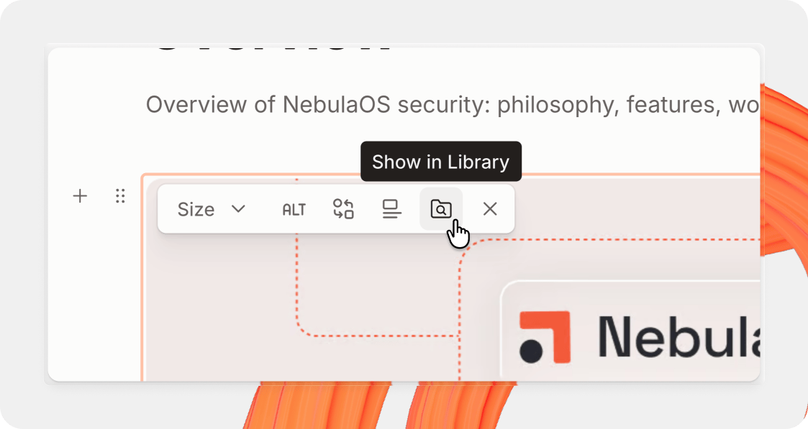

# Examples



## Code themes for published docs



We’ve just added a ton of new [code themes](https://app.gitbook.com/s/NkEGS7hzeqa35sMXQZ4X/manage-your-site/customization/icons-colors-and-themes#code-theme-premium-and-ultimate) for your published docs.

You can now choose from our standard themes — which use your site’s semantic colors — or one of 60 themes from [Shiki](https://shiki.style/themes).

You can choose your code theme for light and dark mode individually. And you can use any light or dark color scheme in any mode (e.g. a dark code theme when your docs are in light mode).

Want to set a separate theme for your [API blocks](/broken/spaces/NkEGS7hzeqa35sMXQZ4X/pages/EAZLjjyX6jX76NFnj71P)? No problem — you can override them by clicking the **Customize per block type** <picture><source srcset=".gitbook/assets/settings - dark.svg" media="(prefers-color-scheme: dark)"></picture> button in the **Customization** screen.

### Improvements

* You’ll notice some big improvements to the in-app search tool. We’ve added more structure and information to search results, and made it easier to browse and open the results with the keyboard, making it easier to find the content you need.
* We’ve made it easier to find [GitBook Agent](/broken/spaces/NkEGS7hzeqa35sMXQZ4X/pages/KHHFlE1MtpVIaZboN8b2) when editing your docs in a change request — you can now click the **Agent** button in the header bar to open a chat with the Agent.
  * We’ve also added new buttons so you can share feedback about specific messages within a chat with the Agent.
* The default title of a change request (e.g. John’s Jan 1 changes) is now just a placeholder, encouraging people to add descriptive subjects. This is particularly important if you use [merge rules](https://app.gitbook.com/s/NkEGS7hzeqa35sMXQZ4X/collaborate/merge-rules) to require a subject for a change request before it can be merged.

### Fixes

* Fixed some permission issues for importing content and viewing a change request with comments.
* Fixed an issue that was causing GitBook to hang when loading space or change request content.
* Fixed a bug that meant pixel values didn’t show when resizing table with the pointer. They’ll now show as expected.
* Fixed an unexpected scroll issue in the Agent side panel.




## Improved side sheets and sidebar navigation for your docs site on mobile



We’ve rolled out a new, more consistent side-sheet experience on published documentation for information that doesn’t fit on the screen.

Now, when users browse your docs on mobile, they can open your table of contents or AI Assistant and see the new side sheet in action. It really shines in the TOC, which also includes your site’s logo and a language picker, if you have translated your docs with variants.

## Add social accounts to your docs site

<figure><figcaption></figcaption></figure>

You can now add social accounts to your docs site’s metadata and footer.

You can choose from a wide range of social accounts, including Facebook, Reddit, Slack and Medium. All the accounts you add will appear in your site’s metadata and footer — although you can toggle them off to remove them from the footer, but keep them in the metadata.

Head into the **Customization** menu and open the new **Sharing** tab to find the new option and add your socials.

### Fixed

* Fixed an issue with large tables that meant the scroll position would sometimes be incorrect or broken when selecting a cell.
* Fixed a bug with images that meant, if an image block was selected and you tried to open the image menu on a _different_ image block, the focus would jump back to the selected block rather than the image you just clicked.



## Jump to any image, file, variable or reusable content in the new Library

<figure><figcaption></figcaption></figure>

To add to last week’s TOC improvements, you can now select any image or file and jump directly to it in Library — making it easy to find, rename and spot duplicates of specific items fast.

This is particularly useful for spaces with larger libraries containing dozens or hundreds of items.

In addition to this, you can now also rename pages in the Pages tab of the table of contents with a double-click, just like you can with content within the Library tab.

### Improvements

* We’ve improved the way headings work with pasted content — so you can now paste content into a heading block and it will maintain the heading formatting, rather than keeping the text’s original formatting.
* It’s now easier than ever to resize table block columns, as we’ve made the grab area wider and easier to see
* You’ve been able to click the + button between two pages to add a new page or page group to the table of contents for a while now. But now the menu includes more options, including links, OpenAPI references and more.
* You can now add longer titles to table headers — they’ll expand to include the full title rather than truncating the text.
* We’ve also made a bunch of small improvements to comments, including:
  * Made the skeleton shown as a comment is loading match the actual layout of the comment popover.
  * Improved the color legibility and contrast of comment highlights on blocks for light and dark mode.
  * Increased the gaps between comments and added a border for easier distinction.
  * Reduced the spacing around the comment input to reduce the wasted space in the menu.

### Fixes

* Fixed a timezone bug in the version history that meant the relative date shown in the sidebar would sometimes be different to the timestamps of entries within those sections.
* Fixed an issue where the **Update** button was shown for a change request with conflicts. Now it will show the **Open editor** button as expected.
* Fixed an issue that meant GitBook Agent would sometimes edit your content when asked to review changes. Now it’ll just leave comments and suggestions instead.
* Fixed an issue that meant icons would sometimes disappear in the image toolbar.
* Fixed some small issues with search and improved the search experience in the new table of contents.
* Fixed a bug that meant your expanded code block state would be lost — now GitBook should remember whether you expanded or collapsed a code block.
* Fixed an issue that meant a change request’s Overview screen would crash if a user was a reader in the space.
* Fixed an issue that meant adding a link to a button would sometimes be delayed by the link palette loading. Now you can paste a URL and hit enter to add the link immediately.
* Fixed a bug that meant auto-translated pages with images within table blocks would remove the images.
* Fixed a bug that meant importing ZIP files on Windows operating systems would fail. ZIP imports should now work as expected.
* Fixed a bug with icon colors that meant background colors were changed rather than the icon itself’s color.


