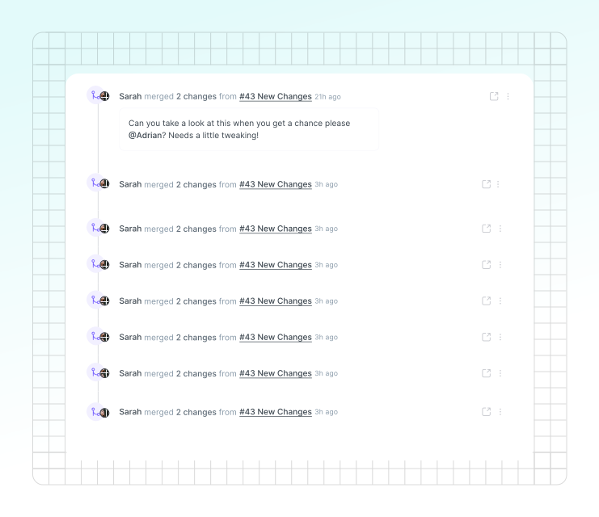

# Change requests

A change request is a copy of your main content. It comes from the simple concept of [**branching**](https://git-scm.com/book/en/v2/Git-Branching-Branches-in-a-Nutshell), and will feel familiar to anyone who uses pull requests in GitHub or merge requests in GitLab.

In a change request, you can edit, update and delete elements of your content, request reviews on your changes, then merge them back into your main version to apply all the changes you made.

<figure><figcaption><p>Edit your content through change requests.</p></figcaption></figure>

### Creating a change request

Inside a space where live edits are disabled, click the **Edit** button in the [space header](../resources/gitbook-ui.md#space-header) to start a new change request.

This will open a new change request, where you can edit or delete content as needed. Your changes are saved automatically, and other people can join you in a change request to collaborate in real-time.

Once you’re happy with your changes, you can use the button in the header bar to **Request a review** of your change request, or **Merge** it directly into the main branch.

### Preview a change request

You can preview the changes you've made in a change request through the preview button in the [space header](../resources/gitbook-ui.md#space-header). This will switch you to a view with your docs and the proposed changes in a preview window, so you can see your changes in the entire context of your published documentation.


You can only preview change requests for spaces added to a [published docs site](../publishing-documentation/publish-a-docs-site/).



If your content is published using share links or authenticated access, the preview function won't appear.


### Request a review on a change request

Request a review on your change request when you want to ask members of your team to check your content before you merge the changes into the main branch.

You can add a description to your change request to give your reviewers some context, and tag specific people that you want to check your work.

When you click **Request a review**, the change request’s status will change to **In review**, and anyone you tagged in your review request will get a notification.

If your changes don’t require a review, you can merge your changes into the main version directly instead.


If you don’t tag anyone in your review request, everyone with reviewer permissions will get a notification about your request. If no reviewers are in the space, the next role above reviewer will be notified.


### Reviewing a change request

If you get a request to review a change request, you'll be able to edit the content and leave feedback to make sure it's in good shape before it’s merged to the main version. You can either request changes if you think it still needs work, or approve the change request, to signal it's ready to merge.

Most reviews will take place in the change request’s [comments](comments.md), where collaborators can share feedback and have discussions about specific content blocks, or the change request as a whole.

#### Diff view <a href="#diff-mode" id="diff-mode"></a>

When you open the **Changes** tab in the space header, the diff view will appear. Diff view highlights every page and block that’s been edited in a change request. It will highlight any edited pages in the table of contents, and on the pages it will show the specific blocks that have been added, edited or removed.

There are two options when using diff view:

1. **Show all pages** – This is the default mode for diff view, which will show both modified and non-modified pages in the table of contents. This is good for seeing which pages have been edited in the context of the entire space.
2. **Show only changed pages** – This mode will show only the modified pages in the table of contents, which helps you focus on the changed content. This is particularly helpful in larger spaces with many pages and sub-pages.

You can switch to the **Changes** tab to check the diff view in any change request.

### Merging a change request

Merging a change request will add the change request’s changes into the main branch of content, creating an updated version and a new entry in the space’s [version history](../creating-content/version-control.md#see-the-activity-of-a-specific-draft).

#### Scheduling merges

If you prefer to merge change requests at a scheduled time—for example, to align with your product release cycles—you can use external tools like GitHub Actions or automation platforms such as Zapier, connected through [GitBook’s API](https://gitbook.com/docs/developers/gitbook-api/api-reference/change-requests#post-spaces-spaceid-change-requests-changerequestid-merge).

As an example, adding this GitHub workflow would merege a change request once a week:


```yaml
name: Scheduled GitBook Merge

on:
  schedule:
    - cron: '0 9 * * 3'  # Runs every Wednesday at 09:00 UTC

jobs:
  merge_changes:
    runs-on: ubuntu-latest
    steps:
      - name: Merge Change Request
        run: |
          curl -X POST https://api.gitbook.com/v1/spaces/{space-id}/change-requests/{change-request-id}/merge \
          -H 'Authorization: Bearer YOUR_API_KEY' \
          -H 'Content-Type: application/json'
```



Only [administrators, creators, and reviewers](../account-management/member-management/roles.md) can merge change requests.


### Handling merge conflicts

Sometimes, when you want to merge a change request, you may discover conflicts between the main content and the content you’re trying to merge. In the simplest form, a conflict is a piece of content that could not be merged automatically.

If this happens, you’ll be presented with a conflict alert, and a list of the conflicts you’ll need to resolve before continuing the merge.

### Resolving merge conflicts

You have two options when it comes to resolving a merge conflict — **selecting a version to merge** or **manually** **editing the content**.

#### Selecting a version to merge

You can resolve a merge conflict by selecting a version you want to merge — either your incoming content, or the content that was previously there. This allows you to choose between one change and another — either your recent work, or the original content.

If you’re dealing with a merge conflict that can be resolved this way, you can select the version you want to keep, and the other version will be deleted.

#### Manually editing

If you don’t want to choose between versions, you can resolve a merge conflict by manually editing the conflict. You’ll be able to delete the blocks you don’t need, or even rewrite them entirely. Once you’re happy with the changes, you can move on to the next conflict until they’re all resolved.

### Archiving a change request

If you decide not to merge a change request and want to remove it from the queue, you can archive it.

To archive a change request, first open it up. Then click the **Actions menu** <picture><source srcset="../.gitbook/assets/actions-horizontal - dark.svg" media="(prefers-color-scheme: dark)"></picture> next to the change request’s title and choose **Archive**. You can find and reopen archived change requests later by opening the **Change Requests** menu and selecting the **Archived** tab.
