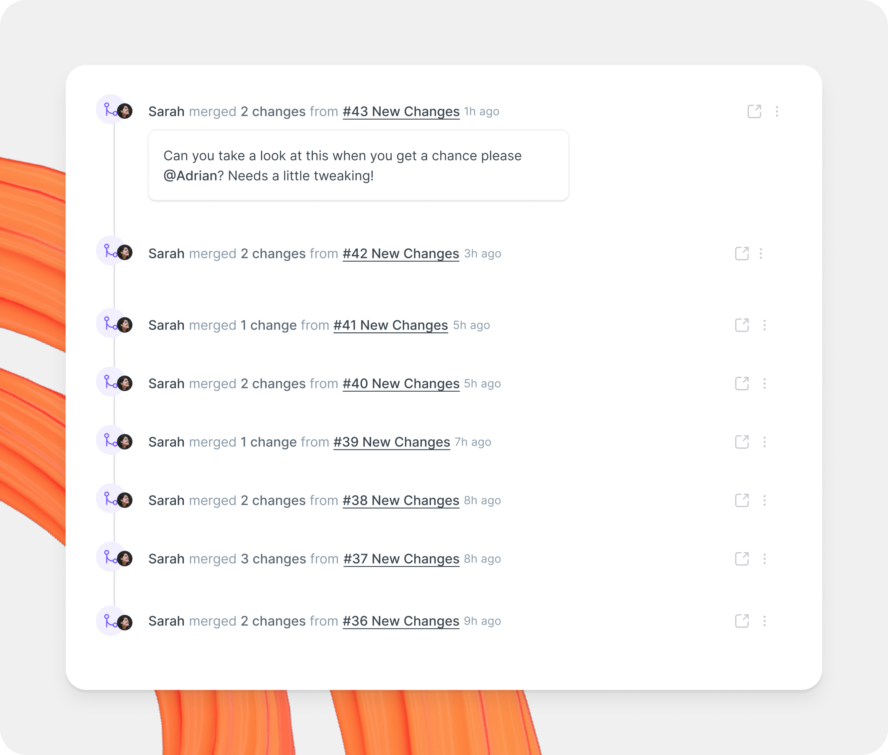

# Change requests

A change request is a copy of your main content. It's based on the concept of branching, and feels familiar to anyone who uses pull requests in GitHub or merge requests in GitLab.

In a change request, you can edit, update, and delete content, request reviews on your changes, then merge them back into your main version.

To browse and manage open change requests in one place, see the [Change requests screen](change-requests-screen.md).

<figure><figcaption>
Edit your content through change requests.
</figcaption></figure>

### Review changes in diff view 

Open the **Changes** tab to review edits in a change request. You can review all pages in context, or focus on changed pages only.


&#x20;By default, changes are shown in a "split-view". The left showing the 'before' version of the page, and the right showing the 'after' state. If you prefer to view changes inline in a single column-layout, click the diff-mode button at the top-right of the Table of contents panel.


### Create and merge a change request



### Open a change request

To edit content, open a change request. You can open one in a few ways:

* Click **Edit** in the top right corner of a section.
* Ask GitBook Agent to create one on your behalf.
* GitBook Agent may create one automatically when it detects a documentation gap.

If you open one manually, GitBook creates the change request and opens it in the editor.



### Make your changes

Edit content directly in the editor, or work with GitBook Agent.

Review your changes before you move on. You can keep editing until you're ready to request a review.



### Request a review

Open the **Overview** tab, then tag one or more reviewers.

Reviewers can approve your changes, leave comments, or request more edits. If you don't tag anyone, everyone with reviewer permissions in the section is notified. If the section has no reviewers, editors and admins are notified instead.

If someone requests changes, update the change request before you merge it. You can also ask GitBook Agent to review the change request.



### Merge

Once the change request is approved, open the **Overview** tab and click **Merge**.

GitBook applies the changes to your live docs immediately. If your section uses merge rules, GitBook checks them before merging.

Merging can't be undone. To revert or adjust content, open a new change request.



### Working with change requests

<table data-card-size="large" data-view="cards"><thead><tr><th></th><th></th><th data-hidden data-card-target data-type="content-ref"></th></tr></thead><tbody><tr><td><strong>Change request screen</strong></td><td>View and manage change requests in one place</td><td><a href="change-requests-screen.md">change-requests-screen.md</a></td></tr><tr><td><strong>Change requests in a section</strong></td><td>Create and review change requests in a single section</td><td><a href="change-requests-in-a-space.md">change-requests-in-a-space.md</a></td></tr></tbody></table>
