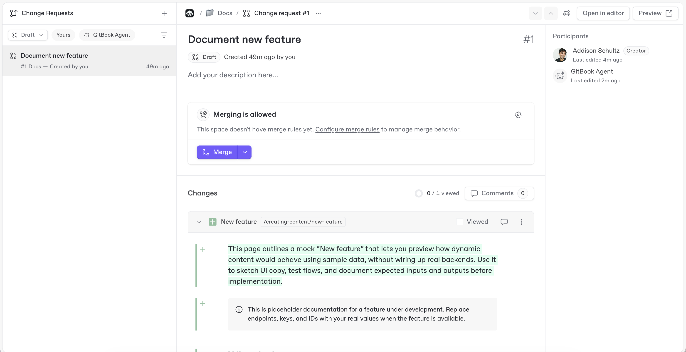

# Change requests screen

The change requests screen lets you view and manage active change requests across your site — open them, merge them, or collaborate with GitBook Agent on updates, all in one place. Open it from **Change requests**, under **General** in the site sidebar.

<figure><figcaption>
View active change requests from the change requests screen.
</figcaption></figure>

### Navigating the change request screen

All change requests in your site appear in the change requests screen. You can filter by status or filter to show only change requests created by GitBook Agent.

Click a change request to open it in an expanded view. From there you can review, edit, and merge the change request, or continue working on it with GitBook Agent. The expanded view also shows the participants and reviewers, the description, and a diff view of the changes.

To inspect diffs in the editor, click **Edit** in the top right corner to open the change request's section, then switch to the **Changes** tab. The diff navigation control appears there.

### Reviewing a change request

When someone requests your review, you can edit the content and leave feedback directly from the change requests screen.

You can request more changes, or approve the change request to signal it is ready to merge.

Most reviews take place in the change request's comments, where collaborators can discuss specific content blocks or the change request as a whole. You can also ask the [GitBook Agent](../../gitbook-agent/review-change-requests-with-gitbook-agent.md) to review a change request — it can check, plan, and continue working on changes alongside your team.

