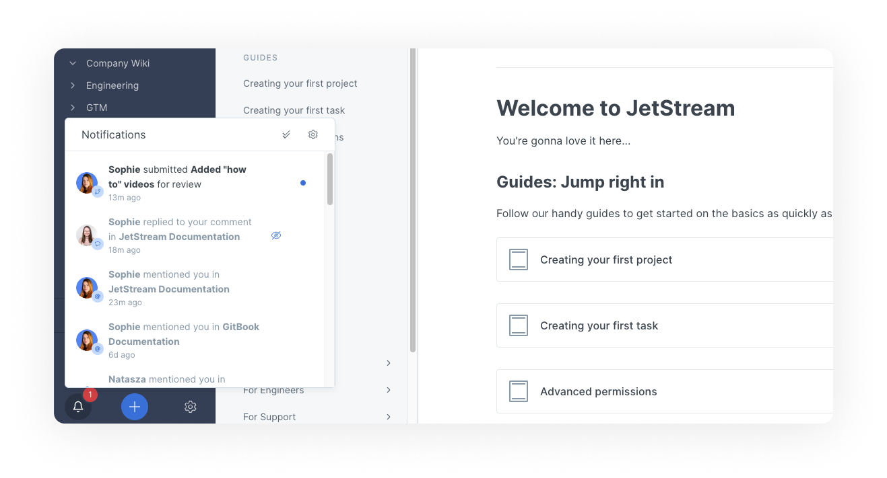
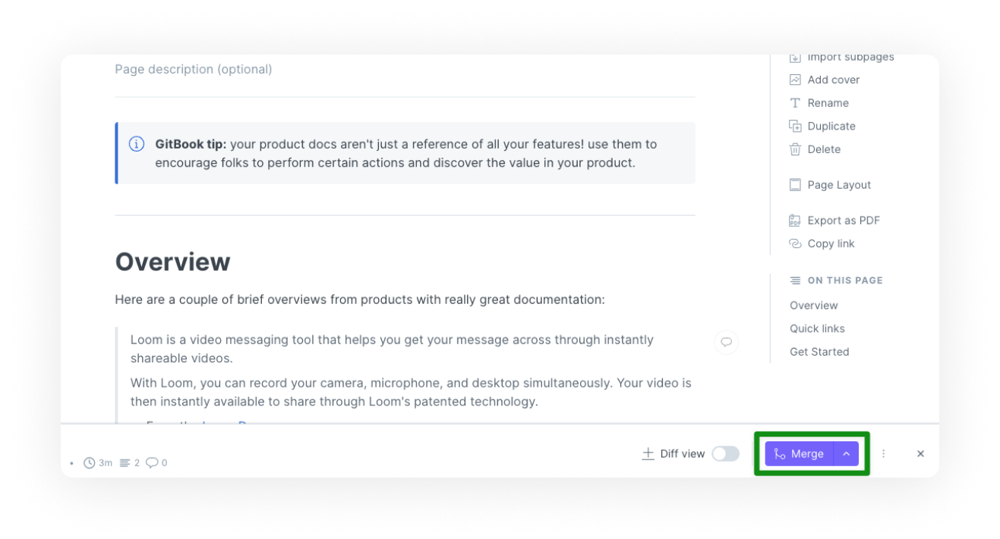
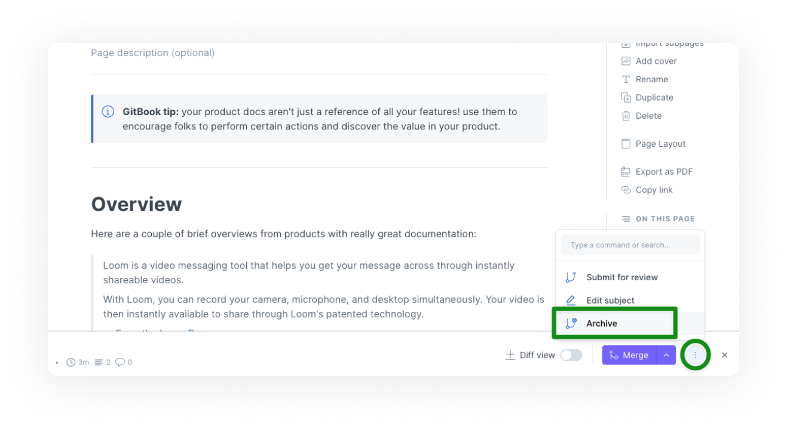

# Change requests

<figure><figcaption>
The change requests panel
</figcaption></figure>

When a space is **locked** for live editing, the main branch of content is read-only, and the only way to contribute to it is by creating and submitting a **change request**.

Change requests are GitBook's way of handling collaboration around branched content.

## Why branched content?

Branches are used heavily in software development, giving contributors ways to keep main code branches protected, with abstracted branches used for proposing or implementing specific changes.

GitBook brings this approach to content and documentation – allowing for content to be branched as many times as required, protecting the main branch of content from changes, giving a clear version history, and allowing for review-focused dynamics around **what** changes make their way into the main branch of content and **why** they're being proposed.

## Creating a change request

In a space that is **locked** for live edits, hit the 'Edit' button in the space header to start a new change request.

<figure><figcaption>
Click the "Edit" button in the top right corner to start a change request
</figcaption></figure>

This will take you into the change request straight away.

While you're in a change request, you might notice it's all pretty familiar if you've used a live edit space already. Your changes are sync'ed automatically, you can collaborate on change request with real-time collaboration, and you have the same editor experience.

The main difference is that **this is a branch of the main content** – your edits are made specifically to the change request.

Once you're happy with your changes, you can **submit** the change request.

## Submitting a change request

<figure><figcaption>
Submit your change request for review in the bottom right corner of the editor
</figcaption></figure>

Change requests are submitted when you want to indicate to collaborators that the change request is ready for review (or you just want to review it yourself!)

Upon submitting, a change request will have its status changed to **in review** and members of the space will be notified.

<figure><figcaption>
A notification that a change request has been submitted for review
</figcaption></figure>

## Reviewing a change request

It's up to you and your team how you want to handle reviews; GitBook is not opinionated or forceful in this regard. Some folks have a very loose review process, others have strict procedures using advanced permission roles.

Most reviews will take place in the change request's [comments](../comments-discussion.md); where collaborators can share feedback and discussions against specific content blocks, or against the change request as a whole.

### Diff mode

You can toggle diff mode on or off for any change request. This will give you an in-context comparison of the primary content and the changes made in the change request.

<figure><figcaption>
Diff mode enabled on a space
</figcaption></figure>


When talking about change requests, it's important to understand how specific roles can affect review dynamics. Members with an [**editor**](../../account-management/member-management/roles.md#editor) role will be able to create and submit requests, but only members with [**reviewer**](../../account-management/member-management/roles.md#reviewer) or above roles are able to merge change requests. When setting your permissions, keep in mind the type of edit and review dynamic you want to achieve!


## Merging a change request

<figure><figcaption>
Use the merge button when a change request has been reviewed
</figcaption></figure>

Once a change request has been reviewed, it's time to merge! Merging a change request will 'put' the change request's changes into the main branch of content, creating an updated main branch and a new item in the space's version history.

### Handling merge conflicts

Sometimes, when you want to merge a change request, there'll be conflicts between your primary content and the content you're trying to merge. In the simplest form, a conflict is a piece of content that could not be merged automatically. Silly computers.

In the event of a conflict, you'll be presented with a conflict alert, and a list of the conflicts:

### Resolving merge conflicts

You have two options when it comes to resolving a merge conflict, **manually** **editing the content** to ensure that it ends up how you intended, or **automatically selecting a version** either 'yours' or 'theirs'.

#### Manually editing

To resolve a merge conflict by manually editing, go ahead and edit the content directly. You'll be able to delete the blocks you don't need, or even rewrite them entirely. Once you're happy with the changes, you can move on to the next conflict, if it exists!

#### Automatically merging a version

If you've ever dealt with merge conflicts in Git (we feel you) then you might be familiar with the 'yours' and 'theirs' approach. This is essentially a binary choice between one change and another, you either want to keep 'your' work, or you want to keep 'theirs'. If you're dealing with a merge conflict that can be resolved this way, you can select the change you want to keep, and the other change will be deleted.

## Archiving a change request

If you decide not to merge a change request and want to remove it from the review queue, you can archive it.

<figure><figcaption>
Archiving a change request
</figcaption></figure>

To archive a change request, open the context menu next to the **merge** button near the bottom-right corner of your change request. Click on **archive**. Once you confirm, the change request will no longer be listed as active. If you need, you can find it later in the archive section of your space's change request listing panel, and you can reopen it at any time.
