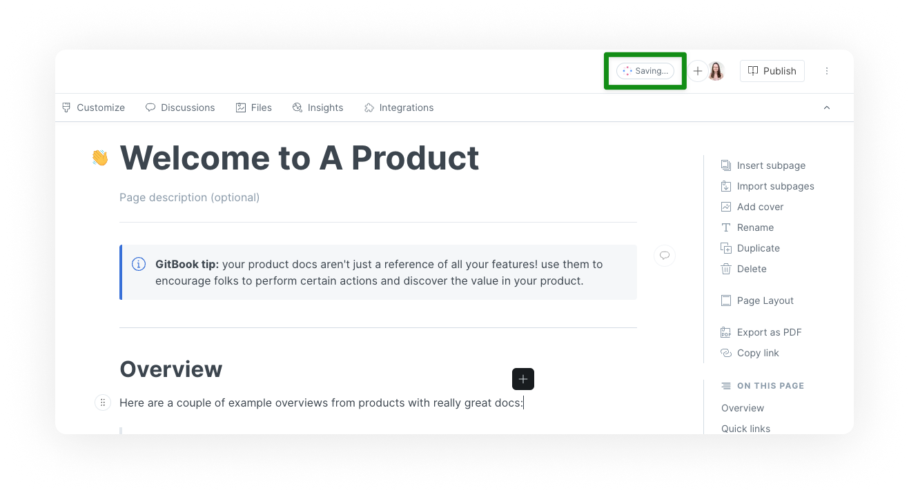

# Live edits

<figure><figcaption>
GitBook saves your live edits automatically
</figcaption></figure>

**Live editing** is the default mode of any newly-created GitBook space. A space in live edit mode is editable instantly by anyone with the [correct permission level](../../account-management/member-management/).


Live editing is not available [in some cases](live-edits.md#when-is-live-editing-not-available).


When a space’s live edits are **unlocked**, you’ll be able to see the avatars of the team members that are currently viewing the space. This is shown at the top right corner of the page. Anyone can start editing the space, but this works on a first come first served basis. When an editor starts making changes, editing is temporarily locked for all other viewers in that space. Once the editor’s changes are saved, editing is released and made available to any of the viewers that want to start making changes.

## Toggling live edits on or off

You can lock or unlock space for live edits by selecting ’Unlock live edits’ and ’Lock live edits’ from the Space’s actions menu.

<figure><figcaption>
Unlock live edits from the space actions menu
</figcaption></figure>

### When is live editing _not_ available?

It is not possible to unlock live editing in the following cases:

1. When a space is published with the **In collection**, **Public**, or **Unlisted** visibility option. We hope to change this in the future.
2. When [Git Sync](../../integrations/git-sync/) is enabled.


Only users with the **admin** or **creator** [roles](../../account-management/member-management/roles.md) can lock or unlock live edits.

