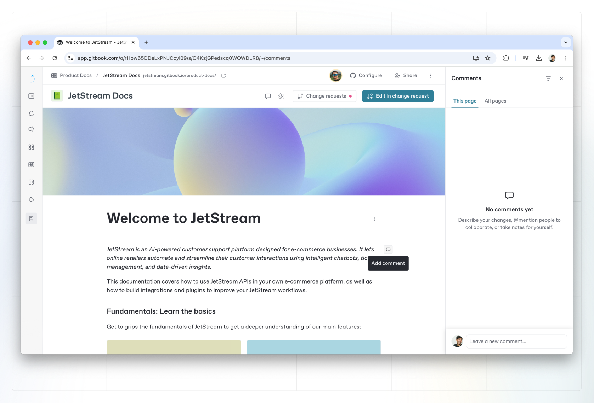

# Comments

Comments allow you to have as much (or as little) conversation as you like around specific pieces of content — without switching out of context from GitBook.

### Add a comment to your content 

You can comment on any block within your content. Hover over a block and click the content icon that appears on the right of the block to open the **Comments** side panel with an empty comment. You can open this panel again by clicking on the **Comments** button <picture><source srcset="../.gitbook/assets/comments-dark.png" media="(prefers-color-scheme: dark)"></picture> in the [space header](../content-editor/editor/navigation.md#space-header).

<figure><figcaption>
Add a comment in GitBook.
</figcaption></figure>

### Comment threads

Any top-level comment in GitBook can be replied to, turning it into a discussion thread.

### Reacting to comments

You can also leave an emoji reaction on any comment by clicking the emoji button on the message or thread you’d like to react to.

### Resolving comments

If you’re done working through a comment thread or idea, you can **resolve** a comment at any time. Resolving a comment will hide it in the interface, but still keep it accessible in the ’Resolved’ tab of the space’s comments section.

### Commenting and change requests

In addition to commenting on a page or content block, you can also leave comments inside of a change request. See [change requests](../content-editor/editor/change-requests.md) to learn more.
