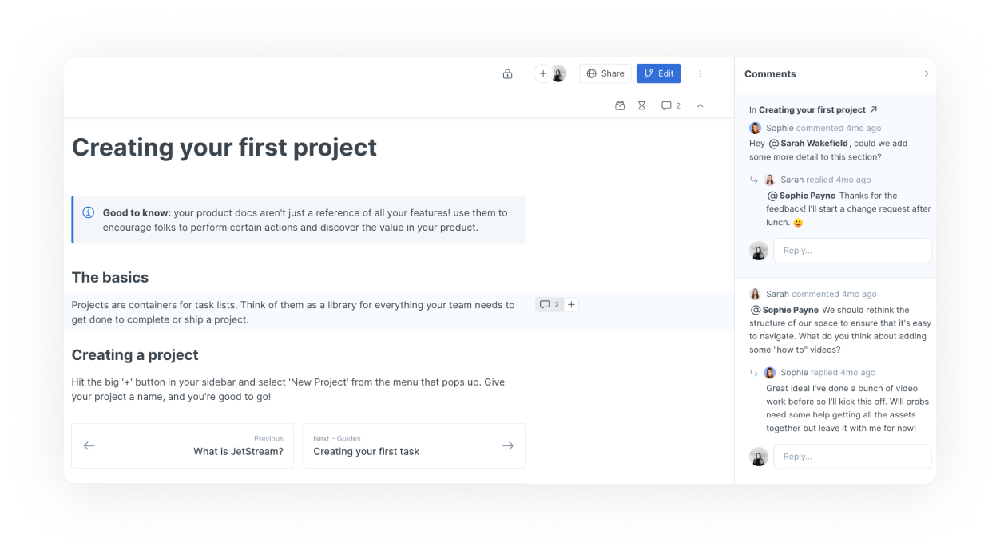
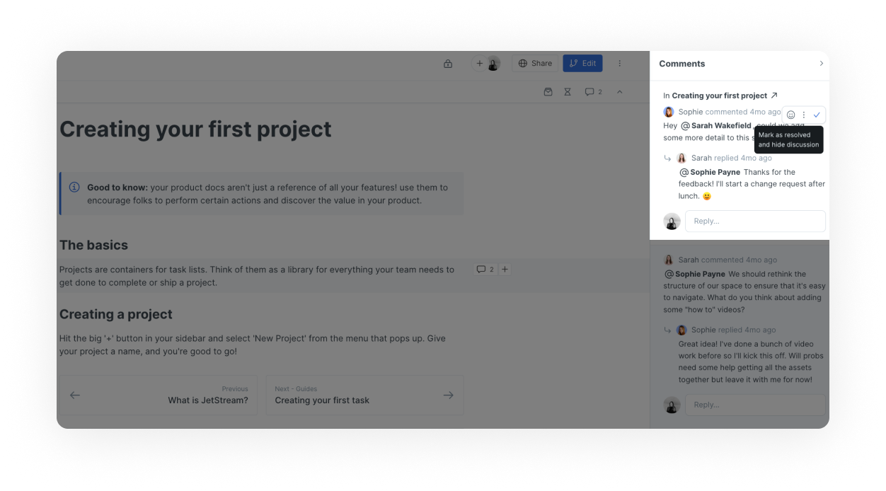
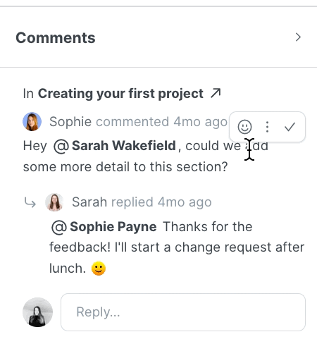

# Comments and discussions

Comments in GitBook allow you to have as much (or as little) conversation as you like around specific pieces of content — without switching over to a workplace chat tool or 'jumping on a call'!

## Comment within your content 

You can comment on any block within your content. The comment will be displayed in a right hand panel which you can open by clicking on the icon in the sub-navigation.&#x20;

<figure><figcaption>
Commenting on a specific content block 
</figcaption></figure>

### Comment threads

Any top-level comment in GitBook can be replied to, turning it into a discussion thread.

## Resolving comments

Commenting and discussions can get messy, especially with larger teams! To reduce the noise, you can **resolve** a comment at any time. Resolving a comment will hide it in the interface, but still keep it accessible in the 'Resolved' tab of the space's comments sidesheet.

<figure><figcaption>
Resolving a comment 
</figcaption></figure>

## Reacting to comments

You can also leave an emoji reaction on any comment.

<figure><figcaption></figcaption></figure>

## Commenting and change requests

With commenting being integral to feedback, you might want to read more about how comments and change requests work together:


[change-requests.md](collaboration/change-requests.md)

