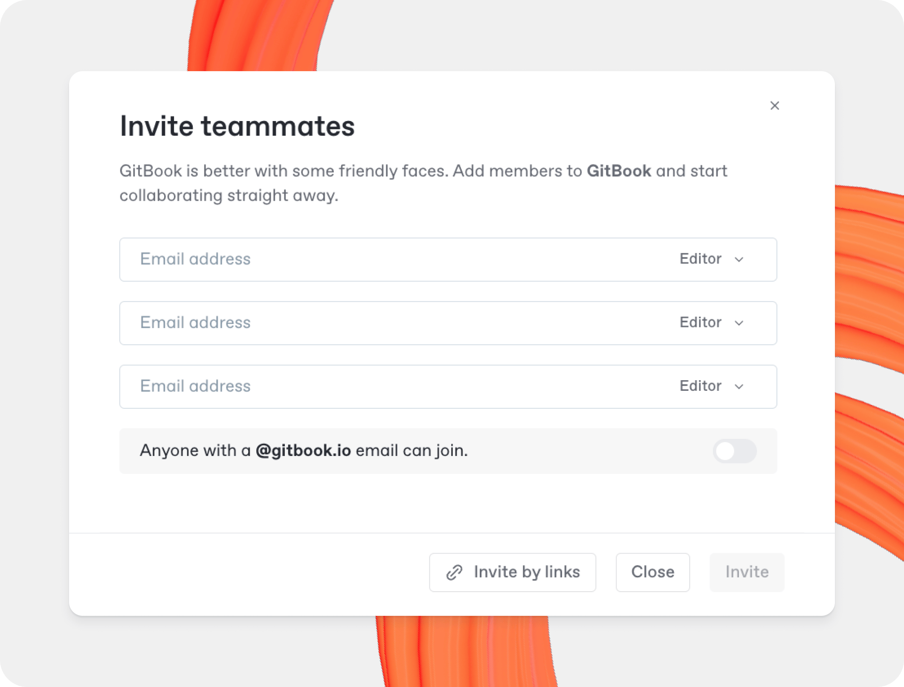

# Inviting your team

<figure><figcaption>
Invite your team to GitBook to collaborate on pages, spaces, and published sites.
</figcaption></figure>


### All additional members will be added to your subscription

Inviting additional members to your organization — regardless of their role or how you add them — will immediately impact the price of your subscription. Take a look at our [billing policy](../account-management/plans/billing-policy.md) for the details.


### Invite someone to join your organization via email 

You can directly invite members through your [organization settings](../account-management/organization-settings.md). In the **Members** section of the **Settings** screen, click **Invite new members**, then add email(s), select their default role, and click **Invite**.

Each member will receive an email that will allow them to sign up to GitBook and instantly join your organization.


### Email domain

You can allow all users with a specific email domain to join your organization if you wish. To do this, open your organization’s **Settings** page, choose the **Members** option, click **Invite new members** and enable the toggle at the bottom of the modal.


### Invite someone to join your organization via invite link 

Invite links in GitBook allow you to maintain a list of links that members can use to sign up and quickly join your organization.

Invite links are tied to specific [roles](member-management/roles.md), and you can create — and revoke — as many invite links as you like.

Here’s how to create an invite link to your organization:

1. Open your [organization settings](../account-management/organization-settings.md), then choose the **Members** section.
2. Click **Invite new members**, then click the **Invite by links** button at the bottom of the modal.
3. Use one of the existing links, or click **Create multiple links** to add a new link.
4. Select the [role](member-management/roles.md) you want for the new user, copy the link, and share it with your new member.

To revoke an invite link, follow the same steps as above, then find the link, open the **Actions menu** <picture><source srcset="../.gitbook/assets/25_01_10_actions_icon_dark.svg" media="(prefers-color-scheme: dark)"></picture> and choose **Revoke**.

## Invite someone to a single space or collection 

To share a single [space](../creating-content/content-structure/space.md), click the **Share** button in the top-right corner of the space. To share a [collection](../creating-content/content-structure/collection.md), open its **Actions menu** <picture><source srcset="../.gitbook/assets/25_02_04_actions_horizontal.svg" media="(prefers-color-scheme: dark)"></picture> and choose **Permissions**. This will open the **Share** modal.

### Invite a member or team from your organization 

Some people in your team may not have access to a specific space in your GitBook organization due to their [role](member-management/roles.md) or specific [permissions settings](member-management/permissions-and-inheritance.md).

To invite someone who’s already a member of your organization:

1. Open the space or collection’s **Share** modal
2. Type their name, choose their role for this space, and hit **Invite**.

You can also add an entire [team](member-management/teams.md) by typing the team name and hitting **Invite**.

### Invite someone from outside your organization 

To invite someone from outside your organization to a space or collection:

1. Open the space or collection’s **Share** modal
2. Add the person’s email address, choose their role for this collection, and hit **Invite**.

By default, people you add will be a [guest](member-management/roles.md#the-guest-role) in the space or collection. Guests only have access to the individual spaces that you invite them to, and can be given a specific [role](member-management/roles.md) within that space — whether it’s to edit the content, or only view and comment on it.

Alternatively, you can also choose to enable the **Invite as an organization member** toggle, which will give the new member access to all your team’s content with the permissions of the role you’ve selected.


### All additional members will be added to your subscription

Inviting additional members to your organization — either as a full member or a guest — will immediately impact the price of your subscription. Take a look at our [billing policy](../account-management/plans/billing-policy.md) for the details.


### Invite guests via link

If you don’t want to use email to invite someone to your content, or want to invite a number of people as guests quickly, you can create a secret link. You can also set the role of guests that join using the link, so you have control over who can do what to your content.

When you share this link, anyone who clicks on it will be able to sign up, join your organization as a guest, and get access to just this single space and its content.

You can revoke the link at any time by opening the **Actions menu** <picture><source srcset="../.gitbook/assets/25_01_10_actions_icon_dark.svg" media="(prefers-color-scheme: dark)"></picture> next to the link and choosing **Revoke**.
