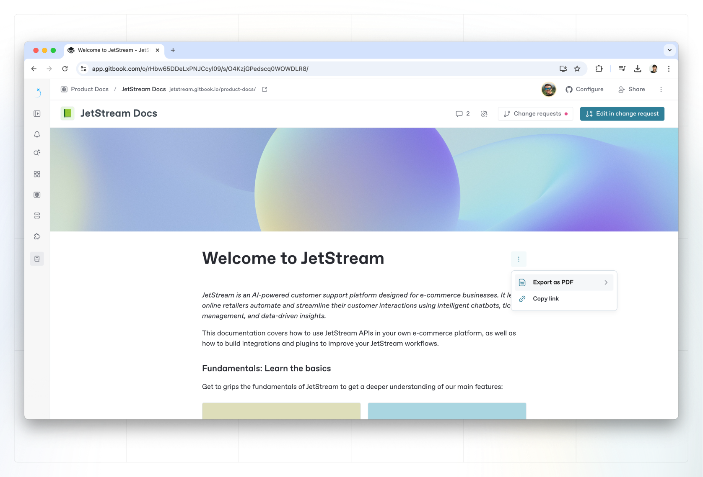
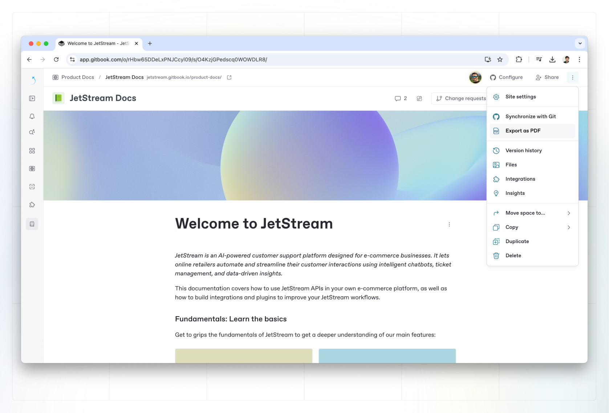

# PDF export


This feature is available as part of the Pro plan and Enterprise plan. To find out more, [visit our pricing page](https://www.gitbook.com/pricing).


### Allow readers to export a PDF version of your published content


**Permissions**

[Admins and creators](../../account-management/member-management/roles.md) can enable and disable PDF export for a space.


To enable or disable PDF export for visitors to your [published docs site](broken-reference), open the docs site’s dashboard and click the **Settings** tab.&#x20;

You can enable PDF export by toggling it on in the **Customization** section.&#x20;

This setting determines whether or not **readers of your published content can download it in PDF format**. This feature is only available for **Standard and Premium sites**.&#x20;

<figure><figcaption></figcaption></figure>

### Export your own internal content as PDF

However you decide to configure your published docs sites, all logged-in members of an organization on a Pro or Enterprise can export a page — or an entire space — from your internal knowledge base as a PDF file.

#### How to export an individual page

1. Open the page you want to export, then open the page’s [Actions menu](../../content-editor/editor/navigation.md#the-actions-menu)  next to the page title.
2. Select **Export to PDF > Current page**.
3. Wait for the page to load, then click the **Print or save as PDF** button in the upper right to open your browsers Print menu.
4. From here, you can save the page as a PDF or open it in your PDF viewer using the typical process for your browser.

<figure><figcaption>
Export a PDF of a single page.
</figcaption></figure>

#### How to export an entire space

1. Open the[ Actions menu](../../content-editor/editor/content-structure/)  next to the page title and choose **Export as PDF > All pages**. Alternatively, open the **Space options**  menu on the far right of the space header and choose **Export as PDF** in the drop-down menu.
2. Wait for the page to load, then click the **Print or save as PDF** button in the upper right to open your browsers Print menu.
3. From here, you can save the page as a PDF or open it in your PDF viewer using the typical process for your browser.

<figure><figcaption>
Export a PDF of an entire space.
</figcaption></figure>
