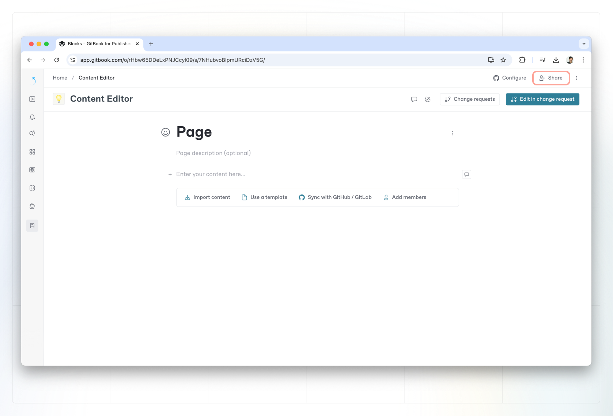
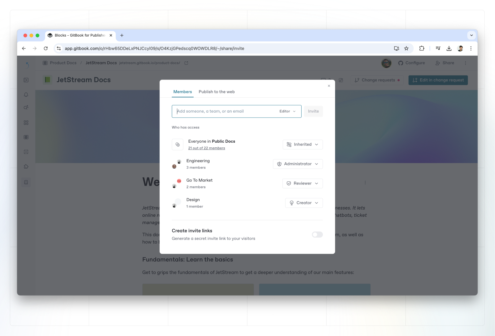

# Share a space

### Sharing a space

To share a space, click the **share** button in the top-right corner of a space. This will open the share modal.

<figure><figcaption>
Share a space
</figcaption></figure>

Inside the share modal, you’ll see different sharing options along the top.


The options available to you will depend on your permissions in the space, as well as [your organization’s plan](../../account-management/plans/).


By default, every member of your organization can see all the content in your organization. But their permissions are inherited from the [role](../../account-management/member-management/roles.md) assigned to them within the [**Organization settings**](../../account-management/organization-management.md) area.&#x20;

You can see everyone who access to your space, and their level of access, in the share modal. You can also make changes to those access settings in this menu.

### Invite members

<figure><figcaption>
Invite members
</figcaption></figure>

#### Invite a person or team from your organization

Some people in your team may not have access to a specific space in your GitBook organization due to their role or specific permissions settings. To invite someone who’s already a member of your organization, simply type their name, choose their role for this space, and hit Invite.

You can also add a whole [team](../../account-management/member-management/teams.md) to a space by typing the team name and hitting Invite.

#### Invite someone from outside your organization

To invite someone from outside your organization, simply add their email address, choose their role, and hit **Invite**. When you choose their role, you can also choose to leave the **Invite as an organization member** toggle switched on to make them a full member of your organization, with access to all your team’s content when they’re logged in.&#x20;

Alternatively, toggle this off to invite them as a [guest](../../account-management/member-management/roles.md#guest-role). Guests only have access to the individual spaces that you invite them to, and can be given a specific role within that space — whether it’s to edit the content, or only view and comment on it.


Inviting someone either as a full member or a guest will make them a member of the organization that owns the space, which **will increase your overall subscription charge.**

The cost for this will depend on [your organization’s plan](../../account-management/plans/).


It is also possible to [invite members to the organization ](../../account-management/member-management/invite-members-to-your-organization.md)from within the **Organization settings** area.

#### Invite guests via link

If you don’t want to use email to invite someone to your content, or want to invite a number of people as guests quickly, you can create a secret link. You can also set the role of guests that join using the link, so you have control over who can do what to your content.

When you share this link, anyone who clicks on it will be able to sign up, join your organization as a [guest](../../account-management/member-management/roles.md#guest-role), and get access to just this single space and its content.&#x20;

You can revoke the link at any time by opening the **Actions menu**  next to the link and choosing **Revoke**.

### Publishing your content


Looking to publish your content to the web? Head to the [published documentation](broken-reference) section to learn more.

