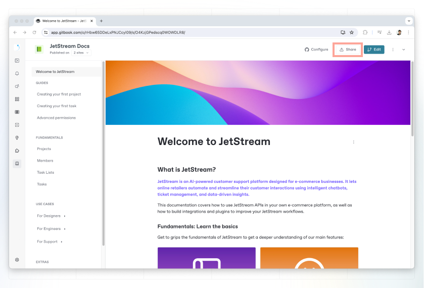

# Share a space

### Sharing a space

To share a space, click the **share** button in the top-right corner of a space. This will open the share modal.

<figure><figcaption>
Share a space
</figcaption></figure>

Inside the share modal, you’ll see different sharing options on the left-hand side.


The options available to you will depend on your permissions in the space, as well as [your organization’s plan](../../account-management/plans/).


### Invite members

<figure><figcaption>
Invite members
</figcaption></figure>

By default, every member of your organization can see all the content in your organization. But their permissions are inherited from the [role](../../account-management/member-management/roles.md) assigned to them within the [**Organization settings**](../../account-management/organization-management.md) area.&#x20;

You can leave the **Invite as an organization member** toggle switched on to make them a full member of your organization, with access to all your team’s content when they’re logged in.&#x20;

Alternatively, toggle this off to invite them as a [guest](../../account-management/member-management/roles.md#guest-role). Guests only have access to the individual spaces that you invite them to, and can be given a specific role within that space — whether it’s to edit the content, or only view and comment on it.


Inviting someone either as a full member or a guest will make them a member of the organization that owns the space, which **will increase your overall subscription charge.**

The cost for this will depend on [your organization’s plan](../../account-management/plans/).


It is also possible to [invite members to the organization ](../../account-management/member-management/invite-members-to-your-organization.md)from within the **Organization settings** area.

### Who can access?

This tab confirms the current visibility of the space, along with who has access to it within the GitBook app. You cannot change any settings here — it’s simply a summary.

### Publishing your content


Looking to publish your content to the web? Head to the [published documentation](broken-reference) section to learn more.

