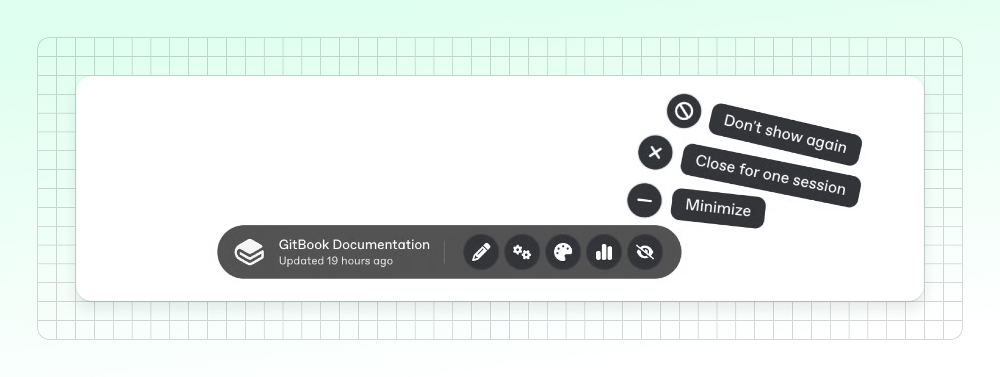

# Toolbar on published sites and site previews

When viewing your live docs site, you may see a toolbar appear at the bottom of the browser window. It provides quick access to useful options with a click:

* Open the editor to view and edit your site’s content
* Open your site’s settings in GitBook
* Open your site’s customization settings
* Open site analytics


The toolbar is **only visible to logged-in members of your GitBook organization**. Site visitors who are not members of your GitBook organization **will not see the toolbar**.


You will also see a slightly different version of the toolbar when you [open a preview URL for your site](change-requests/#preview-a-change-request) from the GitBook app, allowing you to jump back into the app to add feedback or continue editing.

#### When does the toolbar appear?

You will see the toolbar in the following situations:

* Viewing your live site while logged into GitBook
* Previewing earlier versions of your site through your [version history](../creating-content/version-control.md)
* Previewing links for proposed changes, such as in a [change request](change-requests/) created in GitBook or a pull request created through [Git Sync](../getting-started/git-sync/github-pull-request-preview.md)

#### Why isn’t the toolbar displayed?

If you’re logged into GitBook and still don’t see the toolbar, your browser may be blocking third-party cookies.

The toolbar uses third-party cookies to recognize your GitBook session on your published docs site or preview URL. If your browser blocks those cookies, the toolbar may not appear.

To display the toolbar, enable third-party cookies for your docs domain in your browser settings, then reload the page.


This issue is more common in browsers or extensions with stricter privacy settings.


#### Can I hide the toolbar?

Yes. By clicking the last button on the toolbar, you can choose between different options to change how the toolbar is displayed:

1. **Minimize:** This reduces the toolbar to a small orb. To expand it again, you only have to click it.
2. **Close for one session:** Fully removes the toolbar in the current tab until you close it.
3. **Don't show again:** Hides the toolbar and remembers your choice. You can restore the toolbar by clearing your browser’s local storage.

<figure><figcaption></figcaption></figure>
