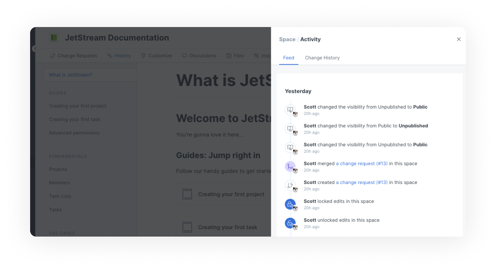
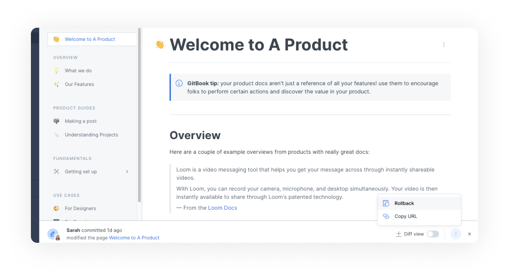

# Version control

You can easily monitor all changes submitted to your content thanks to the **history** tab. Here, your changes are split into two sections: **feed**, where you can see the day-to-day actions that have occurred within a given space, and **change history**, where you can specifically track changes to your space's content.


**Permissions**

Only administrators can access the history tab, where they can view actions and change history in a space.


## Feed 

The activity feed is where you can get a bird's eye view of what's been going on in any given space. This is useful if you've been away from the action for a few days and want to catch up. It's also useful if you're curious about anything that's happened in the space, e.g., when a specific member was added to the space, or when [live edits](../collaboration/collaboration/live-edits.md#toggling-live-edit-on-or-off) were locked or unlocked.

<figure><figcaption>
The activity feed for a space.
</figcaption></figure>

## Change History 

The change history of a space is where you can specifically see actions that result in content changing. These include:

* When [live edits](../collaboration/collaboration/live-edits.md) have been made on the space.
* When a [change request](../collaboration/collaboration/change-requests.md) has been merged.
* When a [Git Sync](../product-tour/git-sync/) operation has been performed.

### Viewing specific changes

You can click on any item in the change history list to view your content at the point this change was made. This is very similar to how [change requests](../collaboration/collaboration/change-requests.md) are viewed.

### Rolling back to a previous version

Rolling back allows admins to revert a space's content to a previous point in time. This is great if you've accidentally made a breaking change and need to quickly get back to a previous version of your content.

Admin users can click the **rollback** button while viewing a specific history item to roll the space back to this point in time.

<figure><figcaption>
Viewing a previous point in time via the change history
</figcaption></figure>


For as long as a space exists in GitBook, no version of its content is deleted. Content is versioned and immutable.

