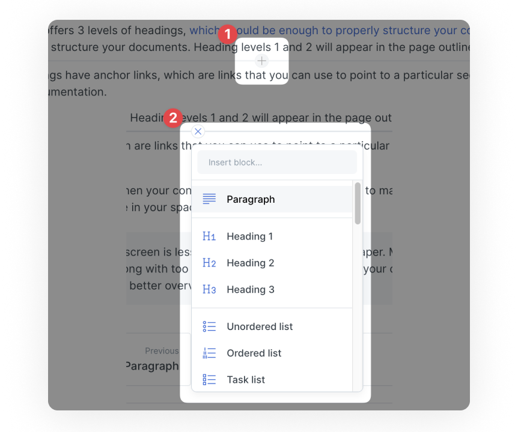

# Blocks

You can choose any of the following content blocks via the command palette:

* [Paragraph](paragraph.md)
* [Heading](heading.md)
* [Unordered list](unordered-list.md)
* [Ordered list](ordered-list.md)
* [Task list](task-list.md)
* [Hint](hint.md)
* [Quote](quote.md)
* [Code block](code-block.md)
* [Insert files...](insert-files.md)
* [Insert images...](insert-images.md)
* [Embed a URL...](embed-a-url.md)
* [Table](table.md)
* [Cards](cards.md)
* [Tabs](tabs.md)
* [Expandable](expandable.md)
* [Drawing](drawing.md)
* [Math & TeX](math-and-tex.md)
* [API method](api-method.md)
* [OpenAPI](openapi.md)
* [Page link](page-link.md)

### Command palette

You can invoke the command palette for adding a block with the cursor in an empty paragraph in two ways:

1. Hitting the keyboard shortcut, which is `command` + `/` on a Mac or `control` + `/` on a PC.
2. Clicking  using your mouse. The icon appears in the left margin of the paragraph that has the current focus.

### Exiting a block

Some content blocks capture the editing cursor to allow you to add content in the context of that block. When you are done, you can continue adding new content to the page either by inserting a new paragraph below or above the content block, or by hitting `command` + `enter` on a Mac or `control` + `enter` on a PC.

The example below shows how to exit [a quote content block](./#quote):

<figure><figcaption>
Exit editing a content block
</figcaption></figure>

### Inserting a new content block

You can insert a new content block below or above an existing block using your mouse:

1. Hover over the editor at the position you need the new content block
2. Click on the + icon that will appear
3. Select the block from the drop-down menu to insert it in that position

<figure><figcaption>
Inserting a new block
</figcaption></figure>

### Selecting blocks and interacting with selected blocks

You can select blocks by pressing the `Esc` key.

Once selected, you can:

* Select more blocks by clicking on them while keeping the `Shift` key pressed
* Moving up and down to select the block above or below, using the `Up` and `Down` keys
* Copy the entire block using `Ctrl` + `C` (Windows) or `Cmd` + `C` (Mac)
* Cut the entire block using `Ctrl` + `X` (Windows) or `Cmd` + `X` (Mac)
* Delete the selected block(s) using `Del`

### New: Full-width blocks :tada:

By making your blocks full-width, you can create a clear visual hierarchy in your content. This is perfect for giving images and tables more space to breathe, but it looks great with a whole range of block types:

* Cards
* Tables
* Code Blocks
* Integrations
* API Blocks
* Image blocks

#### Convert a block to full width:

1. Insert a block into your page
2. Click on   icon next to your block and select full width

<figure><figcaption></figcaption></figure>


Text blocks such as paragraphs are not possible to convert to full width. If you do not see the option to convert your block, it is likely not included on the list of compatible blocks above.


#### Example of a full-width table block&#x20;

<table data-full-width="true"><thead><tr><th>Project</th><th>Owner</th><th data-type="rating" data-max="5">Completeness</th></tr></thead><tbody><tr><td>Project A</td><td>Mike</td><td>4</td></tr><tr><td>Project B</td><td>Jack</td><td>3</td></tr><tr><td>Project C</td><td>Samantha</td><td>5</td></tr></tbody></table>

