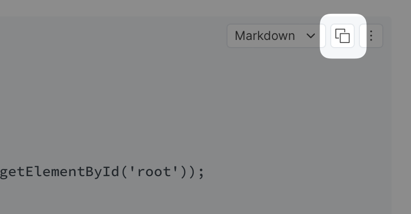

# Code block

You can show code on GitBook using code blocks. You can choose to [set the syntax](code-block.md#set-syntax...), [show line numbers](code-block.md#with-line-numbers), [show a caption](code-block.md#with-caption), and [wrap the lines](code-block.md#wrap-code). There is also a convenient way to [copy the contents of a code block to the clipboard](code-block.md#copying-the-code).

A code block may be useful for:

* Sharing configuration
* Code snippets
* Code files
* Showing usage examples of command line utilities
* Showing how to call API endpoints
* and for many more scenarios...

### Example of a code block


```javascript
‌import * as React from 'react';
import ReactDOM from 'react-dom';
import App from './App';

ReactDOM.render(<App />, window.document.getElementById('root'));
```


You can also combine code blocks with the [tabs content block](tabs.md) to offer the same example in multiple languages:



```javascript
let greeting = function(name) { console.log(`Hello, ${name}!`); };
greeting("Anna");
```



```ruby
greeting = lambda {|name| puts "Hello, #{name}!"}
greeting.("Anna")
```



```elixir
greeting = fn name -> IO.puts("Hello, #{name}!") end
greeting.("Anna")
```




You can now convert code blocks to full width by clicking on the  next to the block. [Read more about full-width blocks.](./#new-full-width-blocks)


### Options

#### Set syntax...

You can set the syntax to any of the supported languages and that will enable syntax highlighting in that language.


We use [Prism](https://github.com/PrismJS/prism) for syntax highlighting. Here's an easy way to check which languages Prism supports: [Test Drive Prism](https://prismjs.com/test.html#language=markup). If you notice a mismatch between GitBook and Prism, there's a chance we are a version or two behind. We'll catch up soon!


#### With line numbers

Toggle showing line numbers. Showing line numbers is useful when the code represents the contents of a file as a whole and it makes sense to have them shown. Hiding line numbers is useful for snippets, usage instructions for command line or terminal expressions and similar scenarios.

#### With caption

A code block can have a caption. The caption is often the name of a file as shown in our [example](code-block.md#example), but it can be used as a title, or anything else you'd like.

#### Wrap code

Depending on what the code snippet represents you may or may not want to wrap lines. Wrapping lines is useful when your code is long and you want to avoid having the viewer scroll back and forth to read it. Wrapping often goes well with showing line numbers as that makes it easier to read the code and understand where each new line starts.

### Actions

#### Copying the code

You can hover over a code block and see an icon that allows you to copy the contents of the code block to the clipboard in one click:

<figure><figcaption><p>Copy code block contents to the clipboard</p></figcaption></figure>

### Representation in Markdown

````markdown


```javascript
‌import * as React from 'react';
import ReactDOM from 'react-dom';
import App from './App';

ReactDOM.render(<App />, window.document.getElementById('root'));
```


````
