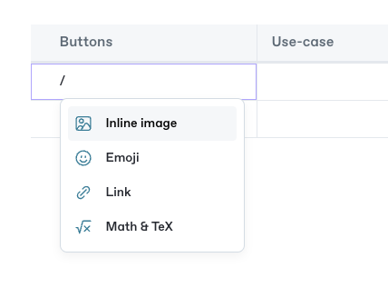

# Embed a URL

To add a rich embed, simply paste the link of the content you want to embed and press the enter key! ✨

### Examples of a rich embed


You can now convert embed blocks to full width by clicking on the  next to the block. [Read more about full-width blocks.](./#new-full-width-blocks)


### Videos



### Codepens



### Medium article



### Spotify music



### Git Sync representation in Markdown

```markdown



```
