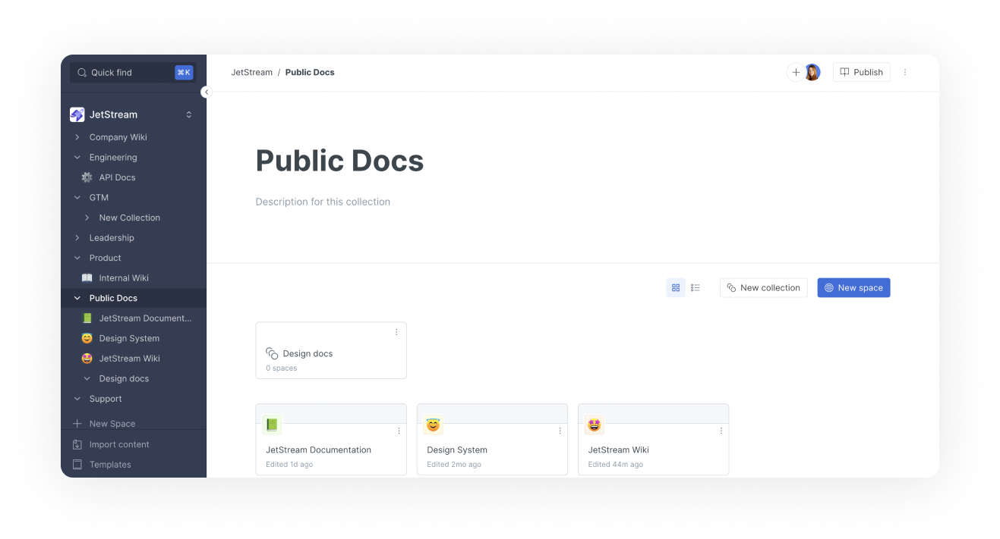

# What is a collection?

Collections are groups of spaces focused around a specific topic, team or purpose. You can think of them as a folder for your spaces.

#### Aside from organizing your content, some of the key features of collections are:

* The ability to manage permissions of spaces at scale allowing you to override the organization-level defaults (read more about that in [permissions](../../account-management/member-management/permissions-and-inheritance.md)).
* The ability to customize your collection and publish the spaces within it as variants (read more about that in [collection publishing](../../publishing/share/collection-publishing.md)).

<figure><figcaption>
A collection in GitBook
</figcaption></figure>

## Create a collection

You can create a collection directly in the sidebar:

<figure><figcaption>
Create a new collection from the sidebar
</figcaption></figure>

Or, in the collection view, by clicking the **new collection** button:

<figure><figcaption>
New collection button in the collection view
</figcaption></figure>

## Move a collection

Hover over the collection name in the sidebar, then click on the triple dot icon that appears on its right-hand side. Click **move to...** from this menu and then choose its new location.

## Nest collections

Collections can be nested inside each other, creating a collection -> sub-collection -> space hierarchy.

Hover over the collection name in the sidebar, then click on the triple dot icon that appears on its right-hand side. Click **move to...** from this menu and then choose its new location. Alternatively, you can drag and drop the collection to its new location.

## Delete a collection

Hover over the collection name in the sidebar, then click on the triple dot icon that appears on its right-hand side. Click **delete** from this menu to delete the collection.


**Deleting a collection is final**, but spaces inside a deleted collection will be moved to 'Trash' and can be restored up to 7 days after deletion.

