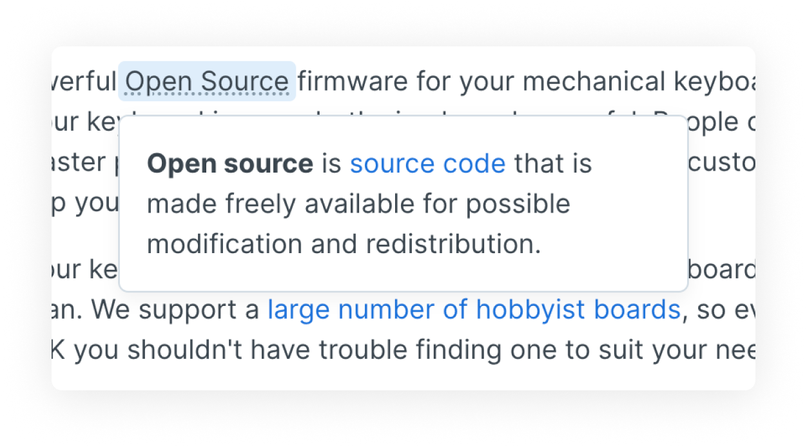

# Annotations

Annotations allow you to add more context into your text without breaking the readers train of thought.&#x20;

### Example of an annotation

<figure><figcaption>
Example of an annotation 
</figcaption></figure>

### How to create an annotation

To create an annotation select the word or phrase you would like to annotate. Once you have selected the text, write the annotation, then click out of it to continue writing in your main paragraph.&#x20;

### Git Sync representation in Markdown

Markdown footnotes will be imported as annotations
