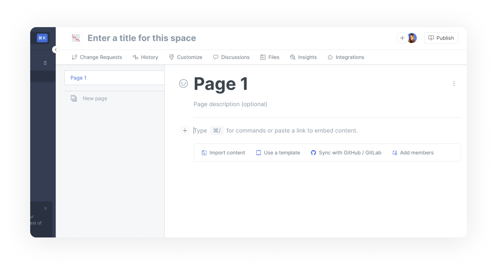

# Import

The import function allows you to migrate and unify existing documentation in GitBook. You can choose to import single or multiple pages although limits apply.&#x20;


**Permissions**

All members with editor permission or above can use the import feature.


## Supported formats

GitBook supports imports from websites or files that are:

* Markdown (.md or .markdown)
* HTML (.html)
* Microsoft Word (.docx).

We also support import from:

* Confluence
* Notion
* GitHub Wiki
* Quip
* Dropbox Paper
* Google Docs

You can also upload a ZIP **** containing HTML or Markdown files when **importing multiple pages.**


**Note: this feature is in beta.**

Feel free to suggest import sources we don't support yet and [let us know](../faq/support.md) if you have any issues.


## Import panel

When you create a new space, you'll have the option to import content straight away:

<figure><figcaption>
The new page menu
</figcaption></figure>

Import a page or subpage by selecting `Import Page` from the New Page menu, or `Import Subpage` in the page action menu, found in the table of contents:

<figure><figcaption>
Import from the page action menu
</figcaption></figure>

When you choose your input source, instructions will explain how to proceed.


Although GitBook supports importing content from different kinds of sources, the end result might be different from your source due to differences in product features and document format.


## Limits

GitBook currently has the following limits for imported content:

* The maximum number of pages that can be uploaded in a single import is **20.**
* The maximum number of files (images etc.) that can be uploaded in a single import is **20.**
