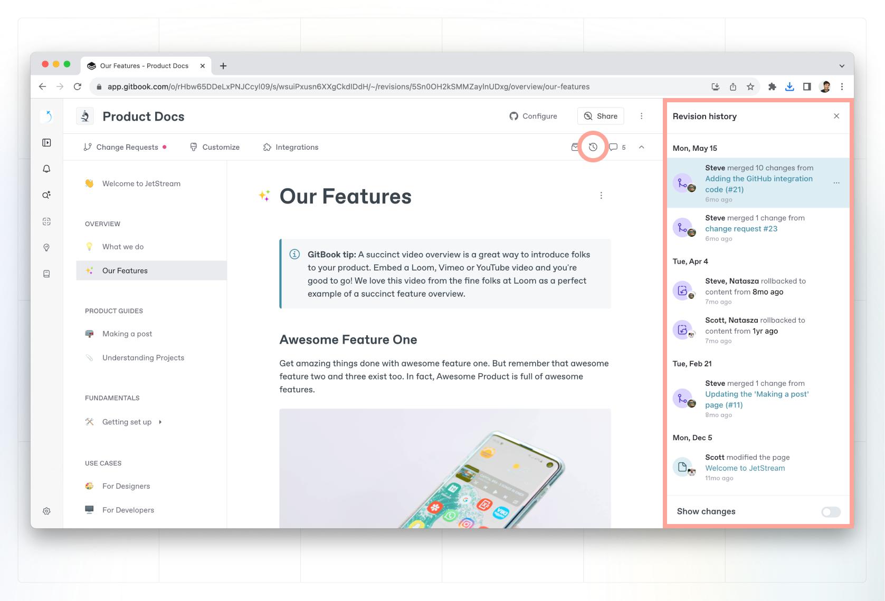

# Version control

You can easily monitor all changes submitted to your content thanks to the **history** tab. You’ll see your **revision history**, where you can specifically track changes to your space’s content.


**Permissions**

Only administrators can access the history tab, where they can view actions and change history in a space.


## Revision History 

The change history of a space is where you can specifically see actions that result in content changing. These include:

- When [live edits](editor/live-edits.md) have been made on the space.
- When a [change request](editor/change-requests.md) has been merged.
- When a [Git Sync](../integrations/git-sync/) operation has been performed.

### Viewing historical versions of content

To view past versions of your content and any changes that were made, navigate to the hourglass icon in the top right-hand corner of the space [sub-navigation](editor/navigation.md#space-sub-navigation). You can click on any item in the change history list to view how your content looked at the point this change was made. This is very similar to how [change requests](editor/change-requests.md) are viewed.

<figure><figcaption>
Revision History
</figcaption></figure>

### Rolling back to a previous version

Rolling back allows you to revert a space’s content to a previous point in time. This is helpful if you’ve accidentally made a breaking change or deleted content and need to quickly get back to a previous version of the space.&#x20;

Admins and creators can click the **rollback** button while viewing a specific history item to roll the space back to this point in time.
