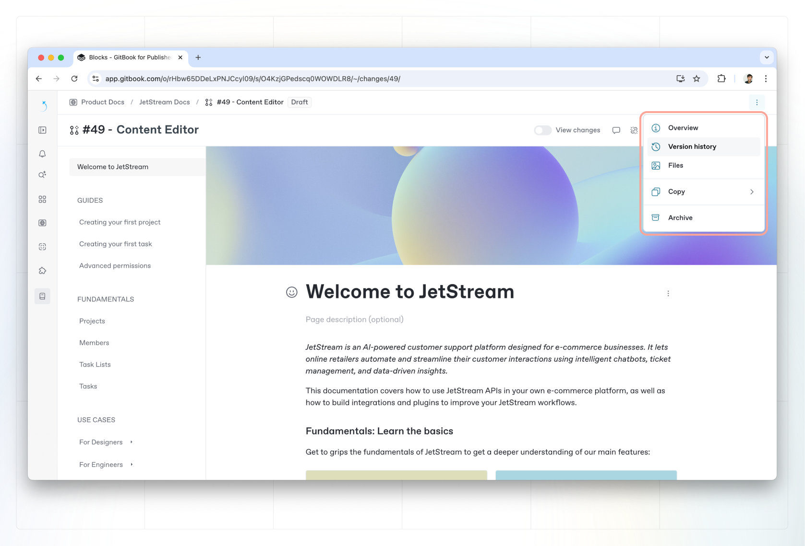

# Version control

You can easily monitor all the changes people have made to your content using to the **Version history** side panel.

### Version history 

In the Version history of a space, you can see a list of all the actions that changed the content within it. These include:

* When someone made [live edits](editing-content/live-edits.md) to the space.
* When someone merged a [change request](../collaboration/change-requests.md).
* When someone performed a [Git Sync](../integrations/git-sync/) operation.

### Viewing historical versions of content

To view past versions of your content and see the changes that were made, click the **Version history** <picture><source srcset="../.gitbook/assets/Revision history dark.png" media="(prefers-color-scheme: dark)"></picture> button from the space’s **Actions menu**  in the top-right corner.&#x20;


**Permissions:** Only users with **admin**, **creator**, **reviewer** and **editor** permissions can view the version history for a space.


Click on any item in the list to see how your content looked at the point this change was made. This is very similar to how you view [change requests](../collaboration/change-requests.md).

<figure><figcaption>
The <strong>Version history</strong> side panel shows all the historical changes people have made to a space.
</figcaption></figure>

### Show changes

When you are viewing an old version of your content, you can choose to highlight the differences between the old and current content — similar to [diff view in a change request](../collaboration/change-requests.md#diff-mode).&#x20;

To enable or disable this, use the **Show changes** toggle at the bottom of the **Version history** side panel.

With show changes enabled, content that has changed will be highlighted by an icon on the left of its content block.&#x20;

### Viewing historical published versions

If you're investigating the version history of a published space, you can also view previews of what the previous versions looked like in the published context (i.e. what the end user would see).

You can do this by:



From the version history side panel, select the revision



Copy the ID at the end of the URL



Add it at the end of your published docs URL as `/~/revisions/<id>`



### Rolling back to a previous version

Rolling back allows you to revert a space’s content to the way it was at a previous point in time. This is helpful if you’ve accidentally made a breaking change or deleted content and need to quickly get back to a previous version of the space.

To roll back to a previous version of your space, hover over the version in the side panel, click the **Actions button**  and select **Rollback**.


**Permissions:** Only users with **admin**, **creator** and **reviewer** permissions can roll back to a previous version.

