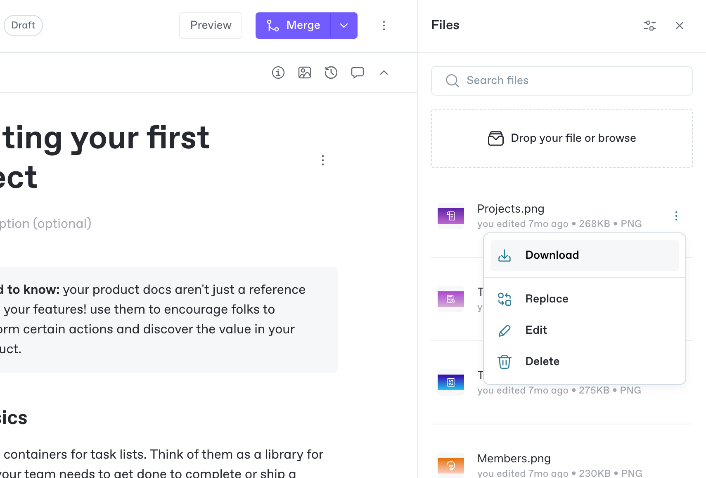

# Files

You can upload files to your GitBook space and add them to your page for people to view or download.

You can show some files, such as images and OpenAPI files, on the page itself for people to see without clicking anything. For others, such as PDFs, users will have to click to view or download it.

You can also optionally add a caption below any file you insert into your page to add more information if needed.

### Example of file 


This is a caption on a file.


## Uploading a file

You can manage uploaded files in the Files side panel of your space. To access the Files panel, click on **Files** <picture><source srcset="../../.gitbook/assets/Files dark.png" media="(prefers-color-scheme: dark)"></picture> in the [space sub-navigation](../editor/navigation.md#space-header-and-sub-navigation).

To upload a file, drag and drop it into the **Drop your file or browse** section, or select it and use your system file dialog to select the file you want to upload.&#x20;


GitBook allows you to upload files up to 100MB per file.


You can also add files to your space when you add an [image block](insert-images.md) or an [OpenAPI block](openapi.md). When you create one of these blocks, the Files panel will open, so you can either select a file, or upload a new file.


**Tip:** You can also drag and drop images from your file system directly into the editor — or paste a copied image into your content. GitBook will automatically add them to the Files side panel for the respective space, so you can view and manage them later.


## Managing files

In the **Files** side panel, you can search for, rename, or delete files in your current space. You can see all your uploaded files below the search bar and file upload sections.&#x20;

Each file has an **Actions menu**  that lets you download, replace, rename, or delete your file. You can search for file names using the search box. Above that you’ll find a **Sort** <picture><source srcset="../../.gitbook/assets/Sort dark.png" media="(prefers-color-scheme: dark)"></picture> option, which lets you sort your files by the date they were last modified, or their size.

<figure><figcaption>
In the Files side panel, you can upload, download, replace, edit, download and delete files.
</figcaption></figure>

### Renaming a file

To rename a file, open the **Actions menu**  for the file, and click **Edit**. In the dialog prompt, enter the new name of your file.

### Deleting a file

To delete a file, open the **Actions menu**  for the file and click **Delete**. After confirming in the dialog that you’re sure you want to delete the file, your file will be deleted.&#x20;


**Note:** Make sure you update any pages that included your deleted file! File blocks that reference a deleted file will show an empty block, or _Could not load image_ error.


### Replacing a file

If you have a file that simply needs updating to a new version, you can replace it. This will swap out the old file and put the new file in its place. Any blocks that previously referred to the old file will then refer to the new file.

To replace a file, open the **Actions menu**  for the file and click **Replace**. In the file replacement dialog that appears, select the new file and wait for the upload indicator to complete. Your file will automatically update everywhere it appeared in your space.

This can be helpful if, for example, you’ve had a major product redesign and need to update outdated UI screenshots that appear on multiple pages. Replacing the original file would update the screenshot everywhere in your space, saving you time and effort.


**Tip:** Once you’ve uploaded an image or a file, you can reference it anywhere in your space by creating an image or a file block and selecting it from the **Files** side panel.&#x20;

We recommend you do this rather than uploading the image again every time you want to include it, to make it easier to replace images later and to avoid having multiple files with the same name.


### Related — embed external content 

If you want to embed external content into your pages, take a look at [how to embed a URL](embed-a-url.md).
