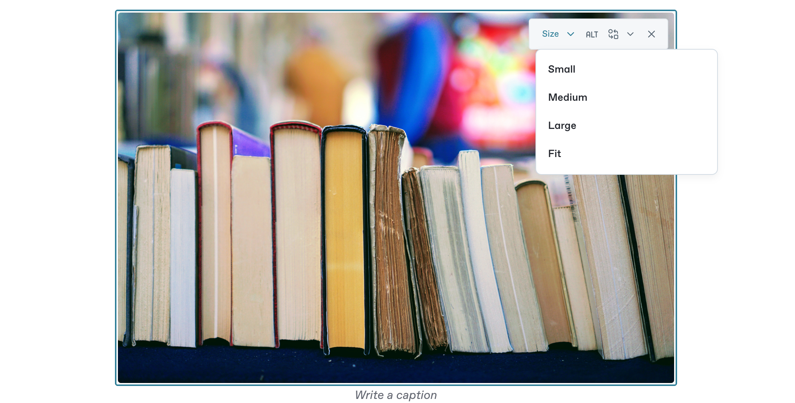

# Images

You can insert images into your page, then choose their size and whether to align them to the left, center, or right. You can also optionally include alt text and/or a caption on your image block.&#x20;


**Tip:** For accessibility purposes, we highly recommend setting alt text for every image in your space.


### Image block examples <a href="#example-of-an-image-block" id="example-of-an-image-block"></a>

Image blocks can display a single image or a gallery on your page, like this:&#x20;

<div align="center">


</div>


You can make image blocks [span the full width of your window](./#full-width-blocks) by clicking on the **Options menu**   next to the block and choosing **Full width**.


### How to add images

There are two ways to add images to your content:

1. Drag and drop the image from your file management system directly into an empty block on your page.
2. [Add an image block](./#inserting-a-new-content-block) to your page and use the **Select images** side panel that appears on the right of the window.&#x20;

If you follow the second process, you can choose to upload a file, select a previously-uploaded file, paste an image URL or add an image from [Unsplash](https://unsplash.com/) using the built-in search.


GitBook allows you to upload images up to 100MB per file.


#### How to create an image gallery

Adding more than one image to an image block will create a gallery. To do this, open the block’s **Options menu**  and choose **Add images…** to open the **Select images** side panel again.

To delete an image from a gallery, open the **Actions menu**  on the image you want to delete and press the **Delete ⌫** key.

### Adding images for light & dark mode <a href="#light-and-dark-mode" id="light-and-dark-mode"></a>

You can set different images for the light and dark mode versions of your published site. GitBook will automatically display the correct image depending on the mode your visitor is in.

To add an image for dark mode, hover over your image, open the **Actions menu**  and click **Replace image** <picture><source srcset="../../.gitbook/assets/Replace image dark.png" media="(prefers-color-scheme: dark)"></picture>. In the drop-down menu, choose **Add image for Dark mode**. Once you’ve set this, you can replace either image from this same menu.

<figure><figcaption><p>Once you’ve set an image for both light and dark mode, you can replace either from this menu.</p></figcaption></figure>


**Note:** GitBook doesn’t currently support light and dark mode images for certain cases, including [page covers](../../published-documentation/customization/page-layouts.md#page-covers) or image covers on [cards](cards.md).


### Light and dark mode images through GitHub/GitLab Sync <a href="#light-and-dark-mode-through-github-gitlab-sync" id="light-and-dark-mode-through-github-gitlab-sync"></a>

You can also add light and dark mode images in Markdown through HTML syntax (`<picture>` and `<source>`).

For block images, use the `<figure>` HTML element with a `<picture>` and `<source>` in it:

```html
Text before

<figure>
  <picture>
    <source
      srcset="
        https://user-images.githubusercontent.com/3369400/139447912-e0f43f33-6d9f-45f8-be46-2df5bbc91289.png
      "
      media="(prefers-color-scheme: dark)"
    />
    
  </picture>
  <figcaption>Caption text</figcaption>
</figure>

Text after
```

For inline images (images that sit inline with text), use the `<picture>` HTML element with a `<source>` in it:

```html
Text before the image
<picture
  ><source
    srcset="
      https://user-images.githubusercontent.com/3369400/139447912-e0f43f33-6d9f-45f8-be46-2df5bbc91289.png
    "
    media="(prefers-color-scheme: dark)" />
  </picture>
and text after the image
```


**Note:** We don’t yet support [GitHub-only syntax](https://github.blog/changelog/2021-11-24-specify-theme-context-for-images-in-markdown/) through `#gh-dark-mode-only` or `#gh-light-mode-only`.


### Resizing

To resize your image, hover over it and open the **Actions menu** . Click the **Size** button to change the size of your image from the available options.

<figure><figcaption></figcaption></figure>

* **Small** – 25% of the image size
* **Medium** – 50% of the image size
* **Large** – 75% of the image size
* **Fit** – Removes all size specifications and displays either at full size or capped at a maximum width of **735** **pixels** for larger images.

If your image is wider than the editor, GitBook will limit the image’s width to the editor’s width instead, and resizing will be based on this limit.


**Note:** When resizing images in an image gallery, the results can differ from resizing an individual image.


### Resizing images through Git Sync

If you want more control over the sizing of your image, you can specify the exact size using Markdown in GitHub or GitLab.

When we export an image, we use the HTML tag ``. As per the specifications, we can specify the dimensions of the image using the `width` and `height` attributes, which only accept values in pixels or a combination of a number and a `%` sign.\
\
Valid variants for specifying the image dimensions are:\
\
`` Sets the image to 100 pixels wide\
`` Sets the image to full size (although this will be limited by the editor)

### Aligning images

By default, image blocks will show your image at its full size, aligned centrally.

To change the alignment of an image, open the block’s **Options menu**  and choose the alignment you want. This will only affect images that are narrower than the editor, or images you’ve [resized](insert-images.md#resizing).

### Representation in Markdown

```markdown
//Simple Block


//Block with Caption


//Block with Alt text

<figure></figure>

//Block with Caption and Alt text

<figure><figcaption><p>GitBook Logo</p></figcaption></figure>

//Block with different image for dark and light mode, with caption
<figure>
  <picture>
    <source srcset="https://user-images.githubusercontent.com/3369400/139447912-e0f43f33-6d9f-45f8-be46-2df5bbc91289.png" media="(prefers-color-scheme: dark)">
    
  </picture>
  <figcaption>Caption text</figcaption>
</figure>
```

### Related

If you are looking to embed external content into your pages, take a look at how to [embed a URL](embed-a-url.md).
