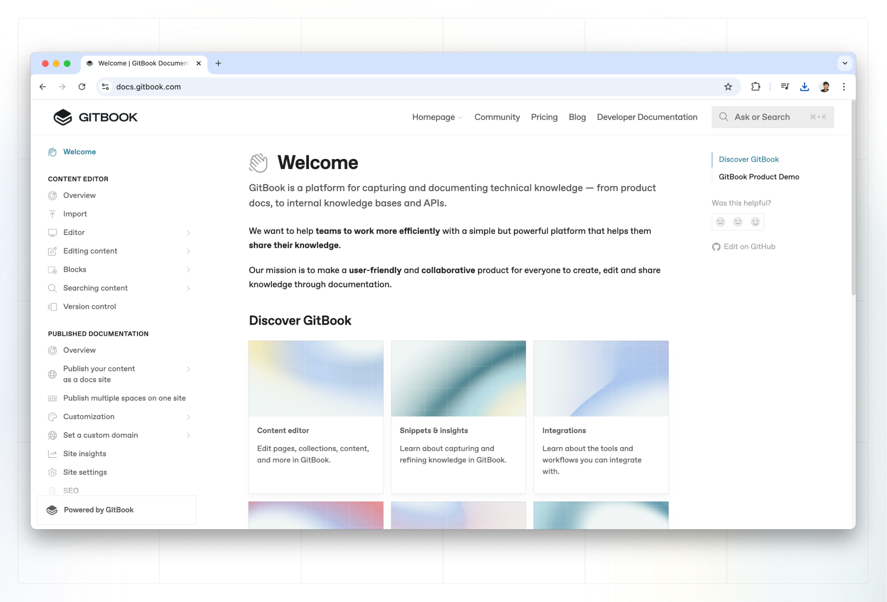

# Ordered lists

Ordered lists, also called numbered lists, help you prioritize items or create a list of steps.&#x20;

### Example of ordered list

1. Item 1
   1. Nested item 1.1
      1. Nested item 1.1.1
   2. Nested item 1.2
2. Item 2
3. Item 3


To create nested items, you can use **Tab** to indent and **⇧ + Tab** to outdent.


### Representation in Markdown

```markdown
1. Item 1
   1. Nested item 1.1
      1. Nested item 1.1.1
   2. Nested item 1.2
2. Item 2
3. Item 3
```

### Adding an inline image to an ordered list

A common pattern in documentation is adding images throughout ordered lists to help guide users with screenshots or diagrams.&#x20;

Let's say we want to add an image below the second item in our ordered list. In order to accomplish this in GitBook, on the row below the image you would type `3.` and then hit `space`, and the ordered list would continue.

1. Item 1
2. Item 2



3. Item 3
4. Item 4
