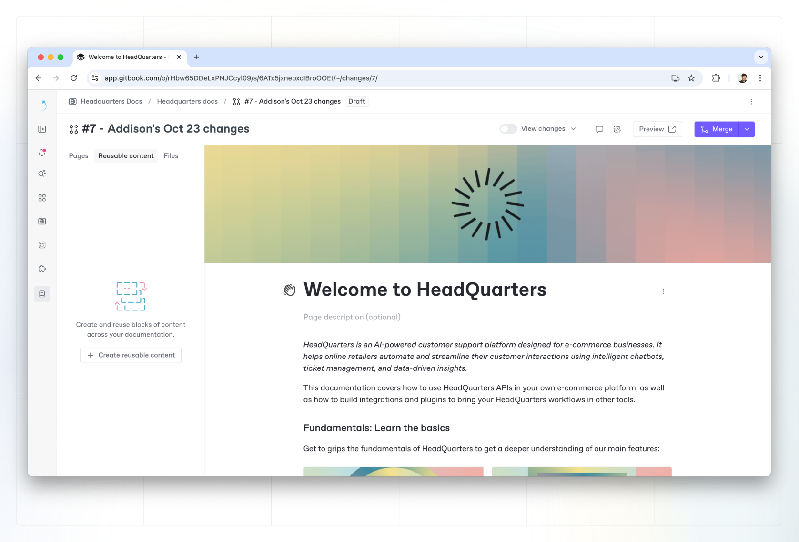

# Reusable Content Blocks (beta)

Reusable content blocks allow you to insert reusable content into your docs. See the overview page for [Reusable Content](../../reusable-content/overview.md) for more info.

<figure><figcaption></figcaption></figure>

### **Insert reusable content**

You can insert a reusable content block as you would with any other block. Hit `/` on an empty line to open the **Insert palette** and choose **Reusable Content Block**. Alternatively, click the `+` on the left of any block or empty line.&#x20;

You can choose the block you want to add from the list, or search for the one you need.

### **Detach a reusable content block**

You can detach a reusable content block by opening the **Action menu**  and selecting **Detach instance**. Detaching an instance of a block will only detach it in the current page.

Once detached, any changes you make to the block(s) will not be reflected across the other instances, and changes you make in those instances will not be reflected in the detached block(s).

