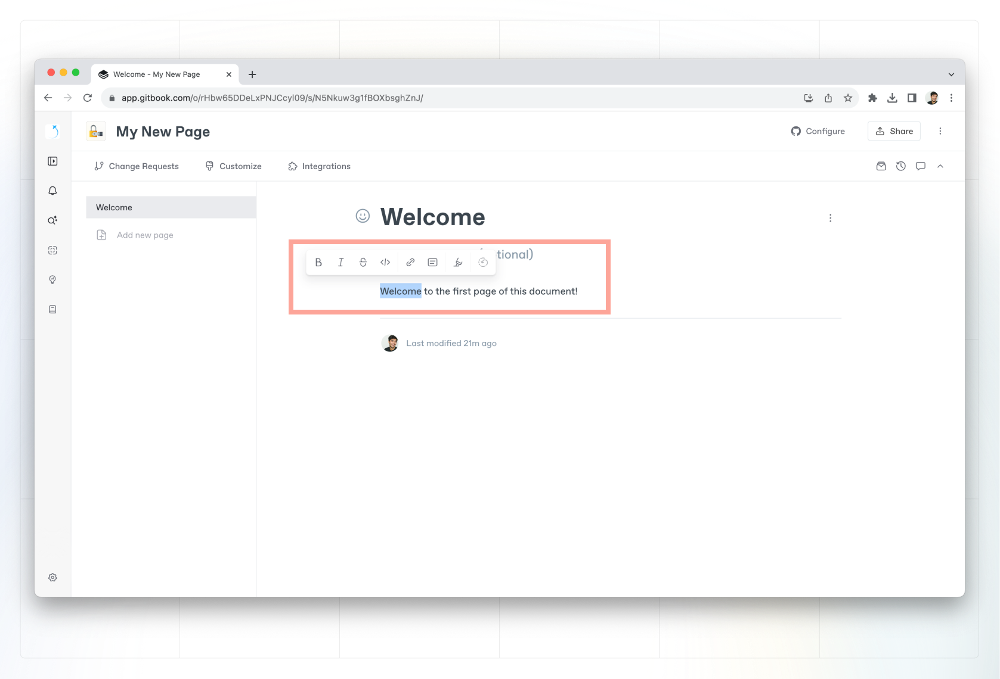

# Formatting your content

To format your text, simply select it and choose one of the formats from the context menu — or use a keyboard shortcut or Markdown syntax. We’ve listed those out below:

<figure><figcaption><p>bold, italics context menu with text highlighted</p></figcaption></figure>


We’ve written these shortcuts using Mac keys. Use **Control** in place of **⌘ (Command)** on Windows or Linux operating systems. Check out [our keyboard shortcuts page](../../help-and-faq/keyboard-shortcuts.md) to see all the shortcuts for all operating systems.


### Bold

Keyboard shortcut: **⌘ + B**



```markdown
**Bold**
```



### Italic

Keyboard shortcut : **⌘ + I**



```markdown
_Italic_
```



### Strikethrough

Keyboard shortcut: **⇧ + ⌘ + S**



```markdown
~~Strikethrough~~
```



### Code

Keyboard shortcut: **⌘ + E**



```markdown
`Code`
```



### Link

Keyboard shortcut: **⌘ + K**

When you add a link to text on your page, you’ll be prompted to provide the link. You can add any URL, but if you’re linking to another page or section in your space, we recommend [using a relative link](inline.md#relative-links).

This is [a link to an external page](https://www.gitbook.com).

This is a [link to another page in this space](../blocks/).

This is a [link to a section on this page](formatting.md#code).

This is [a link that starts an email to a specific address](mailto:support@gitbook.com).
