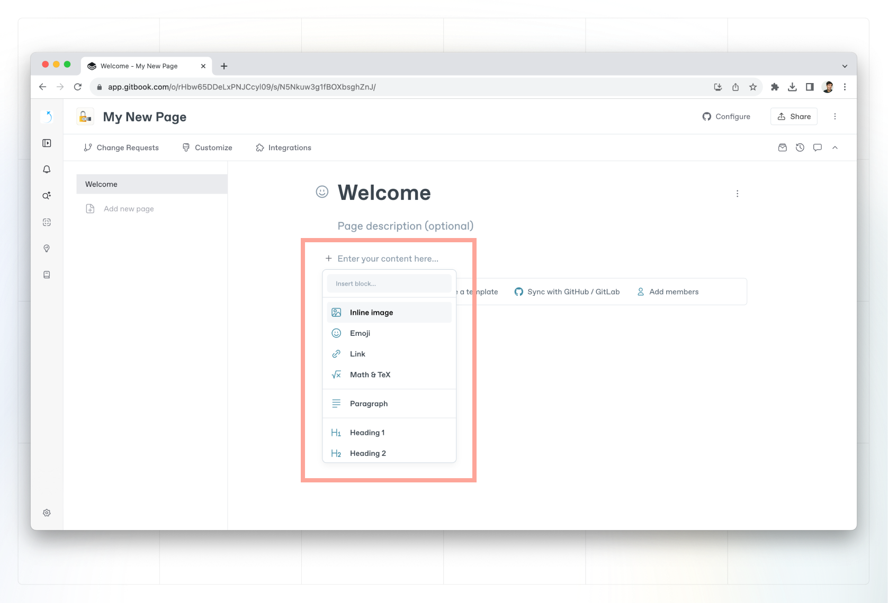
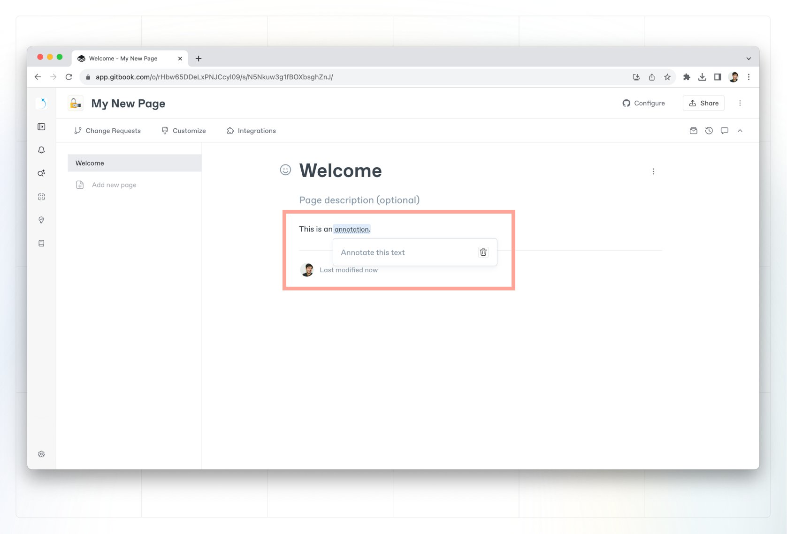

# Inline content

You can also add content to your document by launching the inline palette with the (`/`) command. The forward slash will be replaced by the content you choose to insert.&#x20;

<figure><figcaption>
Inline palette
</figcaption></figure>

## Annotations

Annotations allow you to add more context to your text without breaking the reader’s train of thought.

<figure><figcaption>
Create an annotation.
</figcaption></figure>

### Create an annotation

To create an annotation select the word or phrase you would like to annotate, and click the **annotate** option. Once you’ve written your annotation, click outside of it to continue writing in your main paragraph.

### Markdown representation

Content written as [Markdown footnotes](https://www.markdownguide.org/extended-syntax/#footnotes) will be added as annotations.

## Images

You can insert inline images to your content. By default, their size is proportional to the font size. This is great for adding things like badges or icons.‌

There are 3 different sizes of inline images:‌

1. **Inline size:** the default one is proportionally sized to the font.
2. **Original size:** will remain inline but with its original size with a maximum width.
3. **Convert to block:** this turns an inline image into a [block image](../blocks/insert-images.md) with its original size.


You can switch the size of an inline image by clicking on the image to open the formatting palette, and then choosing one of the options above.


## Emojis

You can add emoji by opening the **inline palette**. Alternatively, type `:` and a list of emojis will pop up directly in line.&#x20;

## Links

You can insert three different types of links:

- [Relative links](inline.md#relative-links)
- [Absolute links](inline.md#absolute-links)
- [Email address `mailto` links](inline.md#email-addresses)

## Relative links

Relative links are links created by linking pages that already exist in your content. The advantage of using relative links is that if the page’s URL, name, or location changes, its reference will be kept up to date resulting in fewer broken links.

Here’s how to insert a relative link:

1. Select some text or click somewhere in your paragraph where you want to insert the link.
2. Wait for the inline palette to appear.
3. Click the inline palette.
4. Start typing the page title.
5. Select the page from the drop-down search results.
6. Hit `enter`.

## Absolute links

Absolute links are for external links.


External links will always open in a new tab.


Here’s how to insert an absolute link:

1. Select some text or click somewhere in your paragraph where you want to insert the link.
2. Wait for the inline palette to appear.
3. Click the inline palette.
4. Paste a URL.
5. Hit `enter`.

## Email address mailto links

Email address `mailto` links are useful when you want your visitors to click on a link that will open up their default email client, fill in `TO` with the email address of your link, and allow them to write an email to send out.

Here’s how to insert an email address `mailto` link:

1. Select some text or click somewhere in your paragraph where you want to insert the link.
2. Wait for the inline palette to appear.
3. Click the inline palette.
4. Paste or type `mailto:something@address.com`, replacing `something@address.com` with the email address you would like to use.
5. Hit `enter`.

## Math & TeX

You can create an inline math formula like this: $$f(x) = x * e^{2 pi i \xi x}$$. We use the [KaTeX](https://katex.org/docs/supported.html) library to render formulas.


You can also insert a block-level math formula directly from the [**command palette**](../blocks/#math-equation).

