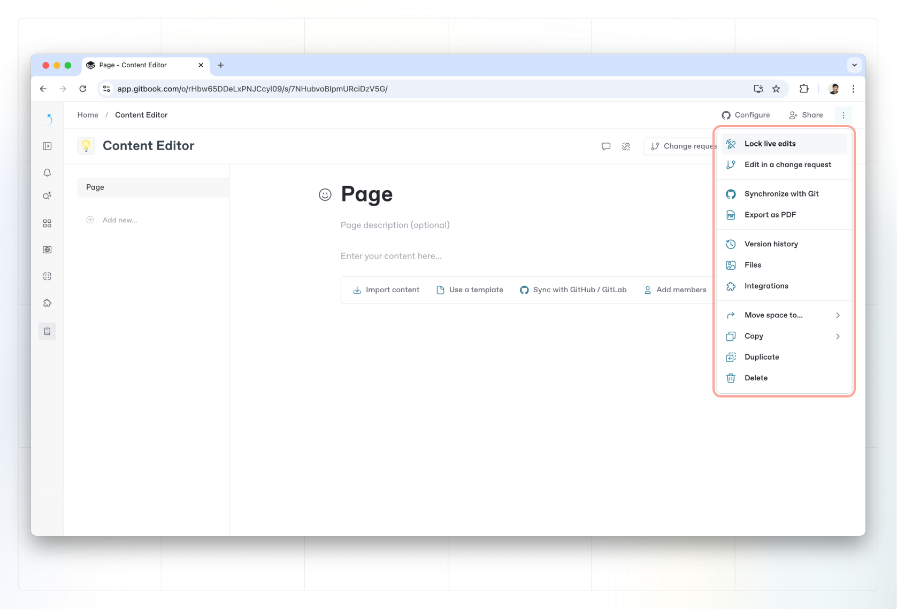

# Live edits

**Live editing** is the default editing mode for any newly-created GitBook space. A space in live edit mode is editable by anyone with the [right permissions](../../account-management/member-management/roles.md).

With live editing enabled, you can see the avatars of anyone currently viewing the space in the top-right corner.

GitBook supports live collaboration, meaning you’ll be able to work on the same document with multiple members at the same time.

## Toggling live edit mode

You can toggle live edit mode in a space by selecting **Lock live edits** or **Unlock live edits** from the space’s **Action menu** .

<figure><figcaption>
You can lock or unlock live edits on a space from the Actions menu.
</figcaption></figure>

### When is live editing _not_ available?

You cannot unlock live editing if:

1. a space is [published](../../published-documentation/overview.md) with the **In collection**, **Public**, or **Unlisted** [visibility option](../../collaboration/share/share-a-space.md). We know this is a limitation, and we hope to change this in the future.
2. a space has [GitHub or GitLab Sync](../../integrations/git-sync/) enabled.


Only users with the **admin** or **creator** [roles](../../account-management/member-management/roles.md) can lock or unlock live edits.

