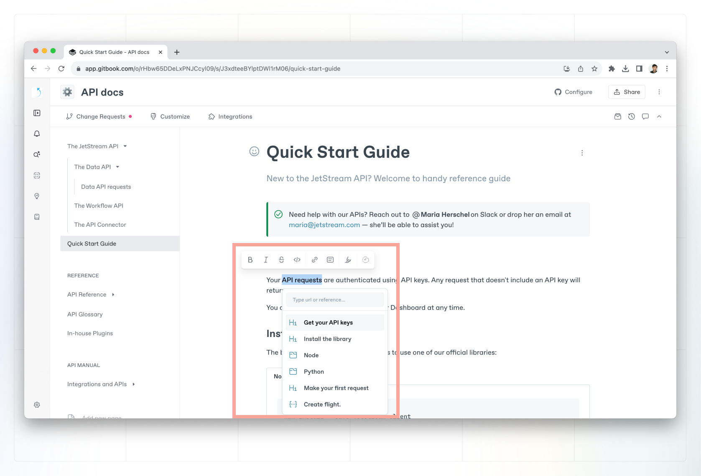

# Rich text

### Links 

‌You can add links to your document in 2 different ways:‌

#### Relative links 

Relative links are links created by linking pages that already exist in your content. Relative links are useful if the page’s URL, name, or location changes, as its reference will be kept up to date—resulting in fewer broken links.

<figure><figcaption>
adding relative link
</figcaption></figure>

#### Absolute links

Add an absolute link if you would like to link to an external website or resource. Select some text to open the **inline palette**, click the link icon , paste a URL and press **enter**.


You can also add a link by selecting text and pressing `CMD` + `K` to bring up the inline palette for links.


#### Email address

You can also add an email address using the inline palette. Write `mailto:name@email.com` and click **enter**.
