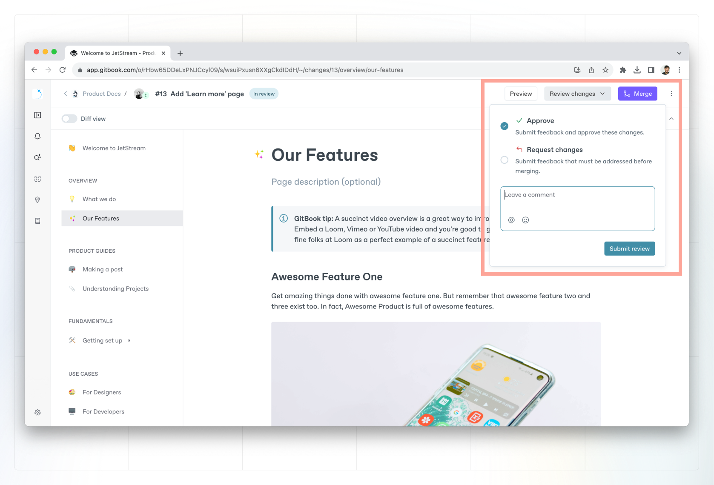
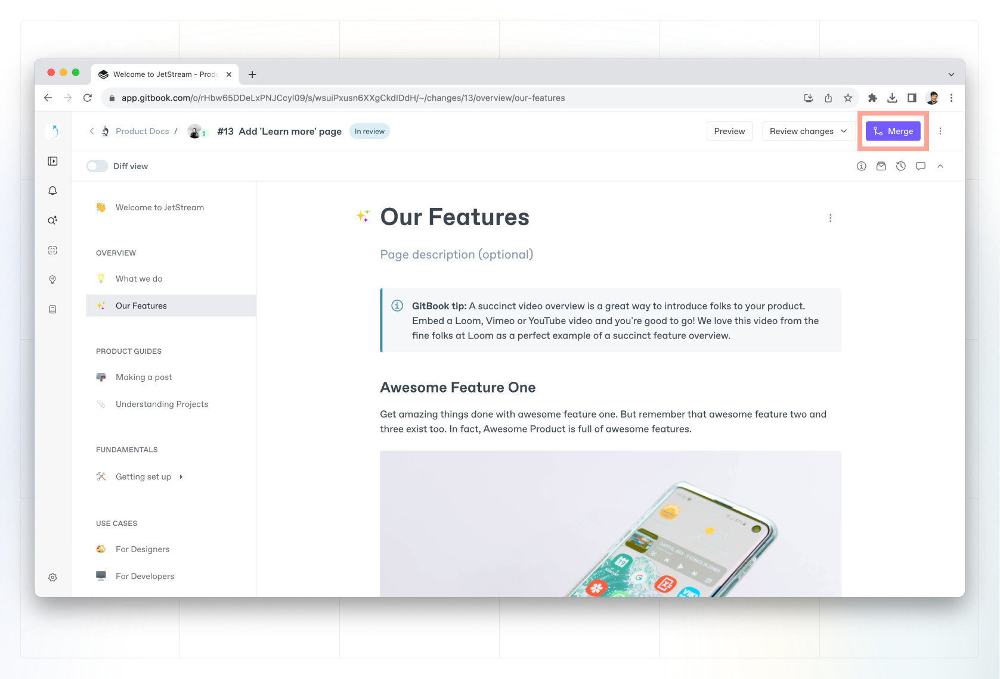
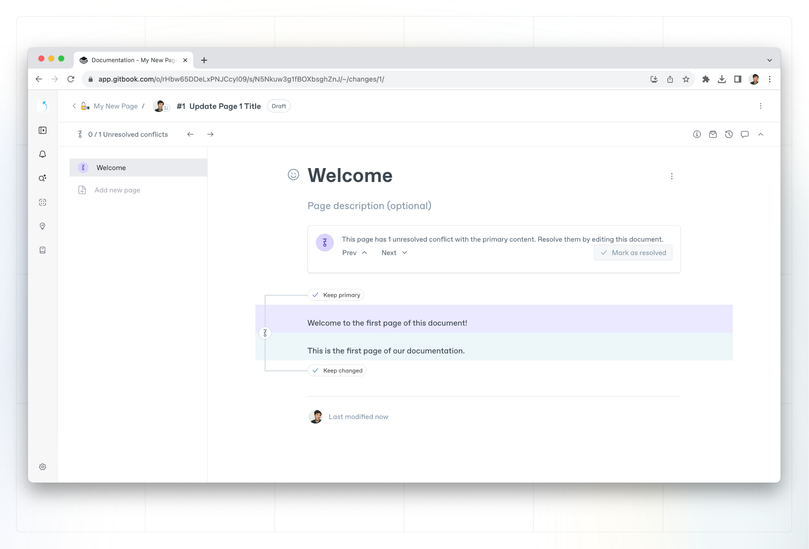

# Change requests

A change request is a copy of your main content. It comes from the simple concept of [**branching**](https://git-scm.com/book/en/v2/Git-Branching-Branches-in-a-Nutshell), and will feel familiar to anyone who uses pull requests in GitHub or merge requests in GitLab.

In a change request, you can edit, update and delete elements of your content, request reviews on your changes, then merge them back into your main version to apply all the changes you made.


**Note:** You’ll need to open a change request to edit any content in any [published](../../published-documentation/overview.md) space, any space that’s [synced with GitHub or GitLab](../../integrations/git-sync/), or any space with [locked live edits](live-edits.md).


### Creating a change request

Inside a space where live edits are disabled, click the **Edit** button in the space header to start a new change request.

<figure><figcaption>
You can start a new change request by clicking the Edit button in the top-right of the window, which only appears if live edits are locked.
</figcaption></figure>

This will open a new change request, where you can edit or delete content as needed. Your changes are saved automatically, and other people can join you in a change request to collaborate in real-time.

Once you’re happy with your changes, you can use the button in the header bar to **Request a review** of your change request, or **Merge** it directly into the main branch.


Any member with an [editor](../../account-management/member-management/roles.md#editor) role can create and submit a change request, but only members with a [reviewer](../../account-management/member-management/roles.md#reviewer) role or above can merge it.


### Preview a change request

You can preview the changes you've made in a change request through the preview button in the upper right corner. This will open up a window with your docs and the proposed changes in a staging environment, so you and your team can see your changes in the entire context of your published documentation.


If your content is published using share links or visitor authentication, the preview function won't appear.


<figure><figcaption>
Preview a Change Request
</figcaption></figure>

### Request a review on a change request

You can request a review on your change request when you want to ask members of your team to check your content before you merge the changes into the main branch.

You can add a description to your change request to give your reviewers some context, and tag specific people that you want to check your work.

When you click **Request review**, the change request’s status will change to **In review**, and anyone you tagged in your review request will get a notification.


**Note:** If you don’t tag anyone in your review request, everyone with reviewer permissions or higher will get a notification about your request.


<figure><figcaption>
When you request a review, you can add a description to give people more context, and tag specific reviewers.
</figcaption></figure>

If your changes don’t require a review, you can merge your changes into the main version directly instead.

### Merging a change request

Merging a change request will add the change request’s changes into the main branch of content, creating an updated version and a new entry in the space’s [version history](../activity-history.md#see-the-activity-of-a-specific-draft).

<figure><figcaption>
Once you’re happy with your changes, you can click <strong>Merge</strong> to add the changes to the main branch.
</figcaption></figure>

### Handling merge conflicts

Sometimes, when you want to merge a change request, you may discover conflicts between the main content and the content you’re trying to merge. In the simplest form, a conflict is a piece of content that could not be merged automatically.

If this happens, you’ll be presented with a conflict alert, and a list of the conflicts you’ll need to resolve before continuing the merge.

<figure><figcaption>
You may experience a merge conflict — this menu should give you some context about what happened so you can resolve it.
</figcaption></figure>

### Resolving merge conflicts

You have two options when it comes to resolving a merge conflict — **selecting a version to merge** or **manually** **editing the content**.

#### Selecting a version to merge

You can resolve a merge conflict by selecting a version you want to merge — either your incoming content, or the content that was previously there. This allows you to choose between one change and another — either your recent work, or the original content.

If you’re dealing with a merge conflict that can be resolved this way, you can select the version you want to keep, and the other version will be deleted.

#### Manually editing

If you don’t want to choose between versions, you can resolve a merge conflict by manually editing the conflict. You’ll be able to delete the blocks you don’t need, or even rewrite them entirely. Once you’re happy with the changes, you can move on to the next conflict until they’re all resolved.

### Reviewing a change request

If you get a request to review a change request, you'll be able to edit the content and leave feedback to make sure it's in good shape before it’s merged to the main version. You can either request changes if you think it still needs work, or approve the change request, to signal it's ready to merge.

Most reviews will take place in the change request’s [comments](../../collaboration/comments-discussion.md), where collaborators can share feedback and have discussions about specific content blocks, or the change request as a whole.

#### Diff view 

Diff view allows you to toggle a view that makes it easy to see what’s been edited in a change request.

It highlights edited pages in the table of contents, so you can quickly jump to the relevant parts of the space. And on individual pages, diff view shows the specific blocks that you’ve added, edited or removed.

You can toggle diff view on or off for any change request.

<figure><figcaption>
You can toggle diff mode on or off for any change request to make it easier to see what’s changed.
</figcaption></figure>


**Remember:** Members with an [editor](../../account-management/member-management/roles.md#editor) role can create and submit requests, but only members with a [reviewer](../../account-management/member-management/roles.md#reviewer) role or above can merge change requests.


### Archiving a change request

If you decide not to merge a change request and want to remove it from the queue, you can archive it.

To archive a change request, first open it up. Then click the **Actions menu**  in the top-right corner of the window and choose **Archive**. You can find and reopen archived change requests later by opening the **Change Requests** menu and selecting the **Archived** tab.

<figure><figcaption>
To find a change request that you archived, open the <strong>Change Requests menu</strong> and select the <strong>Archived</strong> tab. You can reopen archived change requests if needed, too.
</figcaption></figure>
