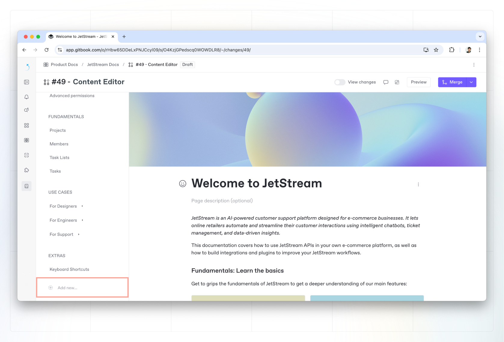

# Pages

A page in GitBook is the place where you add, edit and embed content. Pages always live inside a [space](what-is-a-space.md), allowing you to group up related content and create different sections for the topics or areas you’re covering.

### Table of contents

You can create as many pages as you need in a space. They’re all visible on the left side of your screen in your space’s [table of contents](../navigation.md#table-of-contents).

### Hide a page from the table of contents

You can hide a page or group of pages from your site's table of contents by clicking the page’s **Action menu**   and toggling **Hide page**.

Hidden pages will still be indexable by search and GitBook AI, but will not appear in the table of contents in your published site. Hidden pages will still be accessible through direct links.

If hidden the following will appear in the front matter of the markdown file when using Git Sync:

<pre class="language-markdown"><code class="lang-markdown">---
hidden: true
<strong>---
</strong></code></pre>



### Organizing your content

There are three types of pages you can add:

#### Pages

A page has a title, and optional description, and an area where you can write and add any kind of content.‌

You can nest pages by dragging and dropping a page below an other in the table of contents. Doing this creates a subpage.


**Tip:** There’s no limit to page nesting, but we’d recommend you avoid more than three levels of nesting to avoid an overly-complex navigation.


When you change the title of a page, the page’s slug (the part at the very end of the URL, e.g. `/hello-world`) will also change — unless you’ve manually set the page’s slug previously.

You can change the title and the slug of a page at any time by clicking opening the page’s **Action menu**   and choosing **Rename**.

#### Page groups

Page groups make it easy to bring pages together into sections that cover related content.

Page groups can only live at the **top level** of the [table of contents](../navigation.md#table-of-contents). You cannot nest page groups inside page groups.

To change the title and slug of a page group, click the **Action menu** icon  next to the group title in the table of contents and choose **Rename**.

#### External links

External links are simply links to external sites and resources. Adding a link doesn’t create a page in your content. Clicking one in the sidebar will immediately open the link in a new tab.

### Create a new page

<figure><figcaption>
You can create a new page or page group from table of contents.
</figcaption></figure>

When in [live edit](../live-edits.md) mode or in a [change request](../change-requests.md), you can create a new page by clicking **Add new page** > **New document page** at the bottom of your table of contents.&#x20;

Alternatively, you can hover between pages in the table of contents and click the **+** icon that appears.

Once you’ve created a new page, you can add content to it using the [editor](../).

### Create a page group

Just like creating a new page, you can create a page group by choosing **Add new page** > **New group** from the bottom of your table of contents.

### Create an external link 

To add an external link to your space, click the **Add new page** button at the bottom of the table of contents, then choose **New link**. Give the link a title — this will appear in the table of contents — and then add the URL and click **Insert**.

### Add an icon or emoji to your page



To add better visibility for readers when skimming your table of contents, you can add an optional icon or emoji to an individual page. The icon or emoji will appear in the table of contents, and next to the title at the top of the page.

To add an icon or emoji, click the "**Add icon**" button when hovering the page title, or the emoji button to the left of the title.

<figure><figcaption></figcaption></figure>

#### Customize the icon style

You can choose the style and weight of the icon in your published site's settings. You can find the icon's style settings and more [here](../../../published-documentation/customization/space-customization.md#styling).

### Can’t see the option to create a new page?


If [live edits](../live-edits.md) are disabled for your space, you’ll need to create or edit a [change request](../change-requests.md). Once you’re in a change request, the **New page** button (which allows you to create pages, page groups and links) will be available in the table of contents.

Alternatively, you may not have the correct [permissions](../../../account-management/member-management/permissions-and-inheritance.md) to edit a page.

