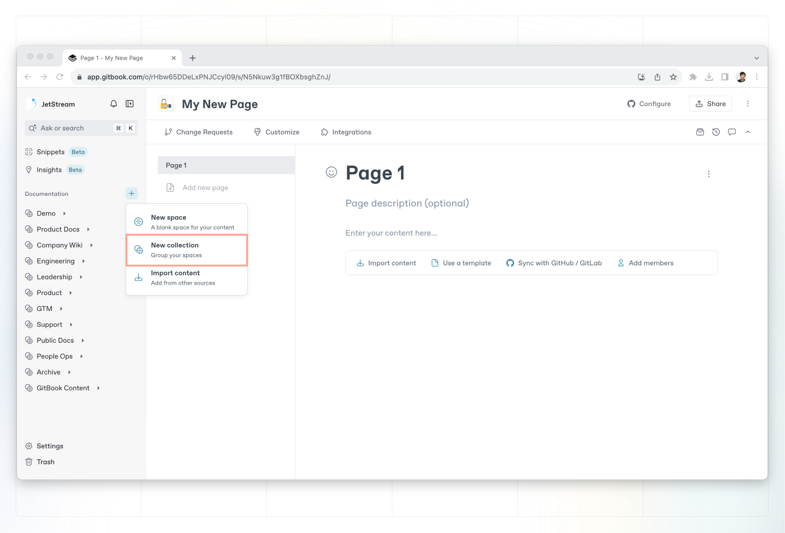

# Collections

Collections are groups of spaces focused around a specific topic, team or purpose. You can think of them as a folder for your spaces.

Collections allow you to:

* organize your content by similar topics or ideas
* manage space [permissions](../../../account-management/member-management/permissions-and-inheritance.md) at scale by allowing you to override the organization-level defaults

<figure><figcaption>
The main view of a collection, with other collections and spaces inside.
</figcaption></figure>

### Create a collection

Click the **+** button next to the **Documentation** header in the sidebar to create a new collection. You can also create a collection or space within another collection from the collection’s main page.

<figure><figcaption>
You can create a collection from the sidebar, or from within another collection.
</figcaption></figure>

### Move a collection

You can move a collection by opening the **Action menu** , selecting **Move collection to…** and choosing a destination. Alternatively, you can drag and drop collections in the sidebar to move or reorder them.\
\
You can move collections into other collections — or even to other organizations, if you have an [admin role](../../../account-management/member-management/roles.md) in both.

### Nested collections

You can nest collections inside each other, creating a collection -> sub-collection -> space hierarchy.

Open a collection and you can click **New collection** from the collection’s main page to create a sub-collection.

To move one collection into another, click **Move collection to…** from the collection’s **Action menu**  and then choose its new location. Alternatively, you can drag and drop the collection to its new location.

### How to delete a collection

You can delete a collection by opening it’s **Action menu**  and selecting **Delete**.


**Deleting a collection is final**, but spaces inside a deleted collection will move to the **Trash** and can be restored up to seven days after deletion. You can access the Trash from the bottom of the sidebar.

