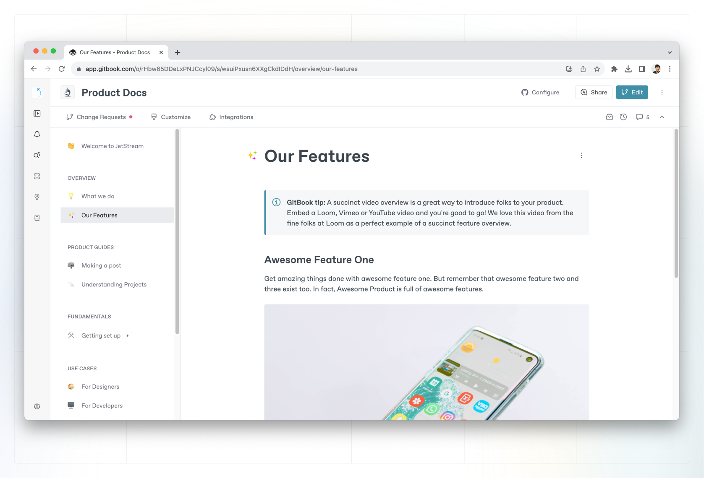
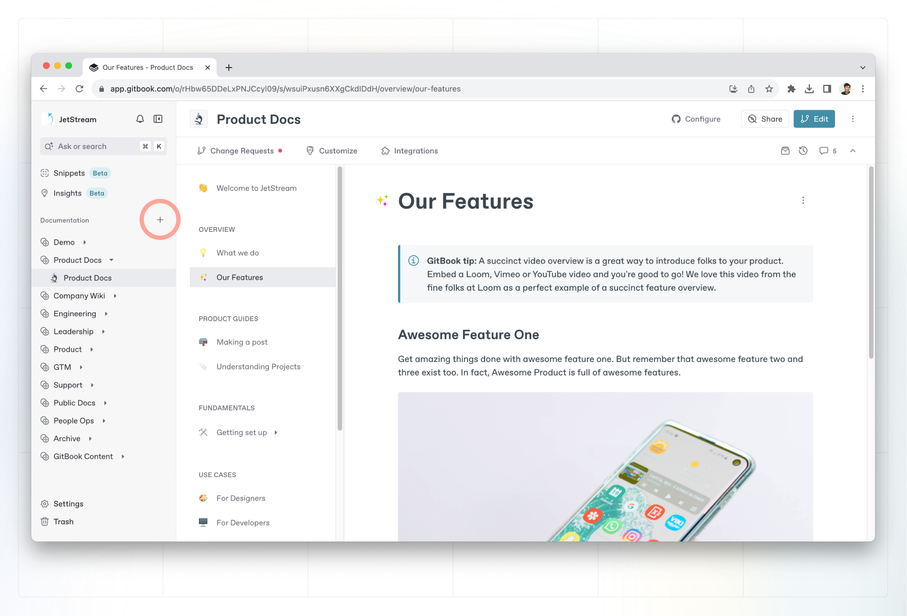

# Spaces

A space is a project that lets you work on a collection of related pages. Imagine it as a virtual book where you can start writing pages individually or collaborate asynchronously with your team members.

<figure><figcaption>
A GitBook space — a collection of pages on a related topic.
</figcaption></figure>

### Create a space

Click the **+** button next to the **Documentation** header in the sidebar and choose **New space** to create a new space. You can also create a new space from a [collection](what-is-a-collection.md).

<figure><figcaption>
You can create a new space from the sidebar by hitting the <strong>+</strong> next to the <strong>Documentation</strong> header.
</figcaption></figure>

### Duplicate a space

To duplicate a space, open that spaces **Action menu**  in the sidebar and select **Duplicate**.

Duplicating a space will create a copy of the source space, in the same location (organization, collection, sub-collection, etc.).

<figure><figcaption>
You can duplicate a space using the Action menu in the sidebar. It’ll appear in the same location as the source space.
</figcaption></figure>

### Move a space

You can move a space by opening the space’s **Action menu**  in the sidebar, selecting **Move space to…** and choosing a destination. Alternatively, you can drag and drop spaces in the sidebar to move or reorder them.\
\
You can move spaces between collections or even organizations, as long as you have an [admin role](../../../account-management/member-management/roles.md) in both.

### Delete a space

You can delete a space by opening the space’s **Action menu**  in the sidebar and selecting **Delete**.


**Deleted spaces can be restored from the Trash for up to 7 days**. After this, they will be permanently deleted.

