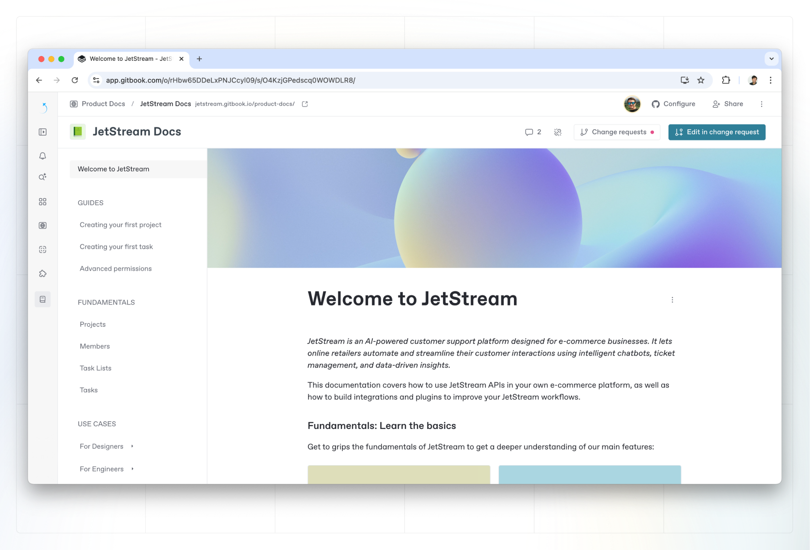

# Overview

<div data-full-width="false"><figure><figcaption><p>The GitBook editor.</p></figcaption></figure></div>

GitBook has a powerful block-based editor that allows you to seamlessly create, update, and enhance your content.


```
print hellow owlrd
```


hello

#### コラボレーション

チームメンバーを招待して共同編集する方法を確認します。

#### コラボレーション

チームメンバーを招待して共同編集する方法を確認します。

### Learn more about

<table data-card-size="large" data-view="cards"><thead><tr><th></th><th></th><th></th><th data-hidden data-card-cover data-type="files"></th><th data-hidden data-card-target data-type="content-ref"></th></tr></thead><tbody><tr><td><strong>Editor</strong></td><td>Learn more about GitBook’s navigation, content structure, and more.</td><td></td><td><a href="../.gitbook/assets/2 (1).png">2 (1).png</a></td><td><a href="editor/">editor</a></td></tr><tr><td><strong>Blocks</strong></td><td>Learn about the different blocks you can insert into a GitBook page.</td><td></td><td><a href="../.gitbook/assets/5 (1).png">5 (1).png</a></td><td><a href="blocks/">blocks</a></td></tr></tbody></table>

<table data-view="cards"><thead><tr><th></th><th></th><th></th><th data-hidden data-card-cover data-type="files"></th><th data-hidden data-card-target data-type="content-ref"></th></tr></thead><tbody><tr><td><strong>Import existing content</strong></td><td>Import content from Markdown, Confluence, Notion and more.</td><td></td><td><a href="../.gitbook/assets/7 (1).png">7 (1).png</a></td><td><a href="import.md">import.md</a></td></tr><tr><td><strong>Search your content</strong></td><td>Search the pages you write or ask GitBook AI questions about your content.</td><td></td><td><a href="../.gitbook/assets/10 (1).png">10 (1).png</a></td><td><a href="searching-your-content/">searching-your-content</a></td></tr><tr><td><strong>Version control</strong></td><td>View or restore pages from an earlier point in time.</td><td></td><td><a href="../.gitbook/assets/8 (1).png">8 (1).png</a></td><td><a href="activity-history.md">activity-history.md</a></td></tr></tbody></table>
